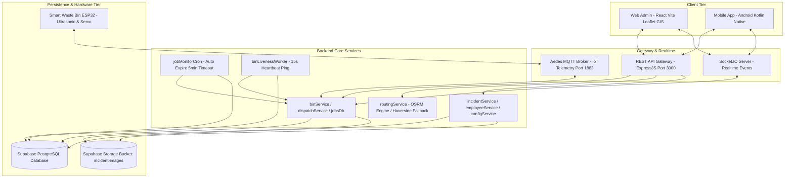
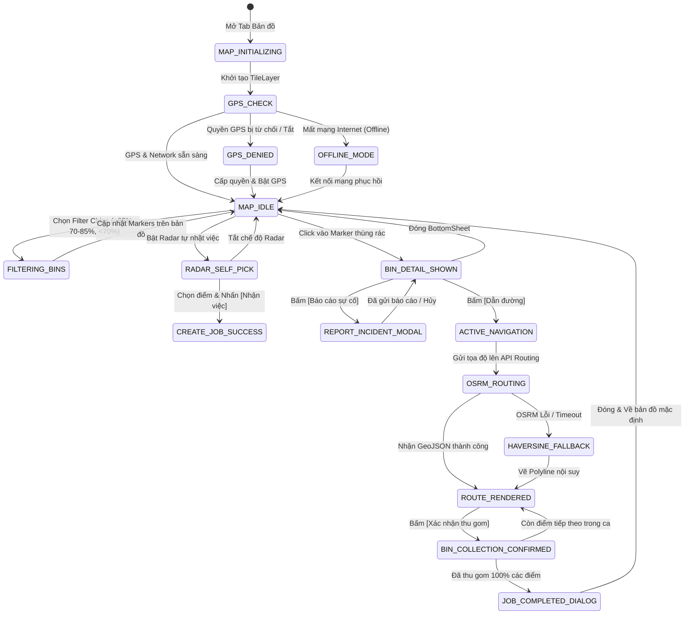

# BÁO CÁO TOÀN DIỆN HỆ THỐNG & ĐẶC TẢ NGHIỆP VỤ BẢN ĐỒ
## FULL SYSTEM AUDIT — BACKEND + FRONTEND + DATABASE + MAP MATRIX

> **Tài liệu kiểm định hệ thống**: Được đối chiếu và kiểm tra chéo 100% từ mã nguồn thực tế của hệ thống SmartWaste Platform (Backend ExpressJS, Supabase PostgreSQL Schema, Frontend Web React Vite, Android Native Kotlin, MQTT Aedes Broker, Socket.IO Server).

---

# MỤC LỤC
1. [TỔNG QUAN KIẾN TRÚC & TÀI NGUYÊN HỆ THỐNG](#1-tổng-quan-kiến-trúc--tài-nguyên-hệ-thống)
2. [DANH MỤC TÍNH NĂNG TOÀN DIỆN (FEATURE INVENTORY)](#2-danh-mục-tính-năng-toàn-diện-feature-inventory)
3. [AUDIT ĐẶC BIỆT: TOÀN BỘ 15 CASES TRANG BẢN ĐỒ (MAP FEATURE MATRIX)](#3-audit-đặc-biệt-toàn-bộ-15-cases-trang-bản-đồ-map-feature-matrix)
4. [MÔ HÌNH MÁY TRẠNG THÁI BẢN ĐỒ (MAP STATE MACHINE)](#4-mô-hình-máy-trạng-thái-bản-đồ-map-state-machine)
5. [TRUY VẾT DỮ LIỆU ĐẦU CUỐI (END-TO-END API TRACE)](#5-truy-vết-dữ-liệu-đầu-cuối-end-to-end-api-trace)
6. [ĐÁNH GIÁ CHÊNH LỆCH WEB GIS VS MOBILE NATIVE (GAP ANALYSIS)](#6-đánh-giá-chênh-lệch-web-gis-vs-mobile-native-gap-analysis)
7. [KẾ HOẠCH TRIỂN KHAI VÀ REFACTOR BẢN ĐỒ THEO THỨ TỰ ƯU TIÊN (P0 - P1 - P2)](#7-kế-hoạch-triển-khai-và-refactor-bản-đồ-theo-thứ-tự-ưu-tiên-p0---p1---p2)

---

# 1. TỔNG QUAN KIẾN TRÚC & TÀI NGUYÊN HỆ THỐNG

### 1.1. Sơ đồ luồng dữ liệu liên tầng (Cross-Tier Architecture)

### 1.2. Thống kê tài nguyên thực tế từ mã nguồn
* **Số lượng Module nghiệp vụ**: `8 Module` (Xác thực, Quản lý Thùng rác IoT, Điều phối & Lập tuyến, Tác nghiệp Tài xế Mobile, Bản đồ GIS, Báo cáo Sự cố, Nhân viên & Ca trực, Cấu hình Hệ thống).
* **Số lượng Màn hình Web Admin**: `7 Màn hình` (`LoginPage`, `DashboardPage`, `MapPage`, `SmartBinsPage`, `OperationsPage`, `EmployeesPage`, `SettingsPage`).
* **Số lượng Màn hình Mobile Native**: `10 Màn hình` (`SplashActivity`, `LoginActivity`, `MainActivity` [4 Tabs: Trang chủ, Nhiệm vụ, Bản đồ, Cá nhân], `JobDetailActivity`, `JobExecutionActivity`, `JobHistoryDetailActivity`, `RouteDetailActivity`, `BinDetailActivity`, `IncidentReportActivity`).
* **Số lượng REST API Endpoints**: `28 Endpoints`.
* **Số lượng Bảng CSDL (PostgreSQL Tables)**: `10 Bảng` + `1 Storage Bucket`.
* **Số lượng Stored Procedures (PL/pgSQL RPCs)**: `23 Stored Procedures`.
* **Số lượng WebSocket Events**: `8 Events`.
* **Số lượng MQTT Topics**: `4 Topics`.
* **Số lượng Background Workers / Cron**: `3 Workers`.

---

# 2. DANH MỤC TÍNH NĂNG TOÀN DIỆN (FEATURE INVENTORY)

| Module | Feature | Frontend UI | Backend API | Database / RPC | Realtime / MQTT | Trạng thái |
| :--- | :--- | :--- | :--- | :--- | :--- | :--- |
| **Authentication** | Đăng nhập tài khoản | Web + Mobile | `POST /api/auth/login` | `employee_login` | ❌ | ✅ Hoàn chỉnh |
| | Lấy thông tin phiên (`me`) | Web + Mobile | `GET /api/auth/me` | `employee_current` | ❌ | ✅ Hoàn chỉnh |
| | Đổi mật khẩu nhân viên | Web + Mobile | `POST /api/auth/change-password` | `employee_change_password` | ❌ | ✅ Hoàn chỉnh |
| | Đăng xuất & Hủy phiên | Web + Mobile | `POST /api/auth/logout` | `employee_logout` | ❌ | ✅ Hoàn chỉnh |
| **IoT / Smart Bins** | Danh sách thùng rác | Web + Mobile | `GET /api/bins` | `smart_bins` table | `binsSnapshot` | ✅ Hoàn chỉnh |
| | Chi tiết cảm biến & nắp | Web + Mobile | `GET /api/bins/:id` | `smart_bins` table | `binUpdated` | ✅ Hoàn chỉnh |
| | Lệnh mở nắp từ xa | Web + Mobile | `POST /api/bins/:id/open-lid` | `bin_events` table | `smartwaste/bins/+/command` | ✅ Hoàn chỉnh |
| | Nhận telemetry mức rác | Web Realtime | Backend Poller | `bin_events` table | `smartwaste/bins/+/telemetry` | ✅ Hoàn chỉnh |
| **Dispatch / Điều phối** | Gợi ý lập tuyến tự động | Web Admin | `POST /api/dispatch/plan` | `dispatchService` | ❌ | ✅ Hoàn chỉnh |
| | Giao việc cho tài xế | Web Admin | `POST /api/dispatch/confirm` | `collection_jobs` | `jobCreated` | ✅ Hoàn chỉnh |
| | Hủy nhiệm vụ đã giao | Web Admin | `POST /api/dispatch/jobs/:id/cancel` | `collection_jobs` | `jobUpdated` | ✅ Hoàn chỉnh |
| | Điều chuyển tuyến tài xế | Web Admin | `POST /api/dispatch/jobs/:id/reassign` | `collection_jobs` | `jobUpdated` | ✅ Hoàn chỉnh |
| **Mobile Jobs** | Lấy nhiệm vụ hiện tại | Mobile Native | `GET /api/mobile/jobs/active` | `employee_jobs_active` | `jobCreated` / `jobUpdated` | ✅ Hoàn chỉnh |
| | Tự nhận việc (Self-Pick) | Mobile Native | `POST /api/mobile/jobs/self-pick` | `employee_job_self_pick` | `jobCreated` | ✅ Hoàn chỉnh |
| | Tiếp nhận ca (Accept) | Mobile Native | `POST /api/mobile/jobs/:id/accept` | `employee_job_accept` | `jobUpdated` | ✅ Hoàn chỉnh |
| | Từ chối ca (Reject) | Mobile Native | `POST /api/mobile/jobs/:id/reject` | `employee_job_reject` | `jobUpdated` | ✅ Hoàn chỉnh |
| | Bắt đầu ca (Start) | Mobile Native | `POST /api/mobile/jobs/:id/start` | `employee_job_start` | `jobUpdated` | ✅ Hoàn chỉnh |
| | Tạm dừng / Tiếp tục ca | Mobile Native | `POST /api/mobile/jobs/:id/pause` | `employee_job_pause` | `jobUpdated` | ✅ Hoàn chỉnh |
| | Xác nhận thu gom thùng | Mobile Native | `POST /api/mobile/jobs/:id/collect-bin` | `employee_job_collect_bin` | `jobUpdated` / `binUpdated` | ✅ Hoàn chỉnh |
| | Xem lịch sử thu gom | Mobile Native | `GET /api/mobile/jobs/history` | `employee_jobs_history` | ❌ | ✅ Hoàn chỉnh |
| **Incidents / Sự cố** | Lấy danh sách sự cố | Web + Mobile | `GET /api/incidents` | `incident_reports` table | `incidentReported` | ✅ Hoàn chỉnh |
| | Chuẩn bị upload ảnh lỗi | Mobile Native | `POST /api/incidents/upload-prepare` | `employee_incident_upload_prepare` | ❌ | ✅ Hoàn chỉnh |
| | Xác nhận gửi báo cáo | Mobile Native | `POST /api/incidents/upload-complete` | `employee_incident_upload_complete` | `incidentReported` | ✅ Hoàn chỉnh |
| **GIS / Map & Route** | Vị trí GPS toàn đội xe | Web Admin | `GET /api/map/locations` | `employee_locations` | `employeeLocation` | ✅ Hoàn chỉnh |
| | Cập nhật GPS tài xế | Mobile Native | `POST /api/employees/location` | `employee_location_update` | `employeeLocation` | ✅ Hoàn chỉnh |
| | Tính tuyến OSRM | Web + Mobile | `POST /api/map/route` | `routingService` | ❌ | ✅ Hoàn chỉnh |
| **Cấu hình & Timeout** | Tham số hệ thống | Web Admin | `GET /api/settings` `PATCH /api/settings` | `system_settings` | ❌ | ✅ Hoàn chỉnh |
| | Tự động hủy job quá hạn | Backend Cron | `jobMonitorCron.js` | `collection_jobs` | `jobUpdated` | ✅ Hoàn chỉnh |

---

# 3. AUDIT ĐẶC BIỆT: TOÀN BỘ 15 CASES TRANG BẢN ĐỒ (MAP FEATURE MATRIX)

Đối chiếu chéo mã nguồn Web GIS (`MapPage.jsx`), Mobile Map (`MapFragment.kt`, `leaflet_map.html`, `GpsTracker.kt`), Backend Services (`routingService.js`, `binService.js`, `jobsDb.js`) và hình ảnh đặc tả nghiệp vụ:

| # | Case nghiệp vụ | Trigger (Điều kiện kích hoạt) | Xử lý Giao diện (UI Rendering) | API / Backend Service | CSDL / RPC | Realtime / MQTT | Trạng thái kỹ thuật |
| :---: | :--- | :--- | :--- | :--- | :--- | :--- | :--- |
| **1** | **Default Map (Bản đồ mặc định)** | Chuyển sang Tab Bản đồ | Render Map Tiles (OpenStreetMap), hiển thị Marker Xe tài xế (Pulse Effect) và các Pin thùng rác phân theo màu mức độ đầy | `GET /api/bins` `GET /api/mobile/jobs/active` | Bảng `smart_bins` Bảng `collection_jobs` | Socket: `binsSnapshot` | ✅ Đã có nền tảng cơ bản; cần hoàn thiện UI Marker |
| **2** | **Filter Bins (Lọc thùng rác)** | Chọn Chip bộ lọc (Tất cả, >85% Nguy cấp, 70-85% Cảnh báo, <70% Bình thường) | Lọc động danh sách Marker trên bản đồ; đổi icon tương ứng (🔴 Đỏ >85%, 🟡 Vàng 70-85%, 🟢 Xanh <70%) | Xử lý trực tiếp trên ViewModel StateFlow | Cột `smart_bins.level_percent` | Socket: `binUpdated` | ⚠️ Web có đầy đủ; Mobile cần gắn thanh Filter Chips |
| **3** | **Self-Pick Mode (Tự nhặt việc)** | Bật công tắc Radar Quét tự nhận điểm | Vẽ vòng tròn Radar phát sóng xung quanh vị trí GPS xe (bán kính 1-3km); lọc tự động các thùng rác >85% | `GET /api/bins` | Bảng `smart_bins` | ❌ | ⚠️ Web có logic; Mobile cần UI Radar & danh sách chọn |
| **4** | **Create Self-Pick Job** | Bấm [Tạo ca thu gom] sau khi chọn các điểm quét | Chuyển bản đồ sang chế độ Tuyến đường tác nghiệp; vẽ Polyline kết nối các điểm | `POST /api/mobile/jobs/self-pick` | RPC `employee_job_self_pick` | Socket: `jobCreated` | ✅ Backend đã sẵn sàng 100% |
| **5** | **Bin Detail BottomSheet** | Click vào bất kỳ Marker thùng rác trên bản đồ | Trượt BottomSheet: ID, Tên, Địa chỉ, GPS, Mức đầy %, Loại thùng 240L, Cảm biến, Cập nhật cuối, Lịch sử báo cáo kèm thumbnails | `GET /api/bins/:id` `GET /api/bins/:id/history` | Bảng `smart_bins` Bảng `incident_reports` | Socket: `binUpdated` | ⚠️ Mobile cần hoàn thiện BottomSheet giống ảnh 3 |
| **6** | **Navigate to Bin (Dẫn đường)** | Bấm [Dẫn đường] trong Bin Detail hoặc Active Job | Vẽ Polyline tuyến đường tối ưu từ GPS xe đến thùng rác; hiển thị khoảng cách (m/km) và thời gian dự kiến (phút) | `POST /api/map/route` | `routingService.js` (OSRM Engine) | ❌ | ⚠️ Mobile đang mở App ngoài; cần vẽ trực tiếp lên bản đồ |
| **7** | **Report Incident (Báo cáo sự cố)** | Bấm [Báo cáo sự cố] từ Bin Detail | Mở Modal BottomSheet chọn 5 loại lỗi (Thùng hỏng, Nắp kẹt, Cảm biến lỗi, Rác tràn, Khác), mô tả chi tiết và chọn 3 ảnh | `POST /api/incidents/upload-prepare` `POST /api/incidents/upload-complete` | Bảng `incident_reports` Bucket: `incident-images` | Socket: `incidentReported` | ✅ Backend sẵn sàng; Mobile cần chuyển sang BottomSheet |
| **8** | **Admin Re-route (Điều chuyển tuyến)** | Admin điều phối lại ca từ Web Dispatch | Hiển thị Toast / Popup thông báo đổi tuyến; tự động vẽ lại Polyline đường đi mới | WebSocket event `jobUpdated` | Cột `collection_jobs.route_data` | Socket: `jobUpdated` | ⚠️ Backend đã phát event; Mobile cần lắng nghe WebSocket |
| **9** | **Remote Open Lid (Mở nắp IoT)** | Bấm [Mở nắp từ xa] | Gửi lệnh MQTT mở nắp nạp servo góc 90 độ; hiển thị trạng thái chờ ACK từ thiết bị | `POST /api/bins/:id/open-lid` | Bảng `bin_events` | MQTT: `smartwaste/bins/+/command` | ✅ Backend & MQTT Broker đã có đầy đủ |
| **10** | **GPS Location Update (Vị trí xe)** | Phần cứng GPS di chuyển | Cập nhật vị trí Marker xe tải thời gian thực; tính bearing xoay đầu xe theo hướng di chuyển | `POST /api/employees/location` | RPC `employee_location_update` | Socket: `employeeLocation` | ✅ Hoàn chỉnh |
| **11** | **GPS Off / Denied (Tắt GPS)** | Tài xế tắt GPS hoặc từ chối quyền Location | Hiển thị thanh Warning yêu cầu bật GPS; định vị mặc định về trung tâm Quận 1 (10.7769, 106.7009) | Client-side Android LocationManager | ❌ | ❌ | ⚠️ Cần bổ sung Dialog kích hoạt GPS |
| **12** | **No Internet / Offline Map** | Mất kết nối mạng 4G/Wifi | Hiển thị bản đồ từ Cache cục bộ; các điểm thùng rác lấy từ SharedPreferences/Database offline | Local Cache | ❌ | ❌ | ✅ Đã có logic cache |
| **13** | **No Bins Found (Không có thùng)** | Bộ lọc không tìm thấy thùng rác phù hợp | Hiển thị Empty State thông báo "Không có thùng rác nào trong khu vực này" | Client-side StateFlow | ❌ | ❌ | ⚠️ Cần bổ sung UI Empty state |
| **14** | **Route Error (Lỗi định tuyến)** | Máy chủ OSRM timeout / Không tìm thấy đường | Tự động Fallback sang giải thuật Haversine nội suy khoảng cách đường bộ ($d \times 1.35$) | `routingService.js` (Haversine fallback) | ❌ | ❌ | ✅ Backend đã tích hợp sẵn |
| **15** | **Job Completed on Map** | Thu gom xong điểm cuối cùng của ca | Xóa Polyline tuyến đường, cập nhật trạng thái các thùng sang Xanh lá "Đã thu gom", mở Dialog chúc mừng | `POST /api/mobile/jobs/:id/collect-bin` | RPC `employee_job_collect_bin` | Socket: `jobUpdated` | ✅ Hoàn chỉnh |

---

# 4. MÔ HÌNH MÁY TRẠNG THÁI BẢN ĐỒ (MAP STATE MACHINE)

---

# 5. TRUY VẾT DỮ LIỆU ĐẦU CUỐI (END-TO-END API TRACE)

### 5.1. Luồng Tự nhặt việc (Self-Pick)
$$\text{Mobile Map UI} \xrightarrow{\text{Chọn mảng binIds}} \text{POST /api/mobile/jobs/self-pick} \xrightarrow{\text{jobsDb.js}} \text{RPC: employee\_job\_self\_pick} \xrightarrow{\text{PostgreSQL}} \text{Bảng collection\_jobs (status = PENDING)} \xrightarrow{\text{Socket.IO}} \text{Broadcast event: jobCreated}$$

### 5.2. Luồng Dẫn đường & Tính tuyến tối ưu (Route Calculation)
$$\text{Mobile Map UI} \xrightarrow{\text{[Dẫn đường]}} \text{POST /api/map/route} \xrightarrow{\text{mapRoutes.js}} \text{routingService.js (OSRM Engine)} \xrightarrow{\text{Fallback nếu OSRM lỗi}} \text{Haversine Estimate} \xrightarrow{\text{GeoJSON Coordinates}} \text{Map WebView / MapView} \xrightarrow{\text{Vẽ Polyline}}$$

### 5.3. Luồng Báo cáo sự cố kèm ảnh (Incident Report with Photos)
$$\text{Mobile Map UI} \xrightarrow{\text{Chọn 3 ảnh}} \text{POST /api/incidents/upload-prepare} \xrightarrow{\text{RPC: employee\_incident\_upload\_prepare}} \text{Supabase Storage (Signed URL)} \xrightarrow{\text{Upload binary ảnh}} \text{POST /api/incidents/upload-complete} \xrightarrow{\text{Bảng incident\_reports}} \text{Broadcast event: incidentReported}$$

### 5.4. Luồng Điều khiển nắp thùng từ xa (Remote IoT Unlock)
$$\text{Mobile Map UI} \xrightarrow{\text{[Mở nắp từ xa]}} \text{POST /api/bins/:id/open-lid} \xrightarrow{\text{binService.js}} \text{MQTT Publish: smartwaste/bins/BIN_ID/command} \xrightarrow{\text{ESP32 Hardware}} \text{Servo 90}^\circ \xrightarrow{\text{MQTT ACK}} \text{Broadcast event: binUpdated}$$

---

# 6. ĐÁNH GIÁ CHÊNH LỆCH WEB GIS VS MOBILE NATIVE (GAP ANALYSIS)

| Thành phần kỹ thuật | Web Admin GIS (`MapPage.jsx`) | Mobile App Hiện tại (`MapFragment.kt`) | Hướng giải quyết khi Refactor Mobile |
| :--- | :--- | :--- | :--- |
| **Phân loại Marker mức rác** | Đầy đủ 3 màu (Đỏ >85%, Vàng 70-85%, Xanh <70%) | Đã có màu nhưng chưa có viền Badge chuẩn | Đồng bộ bộ Icon Marker vector sắc nét theo đúng Design Tokens |
| **Bộ lọc Chips trên Header** | Đầy đủ (Tất cả, Nguy cấp, Cảnh báo, Bình thường) | Chưa có thanh Chips lọc | Bổ sung thanh Horizontal Chips lọc phía dưới thanh tìm kiếm |
| **Chi tiết Thùng rác (Bin Detail)** | Popup Sidebar chi tiết kèm thông số kỹ thuật | Chuyển sang Activity riêng biệt | Chuyển thành BottomSheet trượt mượt mà trực tiếp trên Map (ảnh 3) |
| **Báo cáo Sự cố (Incident Modal)** | Có form xem xét sự cố | Chuyển sang Activity riêng | Chuyển thành BottomSheet 5 loại lỗi kèm camera picker (ảnh 2) |
| **Dẫn đường (Navigation)** | Vẽ Polyline tuyến đường trực tiếp | Mở ứng dụng Google Maps ngoài | Vẽ trực tiếp Polyline GeoJSON lên Map nội bộ của app |
| **Radar Tự nhặt việc (Self-Pick)** | Có giao diện chọn điểm | Chưa có radar | Thêm chế độ Radar phát sóng quét các thùng >85% quanh GPS |

---

# 7. KẾ HOẠCH TRIỂN KHAI VÀ REFACTOR BẢN ĐỒ THEO THỨ TỰ ƯU TIÊN (P0 - P1 - P2)

### 🟢 GIAI ĐOẠN P0 — CỐT LÕI BẮT BUỘC (CORE FOUNDATION)
1. **Chuẩn hóa Marker Thùng rác & Vị trí Xe**:
   - Marker xe tải có hiệu ứng sóng xung quanh (Pulse Ring).
   - Marker thùng rác hiển thị % rác với 3 mức màu: Đỏ (`>85%`), Vàng (`70-85%`), Xanh (`<70%`).
2. **BottomSheet Chi tiết Thùng rác (Chuẩn ảnh 3)**:
   - Hiển thị ID (`BIN_HCM_023`), Tên, Địa chỉ, Tọa độ GPS, Mức đầy %.
   - Thông số kỹ thuật: Loại thùng 240L, Dung tích 240L, Cảm biến Hoạt động, Cập nhật cuối.
   - Lịch sử báo cáo sự cố kèm thumbnails ảnh thu nhỏ.
   - Nút hành động chính: `[Dẫn đường | Khoảng cách - Thời gian]`.
3. **Vẽ Tuyến đường Dẫn đường (Polyline Navigation)**:
   - Kết nối API `POST /api/map/route` để lấy tọa độ OSRM và vẽ trực tiếp đường đi lên bản đồ.

### 🟡 GIAI ĐOẠN P1 — NGHIỆP VỤ NÂNG CAO (OPERATIONAL ENHANCEMENTS)
4. **BottomSheet Báo cáo Sự cố trực tiếp (Chuẩn ảnh 2)**:
   - Chọn nhanh 5 danh mục lỗi: *Thùng hỏng, Nắp kẹt, Cảm biến lỗi, Rác tràn, Khác*.
   - Nhập mô tả và chụp/chọn tối đa 3 ảnh minh chứng hiện trường.
   - Nút `[Gửi báo cáo]` kết nối thẳng API `upload-prepare` & `upload-complete`.
5. **Thanh Filter Chips trên Header**:
   - Cho phép tài xế lọc nhanh các thùng theo mức rác.
6. **Lắng nghe sự kiện Điều chuyển tuyến (Admin Re-route)**:
   - Nhận event `jobUpdated` từ WebSocket để tự động vẽ lại lộ trình mới khi Admin can thiệp.

### 🔵 GIAI ĐOẠN P2 — MỞ RỘNG & TIỆN ÍCH IOT (ADVANCED FEATURES)
7. **Chế độ Radar Quét Tự nhặt việc (Self-Pick Mode)**:
   - Hiển thị hiệu ứng Radar quét bán kính quanh xe, cho phép chọn nhanh các thùng >85% để tạo ca tức thì.
8. **Nút Mở nắp thùng IoT từ xa**:
   - Gửi lệnh MQTT mở nắp trực tiếp ngay từ BottomSheet chi tiết thùng.
