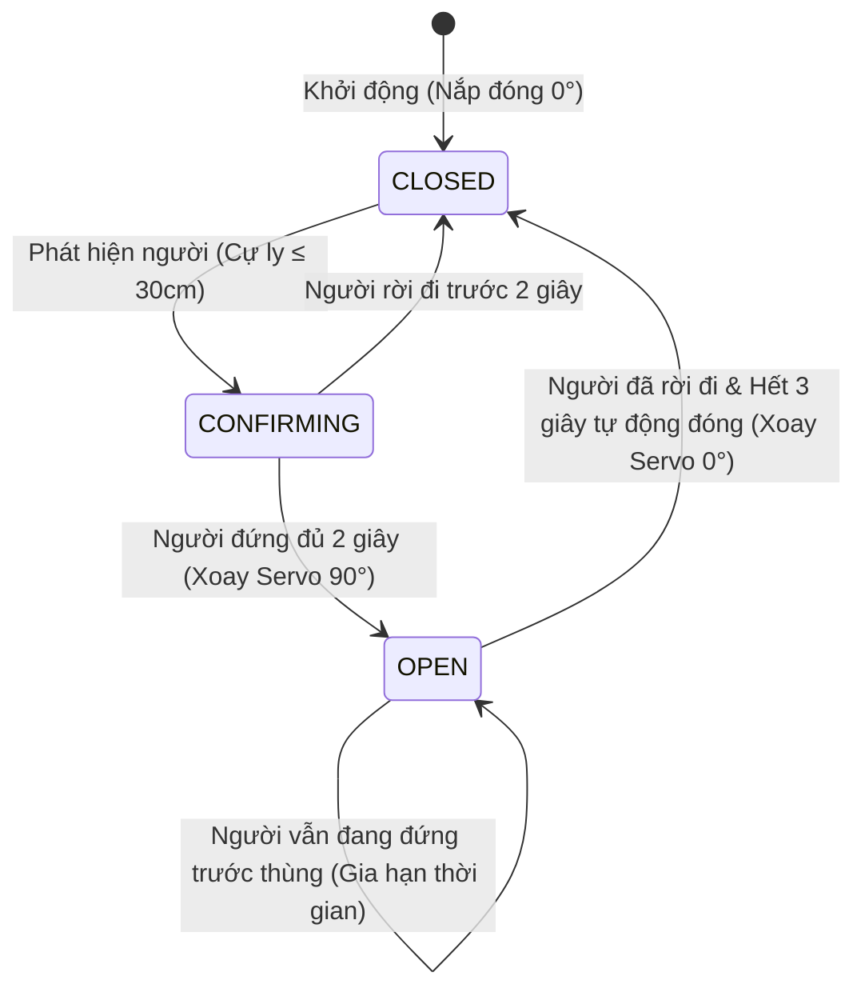

# 🗑️ SmartWaste ESP32 / ESP32-S3 Firmware Documentation

> **Tài liệu Kỹ thuật & Hướng dẫn Vận hành Firmware Thùng Rác Thông Minh IoT**  
> Phiên bản Firmware: `v2.0-Production` | Nền tảng: **PlatformIO / Arduino Framework** | Vi điều khiển: **ESP32-S3 / ESP32-WROOM**

---

## 📑 Mục Lục
1. [Tổng Quan Hệ Thống](#1-tổng-quan-hệ-thống)
2. [Sơ Đồ Kết Nối Phần Cứng & Pinout](#2-sơ-đồ-kết-nối-phần-cứng--pinout)
3. [Máy Trạng Thái Vận Hành (State Machine)](#3-máy-trạng-thái-vận-hành-state-machine)
4. [Đặc Tả Giao Thức MQTT & Xác Thực 2 Chiều](#4-đặc-tả-giao-thức-mqtt--xác-thực-2-chiều)
5. [Hướng Dẫn Cài Đặt Mạng Wi-Fi & MQTT (WiFiManager)](#5-hướng-dẫn-cài-đặt-mạng-wi-fi--mqtt-wifimanager)
6. [Hướng Dẫn Biên Dịch & Nạp Code (PlatformIO)](#6-hướng-dẫn-biên-dịch--nạp-code-platformio)
7. [Xử Lý Sự Cố & Câu Hỏi Thường Gặp (Troubleshooting)](#7-xử-lý-sự-cố--câu-hỏi-thường-gặp-troubleshooting)

---

## 1. Tổng Quan Hệ Thống

Firmware SmartWaste được thiết kế chuyên biệt cho thùng rác thông minh trong hệ sinh thái Smart Waste IoT:
* **Tự động mở/đóng nắp rác không chạm**: Sử dụng cảm biến siêu âm phát hiện người ở cự ly gần và điều khiển động cơ Servo.
* **Đo mức rác theo thời gian thực**: Đo độ sâu thể tích rác còn lại trong thùng và quy đổi ra tỷ lệ phần trăm (`0% - 100%`).
* **Kết nối đám mây Realtime**: Xuất bản dữ liệu đo đạc (Telemetry) chu kỳ **1 giây/lần** qua giao thức MQTT.
* **Xác thực 2 Chiều (Real 2-Way Handshake)**: Tiếp nhận lệnh điều khiển từ xa từ Web Admin / Mobile App và phản hồi gói tin ACK tức thì kèm `commandAckId`.
* **Cấu hình không dây linh hoạt (Captive Portal)**: Tự động phát Wi-Fi AP để người dùng nhập mạng Wi-Fi và IP Server mà không cần nạp lại mã nguồn.
* **Khôi phục cài đặt gốc**: Sử dụng nút BOOT có sẵn trên mạch để xóa cấu hình và cài đặt lại chỉ bằng thao tác giữ 3 giây.

```
       +-------------------------------------------------------------+
       |                  ESP32 / ESP32-S3 Dev Board                 |
       |                                                             |
       |  [Sensor 1: HC-SR04] ---> Phát hiện người (Cự ly < 30cm)    |
       |  [Sensor 2: HC-SR04] ---> Đo mức rác trong thùng (0-100%)   |
       |  [Servo Motor SG90]  <--- Xoay mở nắp (0° - 90°)            |
       |  [Flash NVS Memory]  <---> Lưu SSID, Pass, MQTT IP, Tên     |
       +------------------------------+------------------------------+
                                      | Wi-Fi (2.4GHz)
                                      v
                       +------------------------------+
                       |   Node.js Backend & Broker   |
                       |  (MQTT Port 1883 / REST API) |
                       +------------------------------+
```

---

## 2. Sơ Đồ Kết Nối Phần Cứng & Pinout

### 🔌 Bảng Đấu Nối Chân GPIO (Cấu hình chuẩn trong `config.h`)

| Thiết bị ngoại vi | Chân trên Module | Chân GPIO trên ESP32 | Ghi chú kỹ thuật |
| :--- | :--- | :--- | :--- |
| **Cảm biến 1 (Phát hiện người)** | `VCC` | `5V / VIN` | Nguồn cấp 5V DC |
| | `GND` | `GND` | Nối mass chung |
| | `TRIG` | **GPIO 5** | Chân kích xung siêu âm (Output) |
| | `ECHO` | **GPIO 18** | Chân nhận xung phản xạ (Input) |
| **Cảm biến 2 (Đo mức rác)** | `VCC` | `5V / VIN` | Nguồn cấp 5V DC |
| | `GND` | `GND` | Nối mass chung |
| | `TRIG` | **GPIO 19** | Chân kích xung siêu âm (Output) |
| | `ECHO` | **GPIO 21** | Chân nhận xung phản xạ (Input) |
| **Động cơ Servo (Mở nắp)** | `Dây Đỏ (+)` | `5V / VIN` | Nguồn động lực |
| | `Dây Nâu/Đen (-)` | `GND` | Mass chung |
| | `Dây Cam/Vàng (PWM)` | **GPIO 13** | Xung điều khiển PWM 50Hz |
| **Nút Reset Cấu hình** | `Nút bấm` | **GPIO 0 (BOOT)** | Nút BOOT tích hợp trên mạch ESP32 |

> [!IMPORTANT]
> **Khuyến nghị nguồn cấp:** Nên sử dụng nguồn adapter rời **5V / 2A** hoặc mạch nguồn giảm áp LM2596/Buck để cung cấp dòng ổn định cho động cơ Servo khi nắp rác chuyển động.

---

## 3. Máy Trạng Thái Vận Hành (State Machine)

Hệ thống hoạt động theo máy trạng thái hữu hạn 3 pha (FSM):



* **`CLOSED` (Đóng nắp)**:
  * Góc Servo: `0°`.
  * Cảm biến 2 kích hoạt đo khoảng cách rác `distLevel` và tính `%` đầy theo công thức:
    $$\text{levelPercent} = \frac{\text{BIN\_DEPTH\_EMPTY\_CM} - \text{distLevel}}{\text{BIN\_DEPTH\_EMPTY\_CM} - \text{BIN\_DEPTH\_FULL\_CM}} \times 100\%$$
* **`CONFIRMING` (Xác nhận)**:
  * Khi có người tiếp cận $\le 30\text{ cm}$, bộ đếm `USER_CONFIRM_MS = 2000ms` bắt đầu đếm để chống việc người đi ngang qua kích hoạt mở nắp ngoài ý muốn.
* **`OPEN` (Mở nắp)**:
  * Góc Servo: `90°`.
  * Tạm ngừng đọc Cảm biến mức rác để tránh rác đang rơi làm sai lệch số liệu.
  * Tự động đếm lùi `AUTO_CLOSE_MS = 3000ms` sau khi người dùng rời đi để đóng nắp.

---

## 4. Đặc Tả Giao Thức MQTT & Xác Thực 2 Chiều

Mỗi thùng rác được định danh bằng mã duy nhất `binId` lấy từ địa chỉ MAC Wi-Fi (Ví dụ: `D48AFC9DA3E0`).

### 📤 4.1. Bản Tin Đo Đạc Định Kỳ (Telemetry)
* **Topic:** `wastebin/{binId}/status`
* **Chu kỳ:** `1000ms` (1 giây/lần) hoặc gửi ngay khi có thay đổi trạng thái nắp.
* **QoS:** `1`
* **JSON Payload Schema:**

```json
{
  "state": "CLOSED",
  "distUser": 45.2,
  "distLevel": 18.5,
  "levelPercent": 61.4,
  "servoAngle": 0,
  "controlMode": "AUTO",
  "collectionPaused": false,
  "ipAddress": "192.168.1.105",
  "name": "Thùng Rác Sảnh A",
  "location": "Tầng 1 Tòa Nhà Trung Tâm",
  "commandAckId": "2026-08-16T11:44:23.661Z",
  "commandAckAction": "OPEN"
}
```

#### Giải thích các trường dữ liệu:
| Tên trường | Kiểu dữ liệu | Ý nghĩa |
| :--- | :--- | :--- |
| `state` | String | Trạng thái nắp hiện tại: `"CLOSED"`, `"CONFIRMING"`, `"OPEN"`. |
| `distUser` | Float | Khoảng cách người dùng đo được từ Cảm biến 1 (cm). |
| `distLevel` | Float | Khoảng cách từ nắp đến mặt rác đo được từ Cảm biến 2 (cm). |
| `levelPercent` | Float | Tỷ lệ rác đầy trong thùng (`0.0` đến `100.0%`). |
| `servoAngle` | Integer | Góc xoay hiện tại của Servo (`0` đến `90` độ). |
| `controlMode` | String | Chế độ hoạt động: `"AUTO"` (Tự động) hoặc `"MANUAL"` (Thủ công từ xa). |
| `collectionPaused`| Boolean | Trạng thái tạm dừng thu gom (`true`/`false`). |
| `ipAddress` | String | Địa chỉ IP nội mạng của thùng rác. |
| `name` | String | Tên định danh của thùng rác (lưu trong Flash NVRAM). |
| `location` | String | Vị trí lắp đặt chi tiết (lưu trong Flash NVRAM). |
| `commandAckId` | String | *(Tùy chọn)* ID lệnh vừa thực thi, gửi kèm để hoàn tất 2-Way Handshake. |
| `commandAckAction` | String | *(Tùy chọn)* Tên hành động vừa thực thi (`OPEN`, `CLOSE`,...). |

---

### 📥 4.2. Lệnh Điều Khiển Từ Xa (Remote Commands)
* **Topic:** `wastebin/{binId}/command`
* **QoS:** `1`
* **JSON Payload Schema:**

```json
{
  "action": "OPEN",
  "commandId": "2026-08-16T11:44:23.661Z"
}
```

#### Danh sách 6 Lệnh Điều Khiển:
1. **`OPEN`**: Chuyển sang chế độ Manual, xoay servo mở nắp `90°`, phản hồi ACK.
2. **`CLOSE`**: Chuyển sang chế độ Manual, xoay servo đóng nắp `0°`, phản hồi ACK.
3. **`AUTO`**: Khôi phục chế độ tự động cảm biến, đóng nắp `0°`, hủy tạm dừng thu gom.
4. **`MANUAL`**: Khóa cảm biến tự động, giữ nguyên vị trí nắp hiện tại.
5. **`PAUSE`**: Đánh dấu trạng thái đang thu gom rác, đóng nắp `0°`, tạm ngắt phát sóng cảm biến để bảo vệ công nhân.
6. **`RESUME`**: Kết thúc thu gom, đưa thùng rác trở lại chế độ tự động `AUTO`.

---

## 5. Hướng Dẫn Cài Đặt Mạng Wi-Fi & MQTT (WiFiManager)

Khi xuất xưởng hoặc mang thiết bị đến vị trí lắp đặt mới, bạn không cần nạp lại code mà chỉ cần thực hiện quy trình cài đặt qua Wi-Fi:

```
+------------------+      +-------------------+      +------------------+
|  1. Bật nguồn    | ---> | 2. Kết nối Wi-Fi  | ---> | 3. Mở trình duyệt|
|  ESP32 phát AP   |      | 'SmartBin_XXXX'   |      |    192.168.4.1   |
+------------------+      +-------------------+      +--------+---------+
                                                              |
                                                              v
+------------------+      +-------------------+      +------------------+
| 5. Hoàn tất kết  | <--- | ESP32 lưu NVRAM   | <--- | 4. Điền SSID,    |
| nối Dashboard    |      | & tự khởi động lại|      | Password, MQTT IP|
+------------------+      +-------------------+      +------------------+
```

### Chi tiết các bước:
1. **Kết nối Access Point**: Trên điện thoại hoặc Laptop, tìm mạng Wi-Fi có tên dạng `SmartBin_XXXX` (với `XXXX` là 4 số cuối địa chỉ MAC).
2. **Mở Cổng Cài Đặt**: Trình duyệt sẽ tự động mở trang Portal (nếu không tự mở, hãy truy cập `http://192.168.4.1`).
3. **Điền Thông Tin Cấu Hình**:
   * **Wi-Fi Network**: Chọn mạng Wi-Fi và nhập Mật khẩu.
   * **MQTT Broker IP**: Nhập địa chỉ IP máy chủ (Ví dụ: `192.168.1.15` hoặc domain server).
   * **Tên thùng rác**: Ví dụ: *Thùng Rác Tầng 1 - Khu A*.
   * **Vị trí lắp đặt**: Ví dụ: *268 Lý Thường Kiệt, Q.10, TP.HCM*.
4. **Lưu Cấu Hình**: Bấm **Save**. ESP32 sẽ lưu toàn bộ thông tin vào Flash NVRAM (Preferences) và tự động kết nối mạng.
5. **Khôi phục cài đặt gốc**: Giữ nút **BOOT (GPIO 0)** trên board trong **3 giây** khi đang chạy để xóa cấu hình và mở lại trang cài đặt.

---

## 6. Hướng Dẫn Biên Dịch & Nạp Code (PlatformIO)

### 🛠️ Yêu Cầu Môi Trường
* **VS Code** đã cài đặt Extension **PlatformIO IDE**.
* Cáp nạp Micro-USB hoặc Type-C kết nối ESP32 với máy tính.

### 📦 Cấu Trúc Thư Mục
```text
Esp32_S3/
├── include/
│   └── config.h         # File cấu hình chân GPIO, cự ly và chu kỳ thời gian
├── src/
│   └── main.cpp         # Toàn bộ mã nguồn C++ máy trạng thái, WiFi & MQTT
├── platformio.ini        # File cấu hình môi trường biên dịch PlatformIO
└── README.md            # Tài liệu kỹ thuật firmware
```

### ⚡ Các Lệnh Nạp Code (Terminal)

* **Biên dịch mã nguồn:**
  ```powershell
  pio run -e esp32-s3-devkitc-1
  ```

* **Biên dịch và nạp vào ESP32:**
  ```powershell
  pio run -e esp32-s3-devkitc-1 -t upload
  ```

* **Mở Serial Monitor kiểm tra Log:**
  ```powershell
  pio device monitor -b 115200
  ```

---

## 7. Xử Lý Sự Cố & Câu Hỏi Thường Gặp (Troubleshooting)

| Hiện tượng | Nguyên nhân có thể | Cách khắc phục |
| :--- | :--- | :--- |
| **Servo bị giật hoặc ESP32 bị Reset liên tục khi nắp mở** | Sụt áp do nguồn cấp USB không đủ dòng cho Servo. | Cấp nguồn riêng 5V 2A cho Servo hoặc gắn thêm tụ hóa $1000\mu\text{F}$ giữa chân `VCC` và `GND` của Servo. |
| **Cảm biến luôn trả về 999.0 cm** | Chân Echo/Trig cắm sai hoặc cảm biến bị hỏng. | Kiểm tra lại sơ đồ chân GPIO 5/18 (User) và GPIO 19/21 (Level). |
| **Không tìm thấy Wi-Fi `SmartBin_XXXX`** | Thiết bị đã kết nối thành công Wi-Fi đã lưu trước đó. | Giữ nút **BOOT** trong 3 giây để xóa cấu hình cũ và phát lại AP. |
| **Trạng thái trên Web báo Offline dù ESP32 đang chạy** | Sai IP MQTT Broker hoặc máy chủ bị tường lửa (Firewall) chặn port 1883. | Kiểm tra địa chỉ IP trong cấu hình WiFiManager và mở port 1883 trên máy chủ Backend. |

---

**© 2026 SmartWaste Platform — IoT Smart City Solutions.**
