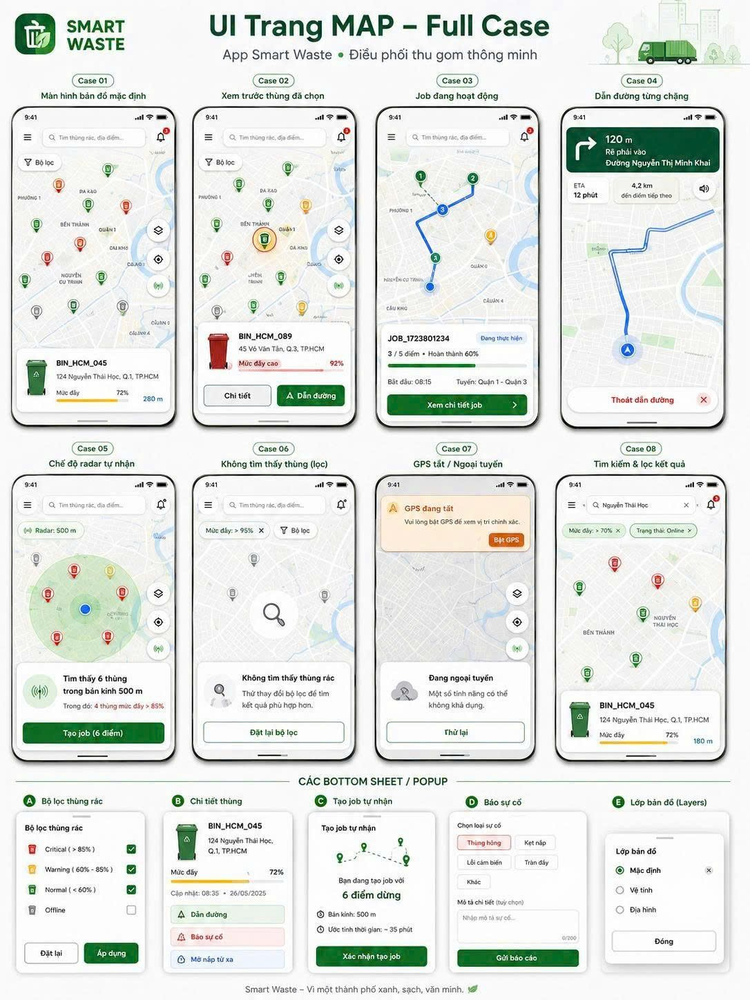
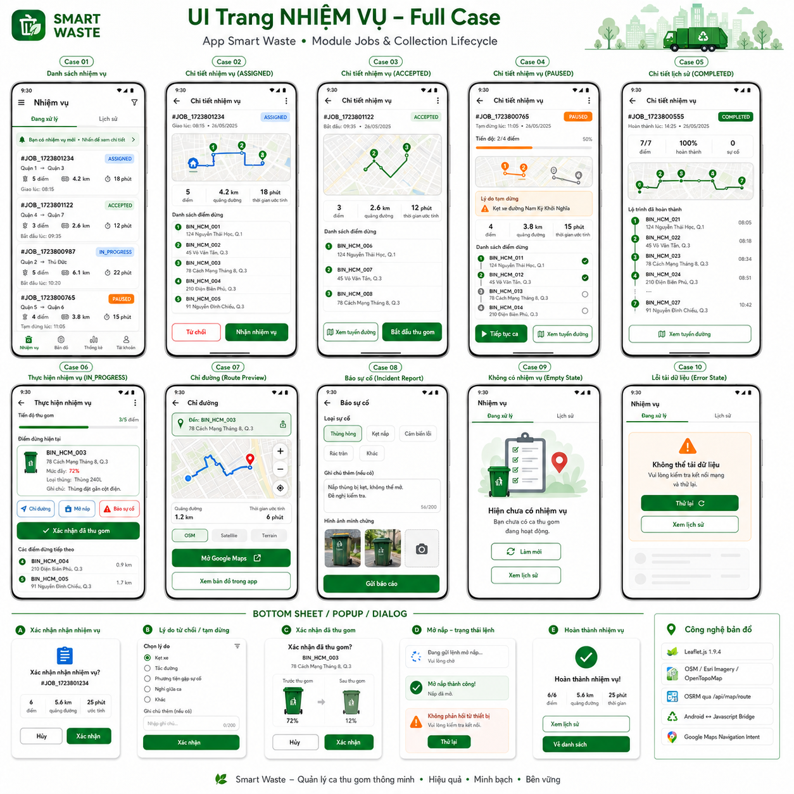
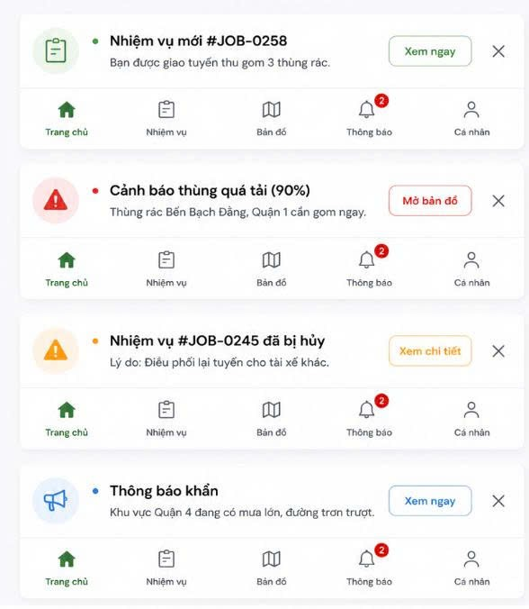
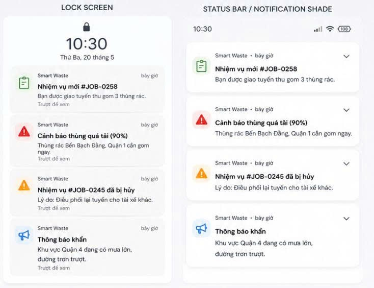
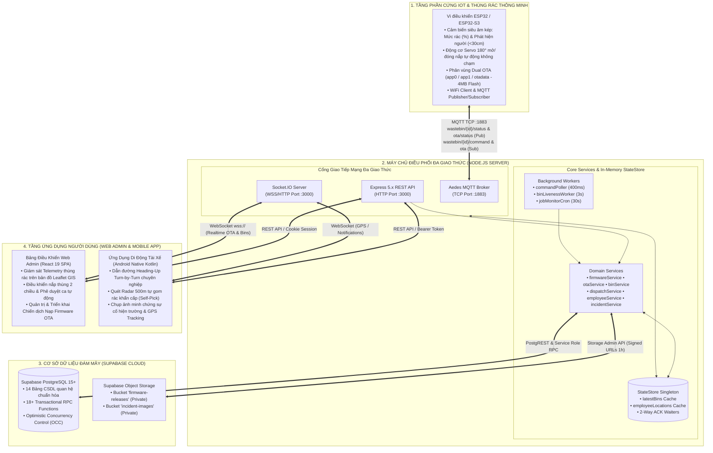

# 🌍 SmartWaste — Nền Tảng Đô Thị Thông Minh Quản Trị & Thu Gom Rác Toàn Diện
### (Smart City IoT, Realtime Server, Web GIS Admin & Android Native Driver Ecosystem)

<div align="center">

[](https://nodejs.org/)
[](https://expressjs.com/)
[](https://react.dev/)
[-3DDC84?style=for-the-badge&logo=android&logoColor=white)](https://developer.android.com/)
[](https://supabase.com/)
[](https://mqtt.org/)
[](https://www.espressif.com/)
[](LICENSE)

<p align="center">
  <b>Giải pháp Chuyển đổi số Quản lý Rác thải Đô thị Toàn diện</b><br>
  Tích hợp Cảm biến IoT Không chạm • Điều khiển Nắp 2 Chiều • Cập nhật OTA Dual-Partition • Điều phối Xe Thông minh OSRM • Dẫn đường Heading-Up Android Native
</p>

[📚 Trung Tâm Tài Liệu](#-trung-tâm-tài-liệu-kỹ-thuật-documentation-hub) •
[📸 Giao Diện Người Dùng](#-giao-diện-người-dùng--trải-nghiệm-thực-địa-ui--ux-showcase) •
[🏛️ Kiến Trúc Hệ Thống](#️-kiến-trúc-tổng-thể-toàn-hệ-sinh-thái) •
[✨ Tính Năng Nổi Bật](#-tính-năng-cốt-lõi--đột-phá-công-nghệ) •
[🚀 Hướng Dẫn Cài Đặt](#-hướng-dẫn-cài-đặt--khởi-chạy-nhanh)

</div>

---

## 📸 Giao Diện Người Dùng & Trải Nghiệm Thực Địa (UI / UX Showcase)

Hệ thống **SmartWaste Mobile Driver App** được thiết kế chuyên biệt cho tài xế thu gom rác thực địa với ngôn ngữ thiết kế hiện đại, giao diện trực quan, tối ưu hóa thao tác lái xe an toàn:

<div align="center">
  <table>
    <tr>
      <td align="center" width="50%">
        
        <br />
        <b>🗺️ Bản Đồ Dẫn Đường Heading-Up & Quét Radar 500m</b>
        <p align="left">
          <sub>• Chế độ xoay bản đồ theo góc lái thực tế (Heading-Up).<br/>
          • Camera tự động neo tại 72% chiều cao màn hình.<br/>
          • Hiển thị trực quan mức rác (%) và nón chiếu sáng định hướng.<br/>
          • Tự động tính toán lại lộ trình (Auto-Reroute) khi lệch >65m.</sub>
        </p>
      </td>
      <td align="center" width="50%">
        
        <br />
        <b>📋 Điều Phối & Quản Lý Ca Thu Gom Thời Gian Thực</b>
        <p align="left">
          <sub>• Danh sách ca làm việc và các điểm dừng tối ưu hóa TSP/VRP.<br/>
          • Thẻ thông tin chi tiết từng thùng rác: tọa độ, mức đầy, địa chỉ.<br/>
          • Thao tác 1 chạm: Tiếp nhận ca, Bắt đầu gom, Báo cáo sự cố.<br/>
          • Cập nhật tiến độ thu gom trực tiếp lên máy chủ điều phối.</sub>
        </p>
      </td>
    </tr>
    <tr>
      <td align="center" width="50%">
        
        <br />
        <b>🔔 Cảnh Báo Tràn Rác & Thông Báo Điều Phối Khẩn Cấp</b>
        <p align="left">
          <sub>• Cảnh báo thời gian thực ngay khi thùng rác vượt ngưỡng $\ge 85\%$.<br/>
          • Thuật toán tự động tìm và gợi ý xe thu gom rảnh rỗi gần nhất.<br/>
          • Pop-up nhận ca khẩn cấp kèm thông tin định tuyến tức thì.</sub>
        </p>
      </td>
      <td align="center" width="50%">
        
        <br />
        <b>📬 Trung Tâm Thông Báo & Lịch Sử Hoạt Động</b>
        <p align="left">
          <sub>• Lưu trữ và phân loại thông báo: Cảnh báo, Ca mới, Lệnh phần cứng.<br/>
          • Đồng bộ Socket.IO Realtime 2 chiều với độ trễ dưới 100ms.<br/>
          • Đánh dấu trạng thái đã đọc và truy cập nhanh vào chi tiết sự vụ.</sub>
        </p>
      </td>
    </tr>
  </table>
</div>

---

## 📚 Trung Tâm Tài Liệu Kỹ Thuật (Documentation Hub)

Hệ sinh thái SmartWaste sở hữu bộ tài liệu kỹ thuật hoàn chỉnh chuẩn Enterprise Senior Architecture đặt tại thư mục **[`docs/`](file:///c:/Users/Phucx/Downloads/waste/docs/README.md)**:

| Phân Hệ | Đường Dẫn Tài Liệu | Nội Dung Trọng Tâm & Đặc Tả |
| :--- | :--- | :--- |
| **🌐 Server Ecosystem** | 👉 **[docs/server/README.md](file:///c:/Users/Phucx/Downloads/waste/docs/server/README.md)** | • Express 5.x REST API, Aedes MQTT Broker `:1883`, Socket.IO `:3000`.<br>• Supabase PostgreSQL (14 bảng, 18+ Stored Procedures ACID, OCC Versioning).<br>• Phân hệ nạp OTA Dual-Partition 4MB, SHA-256 Checksum, Zero-Brick.<br>• Web Admin Dashboard React 19 SPA, Leaflet GIS, Design System Tokens. |
| **📱 Mobile Driver App** | 👉 **[docs/mobile/README.md](file:///c:/Users/Phucx/Downloads/waste/docs/mobile/README.md)** | • Android Native Kotlin (SDK 34), Clean Architecture + MVI/MVVM.<br>• Dẫn đường **Heading-Up / Course-Up Turn-by-Turn** neo xe 72% chiều cao.<br>• Thuật toán Anti-Spin 360°, Dual-Stage Fallback, Tự động Reroute >65m.<br>• Quét Radar 500m Self-Pick, Điều khiển nắp thùng IoT, Offline-First. |
| **🤖 IoT Firmware ESP32** | 👉 **[Esp32_S3/README.md](file:///c:/Users/Phucx/Downloads/waste/Esp32_S3/README.md)** | • Vi điều khiển ESP32 / ESP32-S3, Cảm biến siêu âm HC-SR04, Servo SG90.<br>• Máy trạng thái FSM (Sensor -> Servo -> Telemetry MQTT 1s/lần).<br>• Cơ chế xác thực 2 chiều (2-Way Handshake ACK) & WiFiManager Captive Portal. |

---

## 🏛️ Kiến Trúc Tổng Thể Toàn Hệ Sinh Thái

Hệ thống được thiết kế theo mô hình **4 Tầng Phân Tán Đa Giao Thức (4-Tier Enterprise Multi-Protocol Architecture)**:



---

## ✨ Tính Năng Cốt Lõi & Đột Phá Công Nghệ

### 1. 🤖 Trạm Cảm Biến IoT & Firmware Thông Minh
- **Mở nắp không chạm (Touchless Lid):** Cảm biến siêu âm phát hiện người ở cự ly $<30\text{cm}$, tự động kích hoạt Servo mở nắp $90^\circ$ trong 5 giây và đóng lại êm ái.
- **Đo mức rác thời gian thực (Real-time Depth Telemetry):** Cảm biến đo khoảng cách đáy thùng, tính toán chính xác mức rác $0\% - 100\%$ và xuất bản MQTT định kỳ **1 giây/lần**.
- **Xác thực lệnh 2 chiều (2-Way Handshake ACK):** Tiếp nhận lệnh đóng/mở nắp từ Web Admin/Mobile App và gửi phản hồi ACK tức thì kèm `commandAckId`.
- **Cập nhật Firmware Không dây Dual-Partition (Enterprise OTA):** Hỗ trợ chuyển đổi phân vùng `app0` $\leftrightarrow$ `app1`, tự động rollback về phiên bản an toàn nếu bản cập nhật lỗi (**Zero-Brick Guarantee**).

### 2. 🌐 Máy Chủ Điều Phối Đa Giao Thức (Node.js & Supabase)
- **High Concurrency Engine:** Kết hợp Express 5.x, Aedes MQTT Broker nhúng và Socket.IO trên cùng một tiến trình tối ưu.
- **In-Memory StateStore:** Bộ nhớ đệm RAM lưu trữ trạng thái hàng nghìn thùng rác, tọa độ tài xế và quản lý các Promise chờ phản hồi ACK từ phần cứng.
- **Thuật toán Điều phối Thông minh (Smart Dispatch):** Tự động phát hiện thùng rác quá tải ($\ge 85\%$), tính toán khoảng cách Euclidean/OSRM và tự động gán ca cho tài xế rảnh rỗi gần nhất.
- **Cơ chế Kiểm soát Xung đột Đồng thời (OCC):** Sử dụng `version` field và Stored Procedures PostgreSQL đảm bảo dữ liệu toàn vẹn khi nhiều tài xế cùng thao tác.

### 3. 💻 Bảng Điều Khiển Web Admin (React 19 & Leaflet GIS)
- **Bản đồ GIS Đô thị Trực quan:** Hiển thị vị trí thực tế của toàn bộ thùng rác, phân loại màu theo mức rác (Xanh $<50\%$, Vàng $50-84\%$, Đỏ $\ge 85\%$).
- **Điều khiển Phần cứng Trực tiếp:** Nút gạt mở/đóng nắp, chuyển chế độ Auto/Manual trực tiếp từ giao diện với độ trễ phản hồi dưới 200ms.
- **Quản lý Chiến dịch Nạp OTA:** Tải lên file binary `.bin`, tính toán mã băm SHA-256, triển khai nâng cấp firmware đồng loạt cho các trạm IoT và theo dõi tiến độ nạp theo thời gian thực.

### 4. 📱 Ứng Dụng Di Động Tài Xế (Android Native Kotlin)
- **Dẫn đường Heading-Up Chuyên nghiệp:** Bản đồ tự xoay theo hướng di chuyển của xe, camera neo tại 72% chiều cao màn hình giúp mở rộng tầm nhìn phía trước đến 70%.
- **Thuật toán Anti-Spin 360° & Dual-Stage Fallback:** Xử lý triệt để hiện tượng xoay vòng giật cục khi xe dừng lại hoặc khi la bàn số bị nhiễu từ trường.
- **Tự Động Tính Lại Tuyến (Auto-Reroute):** Tự động phát hiện khi xe lệch khỏi lộ trình $>65\text{m}$ và gọi OSRM vẽ lại đường đi tối ưu ngay lập tức.
- **Quét Radar 500m (Self-Pick):** Cho phép tài xế tự động quét tìm các thùng rác đầy xung quanh và tạo ca gom khẩn cấp tại hiện trường.
- **Chụp ảnh Minh chứng Sự cố:** Tích hợp máy ảnh chụp hiện trường, tự động nén ảnh và tải lên Supabase Storage qua Signed URLs an toàn.

---

## 📁 Cấu Trúc Thư Mục Dự Án

```
waste/
├── docs/                                  ⭐ TRUNG TÂM TÀI LIỆU KỸ THUẬT CHUẨN SENIOR
│   ├── README.md                          # Bản đồ điều phối tài liệu dự án
│   ├── server/README.md                   # Đặc tả Kỹ thuật Server, Backend, Web Admin & OTA
│   └── mobile/README.md                   # Đặc tả Kỹ thuật Android Native Driver App
│
├── UI_Demo/                               📸 HÌNH ẢNH GIAO DIỆN & DEMO THỰC TẾ
│   ├── Page_mobile_Map.png                # Màn hình Dẫn đường Heading-Up & Quét Radar
│   ├── Page_mobile_JOBS.png               # Màn hình Quản lý Ca Gom & Lộ trình tối ưu
│   ├── Noti.png                           # Pop-up Cảnh báo Tràn rác Khẩn cấp
│   └── Noti_2.png                         # Trung tâm Thông báo & Lịch sử
│
├── server/                                🌐 MÁY CHỦ TRUNG TÂM & WEB ADMIN
│   ├── package.json                       # Scripts quản lý toàn bộ Workspace
│   ├── supabase_schema.sql                # DDL 14 Bảng CSDL, 18+ Transactional RPCs, Triggers
│   ├── backend/                           # Node.js Server (REST API, MQTT Broker, Socket.IO)
│   │   ├── server.js                      # Entry point khởi chạy máy chủ
│   │   ├── src/
│   │   │   ├── config/                    # Biến môi trường & cấu hình Supabase Client
│   │   │   ├── controllers/               # Auth, Bins, Dispatch, Incidents, OTA Controllers
│   │   │   ├── mqtt/                      # Aedes MQTT Broker & Topic Handlers
│   │   │   ├── socket/                    # Socket.IO Realtime Gateway & Room Manager
│   │   │   ├── services/                  # Business Logic & Stored Procedure Invokers
│   │   │   ├── state/                     # In-Memory StateStore Singleton
│   │   │   └── workers/                   # Background Workers (Liveness, Poller, Job Monitor)
│   │   └── tests/                         # Bộ kiểm thử tự động API & MQTT
│   └── frontend/                          # React 19 SPA (Web Admin Dashboard)
│       ├── src/
│       │   ├── components/                # UI Components (Header, Sidebar, Modals, GIS Map)
│       │   ├── pages/                     # Dashboard, Bins, Incidents, OTA Manager, Settings
│       │   ├── services/                  # API Client, Socket Client, Toast Provider
│       │   └── styles/                    # Design System Tokens & Modular CSS
│       └── vite.config.js                 # Cấu hình Vite Dev Server & Proxy
│
├── App_Smart_Waste/                       📱 ỨNG DỤNG DI ĐỘNG TÀI XẾ (ANDROID NATIVE)
│   ├── app/src/main/
│   │   ├── java/com/example/app_smart_waste/
│   │   │   ├── core/                      # Mạng Retrofit, Socket.IO, Storage AppConfig
│   │   │   ├── data/                      # Models, API Repositories, DTOs
│   │   │   ├── presentation/              # Activities, Fragments, ViewModels, BottomSheets
│   │   │   ├── service/                   # LocationTrackingService (Foreground Service)
│   │   │   └── utils/                     # Anti-Spin Math, DateFormatter, ImageCompressor
│   │   ├── assets/leaflet_map/            # WebView Leaflet Bridge & Custom Map Styles
│   │   ├── res/                           # Layouts XML, Vector Drawables, Colors, Strings
│   │   └── AndroidManifest.xml            # Khai báo Permissions, Activities, Services
│   ├── build.gradle.kts                   # Cấu hình Gradle & Dependencies (SDK 34)
│   └── gradlew                            # Gradle Wrapper Script
│
└── Esp32_S3/                              🤖 FIRMWARE VI ĐIỀU KHIỂN IOT
    ├── platformio.ini                     # Cấu hình PlatformIO môi trường ESP32-S3
    ├── partitions.csv                     # Bảng phân vùng Flash 4MB Dual-OTA
    ├── src/
    │   ├── main.cpp                       # Vòng lặp chính FSM & Logic điều khiển
    │   ├── ota_client.cpp                 # Trình nạp OTA Client qua HTTPS/TLS
    │   └── wifi_setup.cpp                 # Captive Portal cấu hình mạng không dây
    └── include/
        └── config.h                       # Định nghĩa Pinout GPIO, Topics & Ngưỡng cảm biến
```

---

## 🚀 Hướng Dẫn Cài Đặt & Khởi Chạy Nhanh

### 1. Yêu Cầu Môi Trường Cần Thiết
- **Node.js**: Phiên bản `v18.0.0` trở lên và `npm` `v9.0.0+`.
- **Java Development Kit (JDK)**: OpenJDK `17` hoặc `21`.
- **Android SDK**: Phiên bản `34` (Android 14) cùng Android Studio.
- **PlatformIO**: Cài đặt qua VS Code Extension hoặc CLI (dành cho nạp Firmware ESP32).
- **Tài khoản Supabase Cloud**: Tạo Project PostgreSQL miễn phí tại [supabase.com](https://supabase.com).

---

### 2. Cài Đặt & Khởi Chạy Máy Chủ Server & Web Admin

#### Bước 2.1: Cấu hình Biến môi trường
Tạo file `server/backend/.env` dựa trên file mẫu `.env.example`:

```env
PORT=3000
MQTT_PORT=1883
SUPABASE_URL=https://your-project-id.supabase.co
SUPABASE_SERVICE_ROLE_KEY=your-supabase-service-role-key
CLIENT_ORIGIN=http://localhost:5173
JWT_SECRET=your-secure-jwt-secret-key-32-chars
```

#### Bước 2.2: Khởi tạo Cơ sở dữ liệu Supabase
1. Mở **SQL Editor** trên trang quản trị Supabase.
2. Sao chép và dán toàn bộ nội dung file [`server/supabase_schema.sql`](file:///c:/Users/Phucx/Downloads/waste/server/supabase_schema.sql).
3. Nhấn **Run** để khởi tạo 14 bảng, 18+ Stored Procedures và các Triggers tự động.

#### Bước 2.3: Cài đặt Dependencies và Chạy
```powershell
# Di chuyển vào thư mục server
cd server

# Cài đặt toàn bộ dependencies cho Root, Backend và Frontend
npm run install:all

# CHẾ ĐỘ PHÁT TRIỂN (Development Mode - Chạy song song 2 Terminals)
npm run server   # Terminal 1: Khởi chạy Express API & MQTT Broker (:3000 & :1883)
npm run client   # Terminal 2: Khởi chạy Frontend React 19 Vite (:5173 Hot-Reload)

# HOẶC CHẾ ĐỘ SẢN PHẨM (Production Mode - Gói chung 1 tiến trình)
npm run build
npm start
```
*Truy cập Web Admin Dashboard:* `http://localhost:3000` *(Tài khoản mặc định: `admin` / `admin123`)*.

---

### 3. Cài Đặt & Khởi Chạy Ứng Dụng Di Động Android

```powershell
# Di chuyển vào thư mục Android Project
cd App_Smart_Waste

# Biên dịch bản cài đặt Debug APK
./gradlew assembleDebug

# Cài đặt trực tiếp lên máy thật hoặc máy ảo qua ADB
./gradlew installDebug
```

> **💡 Cấu hình IP Máy chủ trên Điện thoại:**  
> - **Máy ảo Android Studio (Emulator):** Mặc định ứng dụng tự kết nối tới `http://10.0.2.2:3000/`.  
> - **Điện thoại thật:** Kết nối điện thoại cùng mạng Wi-Fi với máy tính, mở màn hình **Cài Đặt** trên ứng dụng và nhập IP LAN của máy tính (ví dụ: `http://192.168.1.50:3000/`).

---

### 4. Nạp Firmware Cho Vi Điều Khiển ESP32 / ESP32-S3

```powershell
# Di chuyển vào thư mục Firmware
cd Esp32_S3

# Biên dịch mã nguồn Firmware
pio run

# Nạp Firmware vào bo mạch qua cổng COM (kết nối cáp USB)
pio run --target upload

# Mở Serial Monitor để theo dõi Log thời gian thực (Baudrate 115200)
pio device monitor
```

---

## 📡 Đặc Tả Giao Tiếp & Giao Thức Cốt Lõi

### Danh Mục Topics MQTT Chính (`Port :1883`)

| MQTT Topic | Hướng Truyền | QoS | Mô Tả Chức Năng |
| :--- | :---: | :---: | :--- |
| `wastebin/{binId}/status` | ESP32 $\rightarrow$ Server | 0 | Xuất bản dữ liệu cảm biến: mức rác (%), trạng thái nắp, khoảng cách người |
| `wastebin/{binId}/command` | Server $\rightarrow$ ESP32 | 1 | Gửi lệnh điều khiển: `OPEN_LID`, `CLOSE_LID`, `SET_AUTO`, `REBOOT` |
| `wastebin/{binId}/ack` | ESP32 $\rightarrow$ Server | 1 | Phản hồi xác nhận thi hành lệnh thành công kèm `commandAckId` |
| `ota/notify/{binId}` | Server $\rightarrow$ ESP32 | 1 | Gửi thông báo có phiên bản Firmware mới kèm Signed URL và SHA-256 |
| `ota/status/{binId}` | ESP32 $\rightarrow$ Server | 1 | Báo cáo tiến độ nạp OTA: `DOWNLOADING`, `VERIFYING`, `SUCCESS`, `ROLLBACK` |

### Danh Mục RESTful APIs Nổi Bật (`Port :3000`)

| Nhóm API | Endpoint | Phương Thức | Mục Đích |
| :--- | :--- | :---: | :--- |
| **Xác Thực** | `/api/auth/login` | `POST` | Đăng nhập hệ thống (Web Admin & Mobile Driver) |
| **Thùng Rác** | `/api/bins` | `GET` | Lấy danh sách toàn bộ thùng rác kèm trạng thái đo mới nhất |
| **Điều Khiển** | `/api/bins/:id/command` | `POST` | Gửi lệnh điều khiển phần cứng có chờ 2-Way Handshake ACK |
| **Điều Phối** | `/api/dispatch/auto-assign` | `POST` | Thuật toán tự động tìm tài xế gần nhất và tạo ca gom |
| **Mobile Jobs** | `/api/mobile/driver/jobs` | `GET` | Lấy danh sách ca làm việc và lộ trình của tài xế đăng nhập |
| **Sự Cố** | `/api/incidents` | `POST` | Tạo báo cáo sự cố kèm tải ảnh minh chứng lên Cloud Storage |
| **Firmware OTA**| `/api/firmware/deploy` | `POST` | Khởi tạo chiến dịch nạp OTA không dây cho danh sách trạm IoT |

---

## 🛡️ Tiêu Chuẩn Bảo Mật & Độ Tin Cậy

1. **Bảo Mật Cơ Sở Dữ Liệu:** 100% các thao tác thay đổi trạng thái nhạy cảm (nhận ca, hoàn thành ca, gán quyền) được thực thi qua **PostgreSQL Stored Procedures (RPCs)** với cơ chế giao dịch ACID nghiêm ngặt.
2. **Cơ Chế Khóa Lạc Quan (OCC):** Sử dụng trường `version` trong bảng `collection_jobs` để ngăn ngừa tình trạng hai tài xế cùng tranh chấp một ca gom tại cùng một thời điểm.
3. **Bảo Vệ Tệp Tin Đám Mây:** Supabase Storage được thiết lập chế độ **Private Bucket**, mọi truy cập xem ảnh sự cố hoặc tải firmware OTA đều phải thông qua **Signed URLs** có thời hạn sử dụng 60 phút.
4. **An Toàn Thiết Bị (Zero-Brick OTA):** Phân vùng kép trên Flash 4MB cho phép ESP32 tự động khôi phục về phân vùng cũ nếu bản cập nhật mới không thể kết nối mạng hoặc lỗi khởi động sau 3 lần thử.

---

## 👥 Bản Quyền & Phát Triển

- **Dự Án**: SmartWaste Urban IoT & Fleet Management Platform.
- **Bản Quyền**: © 2026 SmartWaste Engineering Team. All Rights Reserved.
- **Giấy Phép**: Được phân phối theo giấy phép [MIT License](LICENSE).