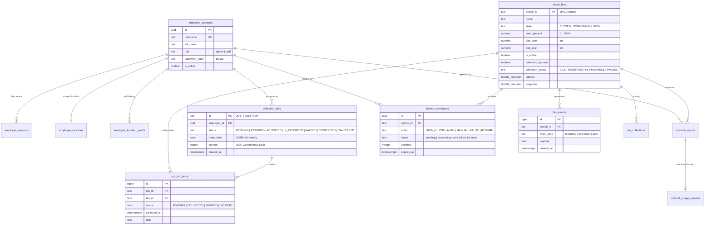

# 🗄️ TÀI LIỆU THIẾT KẾ CƠ SỞ DỮ LIỆU & CÁC CASE TRỌNG YẾU TẦNG BACKEND
## HỆ THỐNG QUẢN TRỊ & ĐIỀU PHỐI SMARTWASTE (BÁM SÁT 100% PRODUCTION CODEBASE)

> **Mục tiêu tài liệu:** Cung cấp tài liệu kỹ thuật chuyên sâu về **Cơ sở dữ liệu Supabase PostgreSQL** và **Kiến trúc các Case Xử lý Trọng yếu Tầng Backend** nhằm phục vụ:
> 1. Thuyết minh kiến trúc Dữ liệu & Backend trước Hội đồng / Giảng viên hướng dẫn.
> 2. Tra cứu chính xác từng bảng, cột, kiểu dữ liệu, ràng buộc (Constraints), Stored Procedures (RPCs).
> 3. Chứng minh cơ chế xử lý tranh chấp dữ liệu (OCC Concurrency Lock), bảo toàn giao dịch ACID và phân luồng Realtime.

---

## 📑 MỤC LỤC TỔNG QUAN

- [PHẦN I: THIẾT KẾ CƠ SỞ DỮ LIỆU SUPABASE POSTGRESQL CHUYÊN SÂU](#phần-i-thiết-kế-cơ-sở-dữ-liệu-supabase-postgresql-chuyên-sâu)
  - [1. Sơ đồ Thực thể Quan hệ (ERD - Entity Relationship Diagram)](#1-sơ-đồ-thực-thể-quan-hệ-erd---entity-relationship-diagram)
  - [2. Chi tiết 12 Bảng Dữ liệu (Schema, Columns, Constraints, Indexes)](#2-chi-tiết-12-bảng-dữ-liệu-schema-columns-constraints-indexes)
  - [3. Danh mục Stored Procedures (PL/pgSQL RPCs) & Transaction Scope](#3-danh-mục-stored-procedures-plpgsql-rpcs--transaction-scope)
  - [4. Cơ chế Khóa Lạc quan (Optimistic Concurrency Control - OCC)](#4-cơ-chế-khóa-lạc-quan-optimistic-concurrency-control---occ)
  - [5. Phân vùng Bộ nhớ Tệp (Supabase Storage Buckets)](#5-phân-vùng-bộ-nhớ-tệp-supabase-storage-buckets)
- [PHẦN II: CÁC CASE NGHIỆP VỤ TRỌNG YẾU TẦNG BACKEND](#phần-ii-các-case-nghiệp-vụ-trọng-yếu-tầng-backend)
  - [Case BE-01: Pipeline Tiếp nhận Telemetry & Đệm Bộ nhớ (StateStore RAM Cache)](#case-be-01-pipeline-tiếp-nhận-telemetry--đệm-bộ-nhớ-statestore-ram-cache)
  - [Case BE-02: Động cơ Điều phối & Tối ưu Tuyến đường OSRM TSP](#case-be-02-động-cơ-điều-phối--tối-ưu-tuyến-đường-osrm-tsp)
  - [Case BE-03: Chuyển giao & Hủy ca An toàn với Khóa OCC Version](#case-be-03-chuyển-giao--hủy-ca-an-toàn-với-khóa-occ-version)
  - [Case BE-04: Liveness Worker Giám sát Ngoại tuyến Tự động](#case-be-04-liveness-worker-giám-sát-ngoại-tuyến-tự-động)
  - [Case BE-05: Bắt tay Xác nhận Thu gom 2 Chiều & Idempotency](#case-be-05-bắt-tay-xác-nhận-thu-gom-2-chiều--idempotency)
  - [Case BE-06: Pipeline Tiếp nhận Báo cáo Sự cố & Khóa Thùng Khẩn cấp](#case-be-06-pipeline-tiếp-nhận-báo-cáo-sự-cố--khóa-thùng-khẩn-cấp)
  - [Case BE-07: Điều phối Nạp Firmware OTA Dual-Partition Fail-Safe](#case-be-07-điều-phối-nạp-firmware-ota-dual-partition-fail-safe)
  - [Case BE-08: Hàng đợi Lệnh Thiết bị Phân tán (Device Commands Queue)](#case-be-08-hàng-đợi-lệnh-thiết-bị-phân-tán-device-commands-queue)

---

# PHẦN I: THIẾT KẾ CƠ SỞ DỮ LIỆU SUPABASE POSTGRESQL CHUYÊN SÂU

## 1. SƠ ĐỒ THỰC THỂ QUAN HỆ (ERD - ENTITY RELATIONSHIP DIAGRAM)



---

## 2. CHI TIẾT 12 BẢNG DỮ LIỆU (DATABASE DICTIONARY)

### 2.1 Bảng `employee_accounts` (Tài khoản & Phân quyền Nhân sự)
* **Khóa chính**: `id (UUID, default: gen_random_uuid())`
* **Mục đích**: Quản lý thông tin đăng nhập, chức vụ và trạng thái hoạt động của Admin và Tài xế.

| Cột (Column) | Kiểu dữ liệu | Ràng buộc (Constraints) | Ý nghĩa nghiệp vụ |
| :--- | :--- | :--- | :--- |
| `id` | `UUID` | `PRIMARY KEY` | Định danh duy nhất nhân viên |
| `full_name` | `TEXT` | `NOT NULL, length >= 2` | Họ và tên đầy đủ |
| `username` | `TEXT` | `NOT NULL, UNIQUE, regex ^[a-z0-9._-]{3,32}$` | Tên đăng nhập hệ thống |
| `email` | `TEXT` | `NULLABLE, UNIQUE (case-insensitive)` | Email liên hệ |
| `password_hash` | `TEXT` | `NOT NULL` | Mật khẩu băm chuẩn bcrypt |
| `role` | `TEXT` | `NOT NULL, check in ('admin', 'staff')` | Vai trò quyền hạn |
| `is_active` | `BOOLEAN`| `NOT NULL, default: true` | Trạng thái kích hoạt tài khoản |
| `deleted_at` | `TIMESTAMPTZ`| `NULLABLE` | Hỗ trợ xóa mềm (Soft Delete) |
| `last_login` | `TIMESTAMPTZ`| `NULLABLE` | Thời điểm đăng nhập gần nhất |
| `created_at` | `TIMESTAMPTZ`| `NOT NULL, default: clock_timestamp()` | Thời điểm tạo tài khoản |

---

### 2.2 Bảng `employee_sessions` (Phiên Đăng Nhập Trượt 8 Giờ)
* **Khóa chính**: `token_hash (TEXT)`
* **Mục đích**: Lưu trữ mã băm phiên đăng nhập, hỗ trợ Sliding Session $8\text{h}$ và thu hồi phiên tức thì khi đăng xuất.

| Cột (Column) | Kiểu dữ liệu | Ràng buộc (Constraints) | Ý nghĩa nghiệp vụ |
| :--- | :--- | :--- | :--- |
| `token_hash` | `TEXT` | `PRIMARY KEY` | Mã SHA-256 của Session Token |
| `employee_id`| `UUID` | `NOT NULL, REFERENCES employee_accounts(id) ON DELETE CASCADE` | Khóa ngoại trỏ đến nhân viên |
| `expires_at` | `TIMESTAMPTZ`| `NOT NULL` | Thời hạn hết hiệu lực phiên ($8\text{h}$) |
| `created_at` | `TIMESTAMPTZ`| `NOT NULL, default: clock_timestamp()` | Thời điểm sinh phiên |

---

### 2.3 Bảng `smart_bins` (Thực Thể Thùng Rác Thông Minh IoT)
* **Khóa chính**: `device_id (TEXT - Chuẩn hóa theo MAC Address)`
* **Mục đích**: Lưu trữ trạng thái vật lý, mức rác, tọa độ GPS và trạng thái điều phối của từng thùng rác.

| Cột (Column) | Kiểu dữ liệu | Ràng buộc (Constraints) | Ý nghĩa nghiệp vụ |
| :--- | :--- | :--- | :--- |
| `device_id` | `TEXT` | `PRIMARY KEY, regex ^[A-Za-z0-9_-]{1,64}$` | Mã định danh phần cứng (MAC) |
| `name` | `TEXT` | `NOT NULL, default: 'Thùng rác mới'` | Tên hiển thị trên bản đồ |
| `location` | `TEXT` | `NOT NULL, default: 'Chưa cập nhật vị trí'`| Địa chỉ vị trí đặt thùng |
| `state` | `TEXT` | `NOT NULL, check in ('CLOSED', 'CONFIRMING', 'OPEN')` | Trạng thái nắp cơ khí |
| `control_mode`| `TEXT` | `NOT NULL, check in ('AUTO', 'MANUAL')` | Chế độ điều khiển tự động / tay |
| `servo_angle`| `SMALLINT` | `NOT NULL, default: 0` | Góc quay hiện tại của Servo ($0^\circ - 90^\circ$) |
| `dist_user` | `NUMERIC(8,2)`| `NOT NULL, default: 0` | Khoảng cách người dùng (cm) |
| `dist_level` | `NUMERIC(8,2)`| `NOT NULL, default: 0` | Khoảng cách từ cảm biến tới rác (cm)|
| `level_percent`| `NUMERIC(5,2)`| `NOT NULL, check between 0 and 100` | Mức rác hiện tại ($0\% - 100\%$) |
| `is_online` | `BOOLEAN` | `NOT NULL, default: false` | Trạng thái kết nối trực tuyến |
| `collection_status`| `TEXT` | `NOT NULL, check in ('IDLE', 'RESERVED', 'IN_PROGRESS', 'PAUSED')`| Trạng thái điều phối thu gom |
| `collection_employee_id`| `UUID`| `NULLABLE, REFERENCES employee_accounts(id)`| Tài xế đang phụ trách thùng này |
| `collection_paused`| `BOOLEAN`| `NOT NULL, default: false` | Cờ tạm dừng phục vụ do sự cố |
| `latitude` | `DOUBLE PRECISION`| `check between -90 and 90` | Tọa độ Vĩ độ WGS84 |
| `longitude` | `DOUBLE PRECISION`| `check between -180 and 180` | Tọa độ Kinh độ WGS84 |
| `last_seen` | `TIMESTAMPTZ`| `NOT NULL, default: clock_timestamp()` | Lần cuối gửi bản tin Telemetry |

---

### 2.4 Bảng `collection_jobs` & `job_bin_items` (Ca Thu Gom & Chi Tiết Lộ Trình)
* **Khóa chính**: `collection_jobs.id (TEXT)` & `job_bin_items.id (BIGINT IDENTITY)`
* **Mục đích**: Quản lý nhiệm vụ thu gom theo cụm, lưu trữ kết quả định tuyến OSRM và bảo vệ đồng thời qua cột `version`.

| Bảng | Cột (Column) | Kiểu dữ liệu | Ràng buộc / Ý nghĩa |
| :--- | :--- | :--- | :--- |
| `collection_jobs` | `id` | `TEXT (PK)` | Mã ca (`JOB_1724058912345`) |
| `collection_jobs` | `employee_id` | `UUID (FK)` | Tài xế được gán phụ trách |
| `collection_jobs` | `status` | `TEXT` | `PENDING`, `ASSIGNED`, `ACCEPTED`, `IN_PROGRESS`, `PAUSED`, `COMPLETED`, `CANCELLED` |
| `collection_jobs` | `target_bin_ids`| `TEXT[]` | Mảng danh sách các `device_id` cần thu gom |
| `collection_jobs` | `route_data` | `JSONB` | Tọa độ Waypoints và Encoded Polyline từ OSRM |
| `collection_jobs` | **`version`** | **`INTEGER`** | **Khóa lạc quan OCC Concurrency Lock (Mặc định: 1)** |
| `job_bin_items` | `id` | `BIGINT (PK)`| Khóa chính tự tăng |
| `job_bin_items` | `job_id` | `TEXT (FK)` | Trỏ đến ca thu gom (`ON DELETE CASCADE`) |
| `job_bin_items` | `bin_id` | `TEXT (FK)` | Trỏ đến thùng rác (`ON DELETE CASCADE`) |
| `job_bin_items` | `status` | `TEXT` | `PENDING`, `COLLECTED`, `SKIPPED`, `INCIDENT` |
| `job_bin_items` | `collected_at` | `TIMESTAMPTZ`| Thời điểm hoàn tất thu gom thùng này |

---

### 2.5 Bảng `device_commands` (Hàng Đợi Lệnh Điều Khiển Phân Tán)
* **Khóa chính**: `id (UUID)`
* **Mục đích**: Hàng đợi gửi lệnh xuống ESP32 có cơ chế Worker Polling, tối đa 3 lần thử lại (`max_attempts = 3`) và timeout sau $30\text{s}$.

| Cột (Column) | Kiểu dữ liệu | Ràng buộc (Constraints) | Ý nghĩa nghiệp vụ |
| :--- | :--- | :--- | :--- |
| `id` | `UUID` | `PRIMARY KEY` | Mã lệnh điều khiển |
| `device_id` | `TEXT` | `NOT NULL, REFERENCES smart_bins(device_id)` | Thùng rác nhận lệnh |
| `action` | `TEXT` | `check in ('OPEN', 'CLOSE', 'AUTO', 'MANUAL', 'PAUSE', 'RESUME')`| Hành động điều khiển |
| `status` | `TEXT` | `check in ('pending', 'processing', 'sent', 'done', 'failed', 'timeout')`| Vòng đời thực thi lệnh |
| `attempts` | `INTEGER` | `NOT NULL, default: 0` | Số lần đã gửi thử |
| `max_attempts`| `INTEGER` | `NOT NULL, default: 3` | Giới hạn số lần thử lại |
| `expires_at` | `TIMESTAMPTZ`| `NOT NULL, default: clock_timestamp() + 30s` | Thời hạn hủy lệnh |
| `acknowledged_at`| `TIMESTAMPTZ`| `NULLABLE` | Thời điểm nhận Hardware ACK từ ESP32 |

---

### 2.6 Bảng `incident_reports` & `incident_image_uploads` (Báo Cáo Sự Cố Hiện Trường)
* **Mục đích**: Ghi nhận sự cố hư hỏng/kẹt nắp/cháy rác kèm ảnh chụp thực địa và đường dẫn ảnh có chữ ký (Signed URL).

| Cột (Column) | Kiểu dữ liệu | Ý nghĩa nghiệp vụ |
| :--- | :--- | :--- |
| `incident_reports.id` | `BIGINT (PK)` | Mã báo cáo sự cố |
| `incident_reports.device_id` | `TEXT (FK)` | Thùng rác phát sinh sự cố |
| `incident_reports.employee_id`| `UUID (FK)` | Tài xế báo cáo |
| `incident_reports.reason` | `TEXT (3-120 chars)`| Lý do (Kẹt nắp, cháy rác, vỡ vỏ, mất cảm biến) |
| `incident_reports.proof_image_url`| `TEXT` | Đường dẫn ảnh minh chứng trong Storage Bucket |
| `incident_reports.status` | `TEXT` | `NEW`, `IN_REVIEW`, `RESOLVED` |

---

## 3. DANH MỤC STORED PROCEDURES (PL/PGSQL RPCS) & TRANSACTION SCOPE

Tất cả các Stored Procedures trong hệ thống đều chạy ở chế độ **`SECURITY DEFINER`**, thiết lập cố định `search_path = public, extensions` và bao bọc toàn bộ luồng trong một **Giao dịch Nguyên tử (Atomic DB Transaction)**:

```
+-----------------------------+----------------------------------------------------------------------------------------------------+
| Tên Stored Procedure (RPC)  | Logic Giao Dịch & Khóa Bảo Vệ Dữ Liệu                                                             |
+-----------------------------+----------------------------------------------------------------------------------------------------+
| `rpc_assign_job`            | • Khóa tài xế: Kiểm tra tài xế chưa có ca ACTIVE nào khác (Tránh gán đè).                          |
|                             | • Chèn 1 dòng vào `collection_jobs` kèm route OSRM.                                                |
|                             | • Chèn N dòng vào `job_bin_items`.                                                                 |
|                             | • Cập nhật N thùng rác sang trạng thái `collection_status = 'RESERVED'`.                           |
+-----------------------------+----------------------------------------------------------------------------------------------------+
| `rpc_reassign_job`          | • Kiểm tra khóa lạc quan: `WHERE id = p_old_job_id AND version = p_old_version`.                   |
|                             | • Hủy ca cũ (`CANCELLED`), giải phóng các thùng đã thu gom xong.                                    |
|                             | • Tạo ca mới (`JOB_NEW`) gán cho tài xế mới với danh sách các thùng chưa gom còn lại.              |
+-----------------------------+----------------------------------------------------------------------------------------------------+
| `rpc_driver_collect_bin`    | • Cập nhật dòng tương ứng trong `job_bin_items` thành `status = 'COLLECTED'`.                      |
|                             | • Reset thùng rác trong `smart_bins`: `level_percent = 0`, `collection_status = 'IDLE'`.            |
|                             | • Đếm số lượng thùng còn lại trong ca: Nếu đã gom hết -> Tự động chuyển ca sang `COMPLETED`.       |
|                             | • Kiểm tra tính Idempotent: Nếu thùng đã gom trước đó -> Trả về kết quả thành công cũ an toàn.   |
+-----------------------------+----------------------------------------------------------------------------------------------------+
| `rpc_cancel_job`            | • Kiểm tra `version`: `WHERE id = p_job_id AND version = p_expected_version`.                      |
|                             | • Chuyển ca sang `CANCELLED`.                                                                      |
|                             | • Mở khóa tất cả các thùng đang ở trạng thái `RESERVED` quay về `IDLE`.                            |
+-----------------------------+----------------------------------------------------------------------------------------------------+
```

---

## 4. CƠ CHẾ KHÓA LẠC QUAN (OPTIMISTIC CONCURRENCY CONTROL - OCC)

### 4.1 Bản chất Kỹ thuật & Đoạn Code SQL Triển khai
Để ngăn ngừa hiện tượng **Race Condition** (ví dụ: 2 Quản trị viên cùng điều phối hoặc chuyển giao 1 ca gom rác vào cùng 1 thời điểm), hệ thống sử dụng cột `version (INTEGER)`:

```sql
-- Đoạn mã nguồn thực tế trong rpc_reassign_job:
update public.collection_jobs
set status = 'CANCELLED',
    cancelled_at = clock_timestamp(),
    version = version + 1
where id = p_old_job_id
  and version = p_old_version
returning * into v_old_job;

if not found then
    raise exception 'Xung đột dữ liệu (OCC Conflict): Ca làm việc đã bị chỉnh sửa bởi một tiến trình khác!';
end if;
```

* **Luồng 1 (Admin A)**: Gửi request với `version = 1` $\to$ Cập nhật thành công $\to$ `version` tăng lên $2$.
* **Luồng 2 (Admin B)**: Gửi request chậm hơn vài mili-giây với `version = 1` $\to$ Điều kiện `where version = 1` không còn khớp $\to$ Không có dòng nào bị ảnh hưởng $\to$ Database chủ động ném ngoại lệ $\to$ Backend phản hồi lỗi `409 Conflict` về Web UI.

---

## 5. PHÂN VÙNG BỘ NHỚ TỆP (SUPABASE STORAGE BUCKETS)

1. **Bucket `incident-images` (Private Bucket)**:
   - Lưu ảnh chụp sự cố hiện trường do tài xế gửi lên từ Android App.
   - Truy cập thông qua **Signed URL** có thời hạn ngắn (Private Bucket) để đảm bảo quyền riêng tư.
2. **Bucket `firmware-binaries` (Private / Restricted Bucket)**:
   - Lưu các file build nhị phân của Firmware ESP32 (`firmware_v1.2.0.bin`).
   - Backend sinh **Signed Download URL có hiệu lực chính xác $60\text{ phút}$** gửi qua MQTT cho ESP32 tải luồng nhị phân an toàn.

---

# PHẦN II: CÁC CASE NGHIỆP VỤ TRỌNG YẾU TẦNG BACKEND

---

## CASE BE-01: PIPELINE TIẾP NHẬN TELEMETRY & ĐỆM BỘ NHỚ (STATESTORE RAM CACHE)

```
[ ESP32 Node 01..1000 ] ──(MQTT QoS 0/1: wastebin/{id}/status)──▶ [ Aedes Broker (Port 1883) ]
                                                                             │
                                                                             ▼
                                                                [ onStatusPayload() Handler ]
                                                                             │
                                              ┌──────────────────────────────┴──────────────────────────────┐
                                              ▼                                                             ▼
                             [ In-Memory StateStore (RAM) ]                                    [ Broadcast WebSocket (60fps) ]
                             • latestBins.set(binId, data)                                     • io.emit('binData', data)
                             • updateLevelHistoryCache()                                       • io.emit('binOverfullAlert')
                                              │
                                              ▼
                             [ Throttled / Batch DB Worker ]
                             • Ghi nhận bin_events khi đổi ngưỡng (>= 70%, >= 85%)
                             • Giảm tải 90% câu lệnh I/O cho Supabase PostgreSQL
```

* **Vấn đề giải quyết**: Nếu $1000$ thùng rác gửi tin mỗi giây $\to$ Tương đương $1000\text{ write queries/s}$, sẽ làm cạn kiệt Connection Pool của Supabase.
* **Giải pháp trong Code ([stateStore.js](file:///c:/Users/Phucx/Downloads/waste/server/backend/src/core/stateStore.js) & [mqttBroker.js](file:///c:/Users/Phucx/Downloads/waste/server/backend/src/mqtt/mqttBroker.js))**:
  - Toàn bộ dữ liệu $1000\text{ms}$ được ghi đè tức thời vào `Map<String, Object> latestBins` trong RAM Node.js.
  - Web Dashboard kết nối WebSocket nhận stream từ RAM cực mượt mà không cần truy vấn DB.
  - Backend chỉ ghi DB khi trạng thái thùng có biến động lớn hoặc theo chu kỳ tổng hợp.

---

## CASE BE-02: ĐỘNG CƠ ĐIỀU PHỐI & TỐI ƯU TUYẾN ĐƯỜNG OSRM TSP

* **File nguồn**: [dispatchService.js](file:///c:/Users/Phucx/Downloads/waste/server/backend/src/services/dispatchService.js) & [routingService.js](file:///c:/Users/Phucx/Downloads/waste/server/backend/src/services/routingService.js)
* **Luồng xử lý**:

```
1. Admin chọn danh sách 5 thùng rác [BIN_01, BIN_04, BIN_07, BIN_12, BIN_19]
2. Backend lấy vị trí hiện tại của Tài xế từ RAM (stateStore.employeeLocationsCache)
3. Backend trích xuất tọa độ GPS của 5 thùng rác từ RAM (stateStore.latestBins)
4. Xây dựng mảng tọa độ Coordinates: [[DriverLng, DriverLat], [Bin1Lng, Bin1Lat], ...]
5. Gọi OSRM Routing Engine API: /trip/v1/driving/coords?roundtrip=false&source=first
6. OSRM giải bài toán TSP (Traveling Salesman Problem) -> Trả về:
   - Encoded Polyline String (Tập hợp hàng ngàn điểm uốn khúc trên đường phố)
   - Tổng cự ly dự kiến (distanceMeters)
   - Tổng thời gian ước tính (durationSeconds)
7. Backend gọi Stored RPC 'rpc_assign_job' lưu ca và route_data vào PostgreSQL
8. Backend phát sóng Socket 'jobAssigned' tới kênh riêng của tài xế: room('employee_<id>')
```

---

## CASE BE-03: CHUYỂN GIAO & HỦY CA AN TOÀN VỚI KHÓA OCC VERSION

* **File nguồn**: [dispatchService.js](file:///c:/Users/Phucx/Downloads/waste/server/backend/src/services/dispatchService.js) (Line 53-136)
* **Tình huống thực tế**: Xe thu gom của Tài xế A bị nổ lốp / hỏng động cơ khi mới hoàn thành $2/5$ thùng. Quản trị viên cần chuyển giao $3$ thùng còn lại cho Tài xế B.
* **Luồng xử lý 2 giai đoạn (2-Phase Reassignment)**:
  1. **Phase 1 (Database Atomic Transition)**:
     - Gọi `rpc_reassign_job` truyền vào `oldJobId` và `oldJob.version`.
     - DB hủy ca cũ (`CANCELLED`), trích xuất mảng các `remaining_bin_ids` chưa thu gom, tạo ca mới cho Tài xế B.
  2. **Phase 2 (Route Recalculation)**:
     - Backend lấy tọa độ hiện tại của Tài xế B và $3$ thùng còn lại.
     - Gọi OSRM tính toán Polyline đường đi mới bắt đầu từ vị trí của Tài xế B.
     - Patch ngược `route_data` mới vào DB và bắn Socket thông báo cho cả 2 tài xế.

---

## CASE BE-04: LIVENESS WORKER GIÁM SÁT NGOẠI TUYẾN TỰ ĐỘNG

* **File nguồn**: [binLivenessWorker.js](file:///c:/Users/Phucx/Downloads/waste/server/backend/src/jobs/binLivenessWorker.js)
* **Cơ chế hoạt động**:
  - Chạy nền chu kỳ mỗi $5000\text{ms}$.
  - So sánh `last_seen` của từng thùng rác với thời gian thực:
    $$\Delta t = \text{now}() - \text{last\_seen}$$
  - Nếu $\Delta t > 15\text{s}$ (`bin_offline_timeout_seconds`):
    - Đánh dấu `is_online = false` trong RAM và DB.
    - Phát sự kiện WebSocket `binData` để Marker trên bản đồ Web Admin chuyển sang màu Xám.
  - Tương tự, nếu tài xế không gửi tọa độ GPS quá $120\text{s}$ $\to$ Đánh dấu tài xế `OFFLINE`.

---

## CASE BE-05: BẮT TAY XÁC NHẬN THU GOM 2 CHIỀU & IDEMPOTENCY

* **File nguồn**: [dispatchService.js](file:///c:/Users/Phucx/Downloads/waste/server/backend/src/services/dispatchService.js) (Line 260-307)
* **Mô hình Handshake 4 bước**:

```
[ Mobile Driver ]                [ Backend Express ]               [ Supabase PostgreSQL ]
       │                                  │                                  │
       │ 1. POST /collect-bin             │                                  │
       │ { jobId, binId, note }           │                                  │
       ├─────────────────────────────────▶│                                  │
       │                                  │ 2. Validate Token & GPS <= 15m   │
       │                                  │ 3. CALL rpc_driver_collect_bin   │
       │                                  ├─────────────────────────────────▶│
       │                                  │    • Item status -> 'COLLECTED'  │
       │                                  │    • SmartBin level -> 0%        │
       │                                  │    • Check if already collected  │
       │                                  │◀─────────────────────────────────┤
       │                                  │ 4. Nhận kết quả { allDone,       │
       │                                  │                   idempotent }   │
       │                                  │                                  │
       │                                  │ 5. MQTT Publish Close Lid        │
       │                                  │    wastebin/{id}/cmd {"CLOSE"}   │
       │ 6. Response HTTP 200 OK          │                                  │
       │◀─────────────────────────────────┤                                  │
       │ { ok: true, allDone, idempotent, │ 7. Socket Emit: 'jobUpdated'     │
       │   job: enrichedProgress }        ├─────────────────────────────────▶│ Web Admin Live KPI
```

* **Xử lý Idempotent**: Nếu mạng bị đứt lúc bước (6) đang truyền $\to$ Mobile bấm lại lần 2 $\to$ RPC nhận diện thùng này đã `COLLECTED` $\to$ Trả về `idempotent: true` kèm tiến độ cũ mà không báo lỗi hay trừ trùng lặp dữ liệu.

---

## CASE BE-06: PIPELINE TIẾP NHẬN BÁO CÁO SỰ CỐ & KHÓA THÙNG KHẨN CẤP

* **File nguồn**: [incidentService.js](file:///c:/Users/Phucx/Downloads/waste/server/backend/src/services/incidentService.js)
* **Luồng xử lý**:
  1. Tài xế chụp ảnh hiện trường $\to$ Upload lên Supabase Storage qua Signed URL.
  2. Mobile gửi POST `/api/incidents` kèm `deviceId`, `reason`, `description`, `proofImageUrl`.
  3. Backend ghi nhận bản ghi mới vào bảng `incident_reports` với trạng thái `NEW`.
  4. Backend tự động cập nhật thùng rác trong `smart_bins`: `collection_paused = true`.
  5. Phát sự kiện WebSocket `incidentReported` kèm chuông báo động trên Web Admin.
  6. Thùng rác bị khóa sẽ tự động bị loại khỏi các thuật toán tạo ca gom OSRM tiếp theo cho đến khi Kỹ thuật viên xử lý và Admin bấm `RESUME`.

---

## CASE BE-07: ĐIỀU PHỐI NẠP FIRMWARE OTA DUAL-PARTITION FAIL-SAFE

* **File nguồn**: [otaService.js](file:///c:/Users/Phucx/Downloads/waste/server/backend/src/services/otaService.js) & [firmwareService.js](file:///c:/Users/Phucx/Downloads/waste/server/backend/src/services/firmwareService.js)
* **Luồng xử lý Orchestration**:

```
1. Admin tải lên file firmware.bin (v1.2.0)
2. Backend tính mã băm SHA-256 Checksum của file:
   sha256 = crypto.createHash('sha256').update(fileBuffer).digest('hex')
3. Upload file lên Storage Bucket và sinh Signed URL có hạn 60 phút
4. Admin tạo Deployment chọn danh sách 10 thùng rác cần nâng cấp
5. Backend gửi lệnh MQTT tới từng thiết bị:
   Topic: wastebin/{deviceId}/ota
   Payload: { "version": "v1.2.0", "url": "https://signed-url...", "sha256": "8a3f...", "sizeBytes": 1249280 }
6. ESP32 tải HTTPS stream vào phân vùng app1 -> So khớp Checksum SHA-256
7. ESP32 định kỳ gửi tiến độ lên topic wastebin/{deviceId}/ota/status:
   {"status": "DOWNLOADING", "progress": 45} -> Backend hứng và bắn Socket cập nhật Progress Bar trên Web
8. ESP32 nạp xong -> Reboot Bootloader sang app1 -> Báo cáo status: "SUCCESS"
```

---

## CASE BE-08: HÀNG ĐỢI LỆNH THIẾT BỊ PHÂN TÁN (DEVICE COMMANDS QUEUE)

* **File nguồn**: [binService.js](file:///c:/Users/Phucx/Downloads/waste/server/backend/src/services/binService.js)
* **Cơ chế phân tán (Distributed Queue Pattern)**:
  - Khi Admin bấm "Mở nắp từ xa" trên Web, lệnh được ghi vào bảng `device_commands` với `status = 'pending'`.
  - Backend lấy `commandId`, đóng gói JSON và gửi qua MQTT Topic `wastebin/{deviceId}/cmd`.
  - Cập nhật trạng thái lệnh thành `status = 'sent'`.
  - Khi ESP32 thực thi xoay servo xong, nó gửi gói tin Telemetry kèm trường `commandAckId: "CMD_UUID"`.
  - Backend bắt được `commandAckId` $\to$ Cập nhật `device_commands`: `status = 'done'`, `acknowledged_at = clock_timestamp()`.
  - Nếu sau $30\text{s}$ không nhận được ACK $\to$ Worker quét hàng đợi đánh dấu `status = 'timeout'`.

---

## 🎯 TỔNG KẾT BẢO VỆ ĐỒ ÁN VỀ CSDL & BACKEND

Hệ thống Cơ sở dữ liệu và Backend của **SmartWaste** được thiết kế đạt chuẩn **Enterprise Architecture**:
* **Bảo toàn dữ liệu tuyệt đối (ACID & OCC)**: Khóa lạc quan `version` và các Stored RPCs loại bỏ 100% rủi ro xung đột dữ liệu.
* **Hiệu năng cực cao (StateStore RAM Cache)**: Tách bạch giữa luồng dữ liệu Telemetry tốc độ cao ($1000\text{ms}$) và luồng lưu trữ bền vững DB.
* **Bảo mật & Phân quyền đa tầng**: JWT Authentication, MQTT Topic Isolation ACL và Signed URL an toàn.
