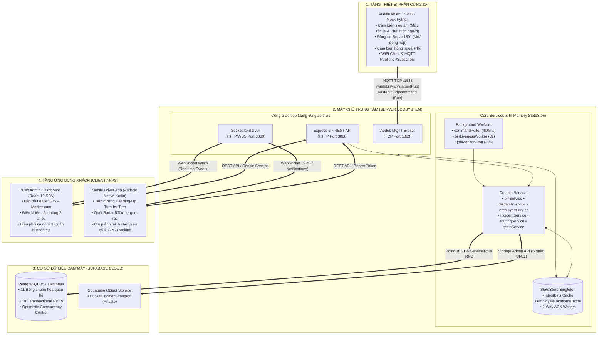

# 📚 HỆ THỐNG TÀI LIỆU KỸ THUẬT DỰ ÁN SMARTWASTE
## (SMARTWASTE URBAN IOT PLATFORM DOCUMENTATION HUB)

> **Hệ sinh thái Quản trị & Điều phối Thu gom Rác Thông minh Đô thị — SmartWaste Platform**  
> **Phiên bản:** 1.0.0 • **Chuẩn Kỹ thuật:** Enterprise Senior Architecture Specification 2026

---

## 🧭 BẢN ĐỒ ĐIỀU HƯỚNG TÀI LIỆU (DOCUMENTATION SITEMAP)

Hệ thống tài liệu kỹ thuật toàn diện được chuẩn hóa và phân tách thành 2 phân hệ chuyên biệt:

```
docs/
├── README.md                      ⭐ [BẠN ĐANG Ở ĐÂY] Trung tâm điều phối tài liệu dự án
│
├── server/
│   └── README.md                  📘 TÀI LIỆU MÁY CHỦ SERVER (BACKEND + FRONTEND WEB ADMIN)
│                                  • Kiến trúc 4 tầng & Multi-Protocol Concurrency (Express, Aedes MQTT, Socket.IO)
│                                  • Supabase PostgreSQL (11 bảng CSDL, 18+ Stored Procedures ACID, OCC)
│                                  • Đặc tả 100% RESTful APIs, WebSocket Events, Background Workers
│                                  • Frontend React 19 SPA, Leaflet GIS Map, Design Tokens & Cài đặt
│
└── mobile/
    └── README.md                  📱 TÀI LIỆU ỨNG DỤNG DI ĐỘNG (MOBILE DRIVER APP - ANDROID NATIVE)
                                   • Clean Architecture + MVI/MVVM, StateFlow, Coroutines, ViewBinding
                                   • Hệ thống Dẫn đường Heading-Up / Course-Up Navigation (Leaflet WebView Bridge)
                                   • Thuật toán Anti-Spin 360°, Dual-Stage Fallback, Tự động Reroute khi lệch >65m
                                   • Quét Radar 500m Self-Pick, Điều khiển nắp thùng IoT, Offline-First & Background Service
```

---

## 🚀 TRUY CẬP NHANH TÀI LIỆU CHI TIẾT

| Phân Hệ | Đường Dẫn Tài Liệu | Nội Dung Trọng Tâm |
| :--- | :--- | :--- |
| **🌐 Server (Backend + Frontend)** | [docs/server/README.md](file:///c:/Users/Phucx/Downloads/waste/docs/server/README.md) | Node.js 18+, Express 5.x, Aedes MQTT Broker :1883, Socket.IO :3000, Supabase PostgreSQL, Storage Signed URLs, OSRM GIS Engine, React 19 SPA, Leaflet Map. |
| **📱 Mobile App (Android Native)** | [docs/mobile/README.md](file:///c:/Users/Phucx/Downloads/waste/docs/mobile/README.md) | Kotlin 1.9+, Android SDK 34, Heading-Up Navigation 72% offset, Anti-Spin Accumulator, Retrofit 2, Socket.IO Realtime, FusedLocationProviderClient, Foreground Service. |

---

## 🏛️ SƠ ĐỒ KIẾN TRÚC TỔNG THỂ TOÀN HỆ SINH THÁI



---

> **SmartWaste Urban IoT Platform — Kiến trúc Kỹ thuật Tiêu chuẩn Doanh nghiệp 2026**
