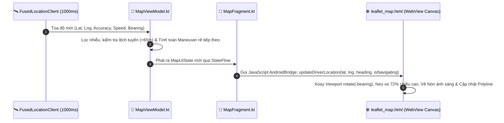

# 📱 TÀI LIỆU KỸ THUẬT TOÀN DIỆN ỨNG DỤNG DI ĐỘNG SMARTWASTE
## (SMARTWASTE DRIVER APP — ANDROID NATIVE ARCHITECTURE)

> **Hệ thống Điều hướng & Điều hành Thu gom Rác Thông minh Thực địa — SmartWaste Mobile Driver Platform**  
> **Kiến trúc:** Clean Architecture + MVI/MVVM (Model-View-Intent / Model-View-ViewModel) + Single Source of Truth  
> **Phiên bản:** 1.0.0 • **Tác giả:** Đội ngũ Kỹ sư Di động Cấp cao (Senior Android System Engineers)  
> **Nền tảng:** Android Native (Kotlin 1.9+, Android SDK 34 / Target API 34, Min SDK 24)

---

## 📑 MỤC LỤC

1. [TỔNG QUAN HỆ THỐNG & NGUYÊN LÝ THIẾT KẾ](#1-tổng-quan-hệ-thống--nguyên-lý-thiết-kế)
   - 1.1. [Giới thiệu ứng dụng SmartWaste Driver](#11-giới-thiệu-ứng-dụng-smartwaste-driver)
   - 1.2. [Sơ đồ Phân định Trách nhiệm (Clean Architecture Layers)](#12-sơ-đồ-phân-định-trách-nhiệm-clean-architecture-layers)
   - 1.3. [Bảng Công nghệ & Thư viện Cốt lõi](#13-bảng-công-nghệ--thư-viện-cốt-lõi)
2. [CẤU TRÚC THƯ MỤC & PHÂN TÁCH MODULE MÃ NGUỒN](#2-cấu-trúc-thư-mục--phân-tách-module-mã-nguồn)
   - 2.1. [Cây thư mục Android Project](#21-cây-thư-mục-android-project)
   - 2.2. [Chi tiết các gói mã nguồn (Package Breakdown)](#22-chi-tiết-các-gói-mã-nguồn-package-breakdown)
3. [HỆ THỐNG DẪN ĐƯỜNG HEADING-UP & BẢN ĐỒ GIS THỜI GIAN THỰC](#3-hệ-thống-dẫn-đường-heading-up--bản-đồ-gis-thời-gian-thực)
   - 3.1. [Kiến trúc Cầu nối Android-Leaflet WebView (Javascript Bridge)](#31-kiến-trúc-cầu-nối-android-leaflet-webview-javascript-bridge)
   - 3.2. [Thuật toán Neo Camera ở 72% Chiều cao Màn hình](#32-thuật-toán-neo-camera-ở-72-chiều-cao-màn-hình)
   - 3.3. [Thuật toán Chống Giật & Xoay Ngược 360° (Anti-Spin Engine)](#33-thuật-toán-chống-giật--xoay-ngược-360-anti-spin-engine)
   - 3.4. [Cơ chế Dự phòng Hướng lái Vận tốc (Dual-Stage Fallback)](#34-cơ-chế-dự-phòng-hướng-lái-vận-tốc-dual-stage-fallback)
   - 3.5. [Tự động Tính lại Tuyến khi Lệch đường (Auto-Reroute Engine >65m)](#35-tự-động-tính-lại-tuyến-khi-lệch-đường-auto-reroute-engine-65m)
   - 3.6. [Bù góc Xoay Marker (Counter-Rotation) & Nón Ánh Sáng (Light Cone)](#36-bù-góc-xoay-marker-counter-rotation--nón-ánh-sáng-light-cone)
4. [CHI TIẾT TOÀN BỘ CÁC PHÂN HỆ MÀN HÌNH & TÍNH NĂNG](#4-chi-tiết-toàn-bộ-các-phân-hệ-màn-hình--tính-năng)
   - 4.1. [Xác thực & Quản lý Phiên (`LoginActivity`)](#41-xác-thực--quản-lý-phiên-loginactivity)
   - 4.2. [Bảng Điều Khiển Trung Tâm (`HomeFragment`)](#42-bảng-điều-khiển-trung-tâm-homefragment)
   - 4.3. [Bản Đồ & Chế độ Dẫn đường (`MapFragment`)](#43-bản-đồ--chế-độ-dẫn-đường-mapfragment)
   - 4.4. [Quản lý & Thực thi Ca Gom (`JobsFragment`, `JobExecutionActivity`)](#44-quản-lý--thực-thi-ca-gom-jobsfragment-jobexecutionactivity)
   - 4.5. [Quét Radar 500m & Tự tạo ca (`Radar Self-Pick`)](#45-quét-radar-500m--tự-tạo-ca-radar-self-pick)
   - 4.6. [Báo cáo Sự cố Hiện trường & Chụp ảnh (`IncidentReportActivity`)](#46-báo-cáo-sự-cố-hiện-trường--chụp-ảnh-incidentreportactivity)
   - 4.7. [Trung tâm Thông báo Thời gian thực (`NotificationCenterActivity`)](#47-trung-tâm-thông-báo-thời-gian-thực-notificationcenteractivity)
   - 4.8. [Hồ sơ Tài xế & Thống kê Ca làm việc (`ProfileFragment`)](#48-hồ-sơ-tài-xế--thống-kê-ca-làm-việc-profilefragment)
5. [DỊCH VỤ CHẠY NGẦM & KHẢ NĂNG HOẠT ĐỘNG NGOẠI TUYẾN (OFFLINE-FIRST)](#5-dịch-vụ-chạy-ngầm--khả-năng-hoạt-động-ngoại-tuyến-offline-first)
   - 5.1. [Foreground Service Định vị GPS (`LocationTrackingService`)](#51-foreground-service-định-vị-gps-locationtrackingservice)
   - 5.2. [Cơ chế Throttling GPS Sync (>10m hoặc 15s)](#52-cơ-chế-throttling-gps-sync-10m-hoặc-15s)
   - 5.3. [Khả năng Hoạt động Ngoại tuyến & Đồng bộ GPS Batch Sync](#53-khả-năng-hoạt-động-ngoại-tuyến--đồng-bộ-gps-batch-sync)
6. [ĐẶC TẢ HỢP ĐỒNG GIAO TIẾP MẠNG & DỮ LIỆU (NETWORK & API CONTRACT)](#6-đặc-tả-hợp-đồng-giao-tiếp-mạng--dữ-liệu-network--api-contract)
   - 6.1. [Retrofit Client & Auth Interceptor](#61-retrofit-client--auth-interceptor)
   - 6.2. [Socket.IO Client Realtime Management](#62-socketio-client-realtime-management)
   - 6.3. [Bảng Tra cứu API Endpoints Mobile sử dụng](#63-bảng-tra-cứu-api-endpoints-mobile-sử-dụng)
7. [HƯỚNG DẪN CÀI ĐẶT, BUILD & KIỂM THỬ (BUILD & RUN GUIDE)](#7-hướng-dẫn-cài-đặt-build--kiểm-thử-build--run-guide)
   - 7.1. [Yêu cầu Môi trường](#71-yêu-cầu-môi-trường)
   - 7.2. [Cấu hình `local.properties` & IP Máy chủ](#72-cấu-hình-localproperties--ip-máy-chủ)
   - 7.3. [Các lệnh Gradle Build & Cài đặt APK](#73-các-lệnh-gradle-build--cài-đặt-apk)

---

## 1. TỔNG QUAN HỆ THỐNG & NGUYÊN LÝ THIẾT KẾ

### 1.1. Giới thiệu ứng dụng SmartWaste Driver

**SmartWaste Driver App** là ứng dụng di động Android Native chuyên dụng dành cho tài xế và nhân viên thu gom rác thải đô thị. Ứng dụng giải quyết bài toán điều hành thực địa với các tiêu chuẩn cao cấp:
- **Dẫn đường Turn-by-Turn chuyên nghiệp:** Chế độ bản đồ tự xoay theo hướng di chuyển của xe (**Heading-Up / Course-Up**), neo xe tại 72% chiều cao màn hình giúp tài xế quan sát hơn 70% cung đường phía trước.
- **Tối ưu hóa Lộ trình:** Nhận lộ trình đã được giải thuật bài toán người giao hàng (TSP/VRP) từ máy chủ, vẽ Polyline chính xác đến từng mét và tự động tính lại đường (**Auto-Reroute**) khi đi lệch lộ trình $>65\text{m}$.
- **Quét Radar Thu gom Khẩn cấp (500m Radar Self-Pick):** Tự động quét tìm các thùng rác đang quá tải trong bán kính 500m xung quanh xe và cho phép tài xế chủ động tạo ca gom ngay tại hiện trường.
- **Điều khiển Phần cứng IoT từ xa:** Cho phép tài xế ra lệnh mở nắp thùng từ cabin xe trước khi đến điểm thu gom.
- **Báo cáo Sự cố Kèm Ảnh:** Chụp ảnh hiện trường, tự động nén và tải lên Supabase Storage với Signed URLs bảo mật.
- **Định vị Chạy ngầm An toàn:** Android 14+ Foreground Service đảm bảo truyền tọa độ GPS về trung tâm điều hành liên tục mà không bị hệ điều hành tiêu diệt.

---

### 1.2. Sơ đồ Phân định Trách nhiệm (Clean Architecture Layers)

```
┌────────────────────────────────────────────────────────────────────────┐
│                          PRESENTATION LAYER                            │
│  Activities, Fragments, Custom Views, BottomSheets, ViewBinding        │
│  StateFlow Observers, Micro-Animations (Spring & Cubic-Bezier)         │
└───────────────────────────────────▲────────────────────────────────────┘
                                    │ UI State / User Actions
┌───────────────────────────────────┴────────────────────────────────────┐
│                             VIEWMODEL LAYER                            │
│  MapViewModel, JobsViewModel, HomeViewModel, ProfileViewModel          │
│  Immutable UiState Reducers, Off-Route Detectors, Bearing Smoothing    │
└───────────────────────────────────▲────────────────────────────────────┘
                                    │ Repositories & Domain Policies
┌───────────────────────────────────┴────────────────────────────────────┐
│                              DOMAIN LAYER                              │
│  MapStatePolicy, JobTransitionPolicy, ManeuverDerivation, PolylineMath │
└───────────────────────────────────▲────────────────────────────────────┘
                                    │ Data Operations & Network Ingestion
┌───────────────────────────────────┴────────────────────────────────────┐
│                              DATA LAYER                                │
│  Repositories (Auth, Bins, Jobs, Incident, Notification)               │
│  Remote: Retrofit2, OkHttp3 Interceptors, Socket.IO Realtime Client    │
│  Local: Encrypted SharedPrefs (AppConfig), Memory Cache, Room DB       │
│  Hardware: FusedLocationProviderClient (GPS, Speed, Bearing, Acc)      │
│  GIS Engine: Leaflet.js inside Accelerated WebView + Canvas Renderer   │
└────────────────────────────────────────────────────────────────────────┘
```

---

### 1.3. Bảng Công nghệ & Thư viện Cốt lõi

| Thành Phần | Công Nghệ / Thư Viện | Mục Đích Sử Dụng |
| :--- | :--- | :--- |
| **Ngôn ngữ Lập trình** | Kotlin 1.9+ | Ngôn ngữ chính, Type-safe, Null-safety tuyệt đối, Coroutines & Flow |
| **Hệ điều hành Mục tiêu** | Android 14 (API 34), Min SDK 24 | Hỗ trợ 99%+ thiết bị Android thực tế trên thị trường |
| **Kiến trúc UI** | MVI / MVVM + ViewBinding | Ràng buộc View an toàn, loại trừ hoàn toàn `findViewById` và NullPointer |
| **Xử lý Bất đồng bộ** | Kotlin Coroutines & `StateFlow` / `SharedFlow` | Quản lý luồng phản ứng nhanh, tự động hủy theo `lifecycleScope` |
| **Định vị Vệ tinh GPS** | Google Play Services `FusedLocationProviderClient` | Thu nhận tọa độ GPS tần số cao (1s), tối ưu tiêu thụ năng lượng |
| **Bản đồ & GIS Engine** | Leaflet.js bên trong Hardware-accelerated WebView | Xoay bản đồ 360° Heading-Up, vẽ Canvas Polyline mượt mà $60\text{ fps}$ |
| **Giao tiếp REST API** | Retrofit 2 + OkHttp 3 + Gson Converter | Gọi REST API, tự động inject JWT Bearer Token qua Interceptor |
| **Truyền thông Thời gian thực** | Socket.IO Client (Java Engine) | Nhận thông báo phân công ca, cảnh báo cháy/quá tải tức thì |
| **Bảo mật Cục bộ** | Encrypted SharedPreferences | Lưu trữ Token và thông tin phiên làm việc bảo mật |

---

## 2. CẤU TRÚC THƯ MỤC & PHÂN TÁCH MODULE MÃ NGUỒN

### 2.1. Cây thư mục Android Project

```
App_Smart_Waste/app/src/main/
├── assets/
│   ├── leaflet_map.html           # GIS Engine, Heading-Up Camera, Canvas, Anti-spin Accumulator
│   ├── leaflet.css                # Style tùy biến cho Marker, Pulse Radar, Light Cone
│   └── leaflet.js                 # Thư viện Leaflet lõi tối ưu hóa
│
├── java/com/example/app_smart_waste/
│   ├── core/                      # Các module nền tảng dùng chung
│   │   ├── location/              # Định vị GPS nền và bộ theo dõi FusedLocation
│   │   │   ├── GpsTracker.kt
│   │   │   └── LocationTrackingService.kt  # Android 14+ Foreground Service
│   │   ├── model/                 # Data Transfer Objects (DTO) & UI Models
│   │   │   ├── DataModels.kt      # JobDto, SmartBinDto, RouteStepDto, IncidentDto...
│   │   │   ├── SystemConfigDto.kt
│   │   │   └── UiState.kt         # Sealed Interface trạng thái UI (Loading, Success, Error)
│   │   ├── network/               # Tầng giao tiếp mạng
│   │   │   ├── ApiClient.kt       # Retrofit singleton với Auth Interceptor
│   │   │   ├── ApiService.kt      # Định nghĩa toàn bộ REST Endpoints
│   │   │   └── RealtimeManager.kt # Socket.IO client kết nối thời gian thực
│   │   ├── notification/          # Quản lý kênh thông báo hệ thống Android
│   │   │   └── NotificationChannels.kt
│   │   ├── storage/               # Lưu trữ cục bộ
│   │   │   └── AppConfig.kt       # Quản lý SharedPreferences, Token, Base URL
│   │   └── utils/                 # Tiện ích bổ trợ
│   │       └── TimeUtils.kt       # Định dạng ngày giờ chuẩn Việt Nam (UTC+7)
│   │
│   ├── data/                      # Tầng dữ liệu (Repository Pattern)
│   │   └── repository/
│   │       ├── AuthRepository.kt
│   │       ├── BinsAndIncidentRepositories.kt  # BinsRepository, IncidentRepository
│   │       ├── JobsRepository.kt
│   │       └── NotificationRepository.kt
│   │
│   └── ui/                        # Tầng hiển thị giao diện người dùng
│       ├── auth/                  # Đăng nhập & Quản lý Phiên
│       │   ├── LoginActivity.kt
│       │   └── LoginViewModel.kt
│       ├── home/                  # Màn hình Trang chủ
│       │   ├── HomeFragment.kt
│       │   └── HomeViewModel.kt
│       ├── map/                   # Bản đồ & Turn-by-Turn Navigation
│       │   ├── MapFragment.kt     # WebView Bridge, GPS feed, Navigation Overlay
│       │   ├── MapViewModel.kt    # StateFlow, Navigation Reducer, Auto-Reroute Engine
│       │   └── MapStatePolicy.kt  # Domain Policy: Phân loại mức rác, icon rẽ, tính cự ly
│       ├── jobs/                  # Phân hệ Quản lý & Thực thi Ca gom
│       │   ├── JobsFragment.kt
│       │   ├── JobsViewModel.kt
│       │   ├── JobDetailActivity.kt
│       │   ├── JobExecutionActivity.kt  # Màn hình thực thi từng điểm dừng
│       │   ├── ActiveJobsAdapter.kt
│       │   ├── JobStopsAdapter.kt
│       │   └── JobHistoryAdapter.kt
│       ├── incident/              # Phân hệ Báo cáo Sự cố Hiện trường
│       │   ├── IncidentReportActivity.kt
│       │   ├── IncidentHistoryActivity.kt
│       │   └── IncidentAdapter.kt
│       ├── notification/          # Trung tâm Thông báo Thời gian thực
│       │   ├── NotificationCenterActivity.kt
│       │   ├── NotificationDetailActivity.kt
│       │   └── NotificationCenterAdapter.kt
│       ├── profile/               # Hồ sơ tài xế & Ca làm việc
│       │   ├── ProfileFragment.kt
│       │   └── ProfileViewModel.kt
│       ├── route/                 # Chi tiết Tuyến đường & Tối ưu lộ trình
│       │   ├── RouteDetailActivity.kt
│       │   ├── RouteDetailViewModel.kt
│       │   └── RouteStopAdapter.kt
│       ├── main/                  # Khung giao diện chính (Bottom Navigation Bar)
│       │   └── MainActivity.kt
│       └── common/                # Thành phần UI dùng chung
│           └── TopCommandNotificationManager.kt
│
└── res/                           # Tài nguyên Giao diện (Layouts, Drawables, Values)
```

---

## 3. HỆ THỐNG DẪN ĐƯỜNG HEADING-UP & BẢN ĐỒ GIS THỜI GIAN THỰC

### 3.1. Kiến trúc Cầu nối Android-Leaflet WebView (Javascript Bridge)

Ứng dụng kết hợp sức mạnh render vector mượt mà của **Leaflet.js** trong Hardware-accelerated WebView cùng khả năng xử lý cảm biến GPS thời gian thực của Kotlin Native:



---

### 3.2. Thuật toán Neo Camera ở 72% Chiều cao Màn hình

Trong chế độ dẫn đường thông thường (North-Up), xe nằm ở chính giữa $(50\%, 50\%)$. Tuy nhiên, trong chế độ lái xe thực tế, tài xế chỉ cần quan sát cung đường **phía trước**. 

Thuật toán tính toán tâm camera dịch chuyển theo góc hướng lái $\theta$ để neo xe ở vị trí **72% chiều cao màn hình** (tức dời tâm về phía sau $22\%$):

$$\Delta X = -H \cdot 0.22 \cdot \sin(\theta_{rad})$$
$$\Delta Y = H \cdot 0.22 \cdot \cos(\theta_{rad})$$
$$P_{center} = P_{driver} - (\Delta X, \Delta Y)$$

*Trong đó:*
- $H$: Chiều cao màn hình tính bằng pixel.
- $\theta_{rad}$: Góc hướng lái tính bằng Radian.
- $P_{driver}$: Tọa độ GPS thực tế của tài xế.
- $P_{center}$: Tọa độ tâm bản đồ Leaflet cần pan tới.

---

### 3.3. Thuật toán Chống Giật & Xoay Ngược 360° (Anti-Spin Engine)

Khi xe đổi hướng từ góc $359^\circ$ sang $1^\circ$, nếu sử dụng góc trực tiếp, camera sẽ bị xoay giật lộn ngược $-358^\circ$. 

Hệ thống triển khai thuật toán **Cumulative Anti-Spin Accumulator**:
```javascript
// Tính góc chênh lệch ngắn nhất (-180° đến +180°)
let diff = (newBearing - (currentCumulativeBearing % 360) + 540) % 360 - 180;
currentCumulativeBearing += diff;

// Áp dụng xoay với đường cong gia tốc mượt mà
mapContainer.style.transform = `rotate(${-currentCumulativeBearing}deg)`;
```
*Kết quả:* Khi chuyển từ $359^\circ \to 1^\circ$, hệ thống nhận diện bước nhảy $+2^\circ$, camera xoay mượt mà $0\text{ms}$ giật.

---

### 3.4. Cơ chế Dự phòng Hướng lái Vận tốc (Dual-Stage Fallback)

1. **Khi xe đang di chuyển ($v \ge 1.2\text{ m/s}$ / khoảng $>4.3\text{ km/h}$):** Ứng dụng lấy trực tiếp giá trị `location.bearing` từ phần cứng vệ tinh GPS.
2. **Khi xe dừng đèn đỏ hoặc di chuyển chậm ($v < 1.0\text{ m/s}$):** Tín hiệu GPS bearing của điện thoại thường bị xoay vòng ngẫu nhiên. Ứng dụng tự động chuyển sang lấy **Vector tiếp tuyến cung đường phía trước** (khoảng cách lookahead $15\text{m}$ trên Polyline OSRM). Nhờ đó, mũi tên dẫn đường **luôn ổn định hướng về phía trước, không bao giờ bị quay ngược về hướng Bắc ($0^\circ$)**.

---

### 3.5. Tự động Tính lại Tuyến khi Lệch đường (Auto-Reroute Engine >65m)

Trong quá trình di chuyển:
1. `MapViewModel` liên tục tính toán khoảng cách vuông góc từ vị trí xe tới đoạn thẳng Polyline gần nhất.
2. Nếu khoảng cách lệch $> 65\text{m}$ liên tục trong **3 chu kỳ GPS liên tiếp** với độ chính xác vệ tinh $accuracy \le 25\text{m}$:
3. `MapViewModel` tự động gọi API `POST /api/map/route` với điểm đầu là vị trí hiện tại của xe và các điểm dừng còn lại trong ca gom.
4. Máy chủ OSRM tính toán tuyến mới và trả về trong $<200\text{ms}$. Ứng dụng cập nhật ngay Polyline mới lên bản đồ mà tài xế không cần bấm nút thủ công.

---

### 3.6. Bù góc Xoay Marker (Counter-Rotation) & Nón Ánh Sáng (Light Cone)

- **Counter-Rotation:** Khi toàn bộ bản đồ xoay góc $-\theta$, các Marker thùng rác và số thứ tự điểm dừng tự động áp dụng `transform: rotate(+theta deg)`. Điều này đảm bảo chữ số, địa chỉ và biểu tượng luôn đứng thẳng theo chiều mắt nhìn của tài xế.
- **Nón Ánh Sáng (Light Cone):** Vẽ luồng ánh sáng đa giác hình quạt màu xanh ngọc $60^\circ$ tỏa ra từ đầu xe, giúp tài xế nhận diện trực quan hướng quan sát trong đêm tối.

---

## 4. CHI TIẾT TOÀN BỘ CÁC PHÂN HỆ MÀN HÌNH & TÍNH NĂNG

### 4.1. Xác thực & Quản lý Phiên (`LoginActivity`)
- Đăng nhập bằng Tên đăng nhập / Mã nhân viên và Mật khẩu.
- Kiểm tra tính hợp lệ dữ liệu bằng Regular Expression trước khi gửi request.
- Lưu trữ an toàn JWT Token vào `AppConfig` (Encrypted SharedPreferences).
- Hỗ trợ **Auto-Login:** Nếu phiên làm việc trước đó còn hiệu lực, ứng dụng tự động chuyển thẳng vào `MainActivity` trong $0.2\text{s}$.

---

### 4.2. Bảng Điều Khiển Trung Tâm (`HomeFragment`)
- **Header Thông tin Tài xế:** Hiển thị ảnh đại diện, họ tên, mã nhân viên và nút chuyển trạng thái sẵn sàng nhận việc (`Online / Offline`).
- **Thẻ Ca Thu Gom Đang Chạy (Active Job Card):**
  - Hiển thị mã ca, số lượng thùng đã gom (Ví dụ: `3/8 thùng` — Tiến độ $38\%$).
  - Khoảng cách và thời gian dự kiến còn lại.
  - Nút *"Tiếp tục lộ trình"* mở thẳng bản đồ Turn-by-Turn.
- **Thống kê Hiệu suất Hôm nay (Today's Key Metrics):**
  - Số thùng đã thu gom thành công.
  - Tổng quãng đường di chuyển (km).
  - Khối lượng rác ước tính (kg).
- **Lối tắt Nhanh:** Bật Quét Radar 500m và Mở mẫu Báo cáo sự cố khẩn cấp.

---

### 4.3. Bản Đồ & Chế độ Dẫn đường (`MapFragment`)

5 Chế độ Bản đồ chuyên biệt:
1. **`IDLE` (Xem tổng quan):** Bản đồ hướng Bắc (`0°`), hiển thị tất cả thùng rác đô thị.
2. **`BIN_SELECTED` (Xem chi tiết thùng):** Camera zoom vào thùng rác được chọn, mở BottomSheet hiển thị mức rác %, địa chỉ, nút mở nắp từ xa và nút dẫn đường tới thùng.
3. **`ACTIVE_JOB` (Xem toàn cảnh ca gom):** Vẽ tuyến đường OSRM nối các điểm dừng có đánh số thứ tự $1, 2, 3...$
4. **`NAVIGATION` (Dẫn đường Turn-by-Turn):** Bật Heading-Up, neo xe 72%, hiển thị Banner ngã rẽ màu xanh đậm (`↱`, `↰`, `↑`, `📍`), ETA, khoảng cách và giọng nói hỗ trợ.
5. **`RADAR` (Quét rác 500m):** Bật vòng tròn radar bán kính 500m quanh xe, lọc ra các thùng đầy $>70\%$ để tài xế tự tạo ca gom.

---

### 4.4. Quản lý & Thực thi Ca Gom (`JobsFragment`, `JobExecutionActivity`)

- **Vòng đời Ca Thu Gom (Job State Transitions):**
  $$\text{ASSIGNED} \xrightarrow{\text{Nhận ca}} \text{ACCEPTED} \xrightarrow{\text{Bắt đầu}} \text{IN\_PROGRESS} \underset{\text{Tiếp tục}}{\overset{\text{Tạm dừng}}{\rightleftharpoons}} \text{PAUSED} \xrightarrow{\text{Hoàn tất 100\%}} \text{COMPLETED}$$
- **Màn hình Thực thi Từng Điểm Dừng (`JobExecutionActivity`):**
  - Danh sách thùng rác cần thu gom sắp xếp theo thứ tự tối ưu OSRM.
  - Nút bấm gửi lệnh IoT **"Mở nắp từ xa"** trước khi xuống xe.
  - Nút chụp ảnh minh chứng hiện trường sau khi đã gom sạch.
  - Chuyển trạng thái điểm dừng: `COLLECTED` (Đã gom) hoặc `SKIPPED` (Bỏ qua kèm lý do: Đường cấm, xe kẹt...).

---

### 4.5. Quét Radar 500m & Tự tạo ca (`Radar Self-Pick`)
- Khi tài xế ở khu vực có nhiều thùng rác đầy nhưng chưa được phân công:
  1. Bật chế độ Radar trên Bản đồ.
  2. Ứng dụng tự động quét trong bán kính $500\text{m}$ xung quanh tọa độ GPS xe.
  3. Hiển thị danh sách các thùng rác có mức đầy $\ge 70\%$.
  4. Tài xế tích chọn các thùng muốn gom và bấm **"Tạo nhiệm vụ ngay"**.
  5. Ứng dụng gọi API `POST /api/mobile/jobs/self-pick`, khóa các thùng rác và kích hoạt ngay lộ trình thu gom mới.

---

### 4.6. Báo cáo Sự cố Hiện trường & Chụp ảnh (`IncidentReportActivity`)
- **Danh mục Loại Sự cố:**
  - `BROKEN_BIN`: Thùng hỏng hóc, nứt vỡ cơ học.
  - `FIRE_RISK`: Thùng bốc khói hoặc có nguy cơ cháy nổ.
  - `BLOCKED_ROAD`: Đường vào bị rào chắn, không thể tiếp cận.
  - `SENSOR_ERROR`: Cảm biến báo sai mức rác.
  - `OVERFILL`: Rác tràn ra ngoài quá mức quy định.
- **Quy trình gửi ảnh minh chứng:** Chụp ảnh từ camera $\to$ Nén JPEG chuẩn $80\%$ $\to$ Lấy Signed Upload URL từ Backend $\to$ Tải ảnh trực tiếp lên Supabase Storage $\to$ Hoàn tất báo cáo kèm tọa độ GPS.

---

### 4.7. Trung tâm Thông báo Thời gian thực (`NotificationCenterActivity`)
- Kết nối Socket.IO nhận tin tức thì từ Web Admin:
  - Thông báo phân công ca mới (`jobAssigned`).
  - Thông báo hủy ca (`jobCancelled`).
  - Cảnh báo thùng rác quá tải khẩn cấp gần xe (`binOverfullAlert`).
- Hỗ trợ đánh dấu đã đọc từng tin và lọc theo danh mục: *Nhiệm vụ*, *Hệ thống*, *Cảnh báo*.

---

### 4.8. Hồ Sơ Tài Xế & Thống Kê Ca làm việc (`ProfileFragment`)
- Thông tin tài xế, mã định danh nhân sự, biển số xe chuyên dụng được cấp phát.
- Thống kê lũy kế: Tổng số ca hoàn thành, tỷ lệ đúng giờ, tổng số tấn rác đã gom.
- Lịch sử ca làm việc chi tiết và nút Đăng xuất an toàn.

---

## 5. DỊCH VỤ CHẠY NGẦM & KHẢ NĂNG HOẠT ĐỘNG NGOẠI TUYẾN (OFFLINE-FIRST)

### 5.1. Foreground Service Định vị GPS (`LocationTrackingService`)
- Chạy dưới dạng **Android Foreground Service** có gắn Notification cố định trên thanh trạng thái (Sticky Notification).
- Hoạt động ổn định trên Android 14+, không bị hệ thống tắt khi khóa màn hình hoặc chạy ứng dụng khác.

---

### 5.2. Cơ chế Throttling GPS Sync (>10m hoặc 15s)
Để tiết kiệm pin và tối ưu hóa băng thông 4G/5G:
- Service chỉ gửi gói tin GPS lên Backend khi:
  - Xe đã di chuyển khoảng cách $> 10\text{m}$ so với tọa độ gửi trước đó, **HOẶC**
  - Đã trôi qua $15\text{ giây}$ kể từ lần gửi gần nhất.
- **Lưu ý:** Cơ chế này chỉ áp dụng cho việc đồng bộ về Server giám sát. Trên màn hình Navigation của điện thoại, GPS luôn được cập nhật liên tục mỗi giây ($1000\text{ms}$) để đảm bảo dẫn đường mượt mà tuyệt đối.

---

### 5.3. Khả năng Hoạt động Ngoại tuyến & Đồng bộ GPS Batch Sync
- **Khi đi vào hầm chui hoặc mất sóng 4G:**
  - Lộ trình Polyline đã tải về vẫn tiếp tục dẫn đường chuẩn xác nhờ GPS vệ tinh không cần Internet.
  - Toàn bộ các điểm tọa độ GPS trong lúc mất mạng được tích lũy vào hàng đợi cục bộ (Local Queue).
  - Khi có mạng trở lại, ứng dụng tự động gọi API `POST /api/location/batch` để đồng bộ toàn bộ chuỗi tọa độ (lên đến 200 điểm/lần) về máy chủ.

---

## 6. ĐẶC TẢ HỢP ĐỒNG GIAO TIẾP MẠNG & DỮ LIỆU (NETWORK & API CONTRACT)

### 6.1. Retrofit Client & Auth Interceptor
Tất cả các cuộc gọi API từ Mobile App đều đi qua `ApiClient` singleton với `AuthInterceptor`:
```kotlin
val request = chain.request().newBuilder()
    .addHeader("Authorization", "Bearer $token")
    .addHeader("Content-Type", "application/json")
    .build()
```

---

### 6.2. Socket.IO Client Realtime Management
Quản lý kết nối WebSocket qua `RealtimeManager`:
- Khi đăng nhập thành công, Mobile App kết nối tới Socket.IO Server và tự động tham gia phòng cá nhân `employee_{id}`.
- Lắng nghe các sự kiện: `jobAssigned`, `jobUpdated`, `binOverfullAlert`.

---

### 6.3. Bảng Tra cứu API Endpoints Mobile sử dụng

| Phương thức | Endpoint | Chức năng nghiệp vụ |
| :--- | :--- | :--- |
| `POST` | `/api/auth/login` | Đăng nhập tài xế, nhận Token và thông tin User |
| `GET` | `/api/auth/me` | Lấy thông tin tài khoản hiện tại |
| `POST` | `/api/auth/change-password` | Đổi mật khẩu tài xế |
| `POST` | `/api/auth/logout` | Đăng xuất và hủy token phiên làm việc |
| `GET` | `/api/mobile/home` | Lấy ca gom hiện tại và thống kê hôm nay |
| `GET` | `/api/mobile/jobs/active` | Lấy thông tin chi tiết ca gom đang hoạt động |
| `POST` | `/api/mobile/jobs/self-pick` | Tạo ca thu gom nhanh từ quét Radar 500m |
| `POST` | `/api/mobile/jobs/:id/accept` | Tài xế tiếp nhận ca gom |
| `POST` | `/api/mobile/jobs/:id/reject` | Tài xế từ chối ca gom |
| `POST` | `/api/mobile/jobs/:id/start` | Tài xế bắt đầu di chuyển gom rác |
| `POST` | `/api/mobile/jobs/:id/pause` | Tạm dừng ca gom (Kèm lý do) |
| `POST` | `/api/mobile/jobs/:id/resume` | Tiếp tục ca gom sau khi tạm dừng |
| `POST` | `/api/mobile/jobs/:id/collect-bin` | Xác nhận đã thu gom 1 thùng rác |
| `GET` | `/api/dispatch/history` | Lấy lịch sử ca làm việc của tài xế |
| `GET` | `/api/bins` | Danh sách toàn bộ thùng rác |
| `GET` | `/api/bins/:id` | Chi tiết một thùng rác |
| `POST` | `/api/bins/:id/command` | Gửi lệnh IoT mở nắp thùng từ xa (Zero-Trust RBAC) |
| `POST` | `/api/location` | Cập nhật vị trí GPS tức thời đơn điểm |
| `POST` | `/api/location/batch` | Đồng bộ hàng loạt tọa độ GPS ngoại tuyến |
| `POST` | `/api/incidents` | Báo cáo sự cố không kèm ảnh hoặc kèm link đã upload |
| `POST` | `/api/incidents/uploads` | Tạo phiên tải ảnh sự cố & nhận Signed Upload URL |
| `POST` | `/api/incidents/uploads/:id/complete` | Xác nhận hoàn tất upload ảnh sự cố |
| `GET` | `/api/incidents/my` | Lấy danh sách sự cố do chính tài xế báo cáo |
| `GET` | `/api/settings` | Đọc cấu hình hệ thống (ngưỡng radar, pinout...) |
| `POST` | `/api/map/route` | Tính toán lộ trình OSRM Turn-by-Turn (Nhận danh sách tọa độ) |

---

## 7. HƯỚNG DẪN CÀI ĐẶT, BUILD & KIỂM THỬ (BUILD & RUN GUIDE)

### 7.1. Yêu cầu Môi trường
- **Android Studio:** Phiên bản Hedgehog (2023.1.1) hoặc Ladybug (2024.2+) trở lên.
- **JDK:** OpenJDK 17 (Khuyến nghị dùng Android Studio Embedded JDK).
- **Android SDK:** Build Tools 34.0.0, Compile SDK 34.

---

### 7.2. Cấu hình `local.properties` & IP Máy chủ
Mở file `App_Smart_Waste/app/src/main/java/com/example/app_smart_waste/core/storage/AppConfig.kt` hoặc thiết lập URL Backend:
- **Chạy trên Máy ảo Android (Android Emulator):** Sử dụng địa chỉ `http://10.0.2.2:3000`
- **Chạy trên Thiết bị Thật (Real Android Device):** Sử dụng địa chỉ IP LAN của máy tính chạy server (Ví dụ: `http://192.168.1.100:3000`).

---

### 7.3. Các lệnh Gradle Build & Cài đặt APK

Di chuyển vào thư mục `App_Smart_Waste` và thực thi:

```bash
# 1. Dọn dẹp và đồng bộ dependencies
./gradlew clean

# 2. Build bản cài đặt Debug APK
./gradlew assembleDebug

# 3. Cài đặt trực tiếp lên thiết bị Android đang cắm cáp USB
./gradlew installDebug

# 4. Chạy Unit Tests
./gradlew testDebugUnitTest
```

*File APK sau khi build thành công sẽ nằm tại:*  
`App_Smart_Waste/app/build/outputs/apk/debug/app-debug.apk`

---

> **SmartWaste Mobile Engineering — Tiêu chuẩn Điều hành Thu gom Rác Đô thị Thông minh 2026**  
> Mọi yêu cầu hỗ trợ kỹ thuật di động, vui lòng liên hệ Nhóm Kỹ thuật Di động SmartWaste.
