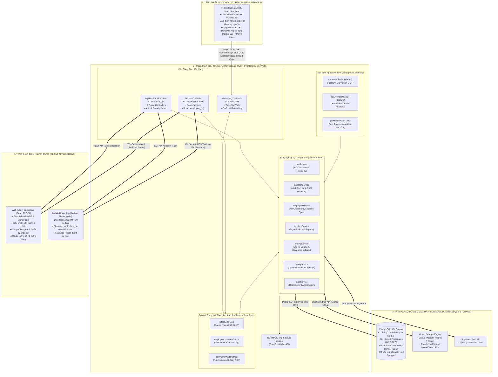
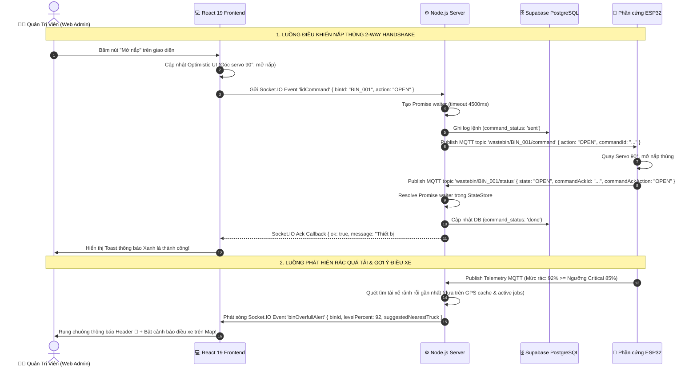
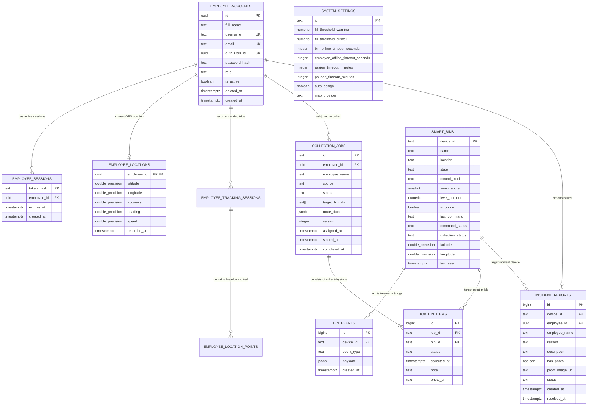
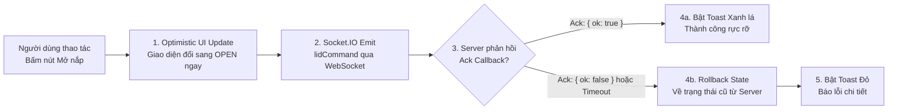
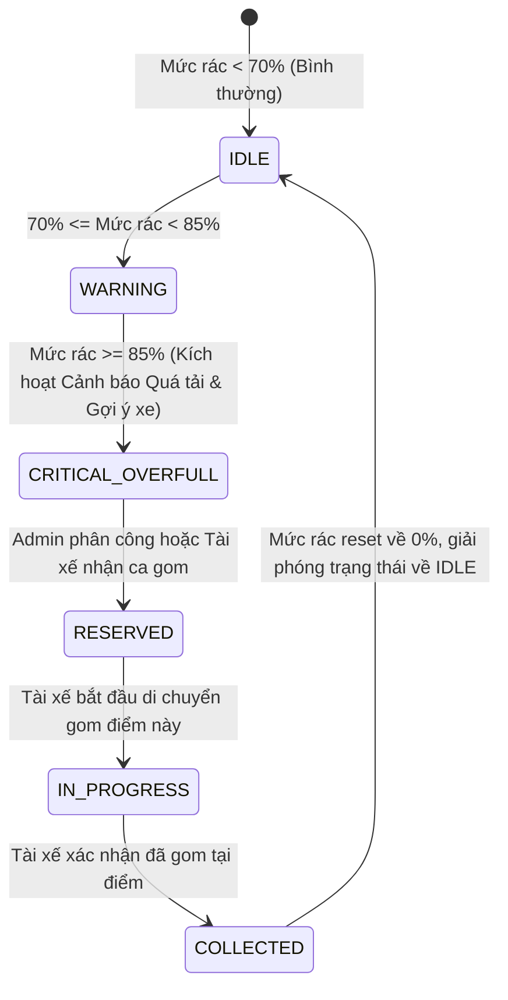
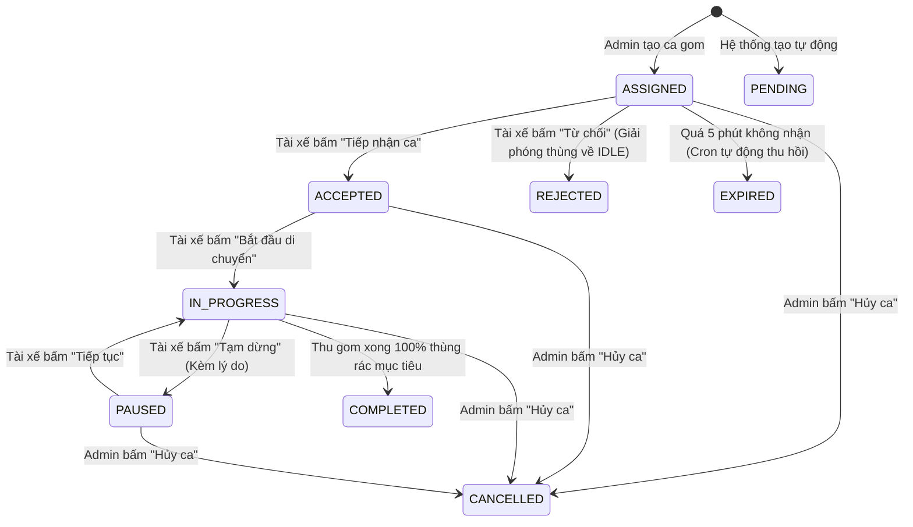
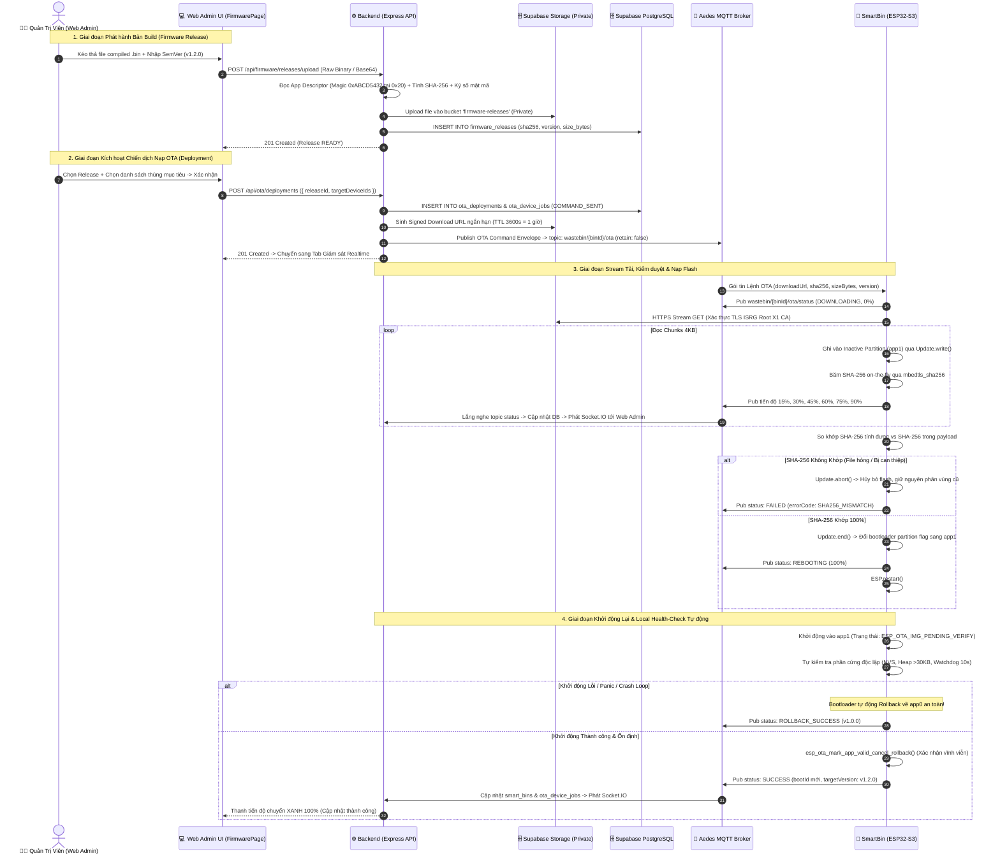

# 📚 TÀI LIỆU KỸ THUẬT TOÀN DIỆN HỆ THỐNG MÁY CHỦ & GIAO DIỆN QUẢN TRỊ SMARTWASTE
## (SMARTWASTE SERVER & WEB ADMIN DASHBOARD ECOSYSTEM)

> **Hệ sinh thái Quản trị & Điều phối Thu gom Rác Thông minh Đô thị — SmartWaste IoT Platform**  
> **Kiến trúc:** Enterprise Multi-Layer Hybrid Engine (Express 5.x REST API + Aedes MQTT Broker + Socket.IO Realtime WebSocket + Supabase Cloud PostgreSQL + React 19 SPA + Leaflet GIS & OSRM Engine).  
> **Phiên bản:** 1.0.0 • **Tác giả:** Đội ngũ Kỹ thuật Cấp cao (Senior Full-Stack & IoT Architects)  
> **Môi trường:** Node.js 18+ (UTC+7 Asia/Ho_Chi_Minh) • **Frontend:** React 19, Vite 8, Pure Modular CSS • **Database:** Supabase PostgreSQL 15+

---

## 📑 MỤC LỤC

1. [TỔNG QUAN HỆ THỐNG & KIẾN TRÚC TOÀN CẢNH](#1-tổng-quan-hệ-thống--kiến-trúc-toàn-cảnh)
   - 1.1. [Giới thiệu nền tảng SmartWaste](#11-giới-thiệu-nền-tảng-smartwaste)
   - 1.2. [Kiến trúc đa tầng (4-Tier Enterprise Architecture)](#12-kiến-trúc-đa-tầng-4-tier-enterprise-architecture)
   - 1.3. [Sơ đồ tương tác Đa giao thức](#13-sơ-đồ-tương-tác-đa-giao-thức)
   - 1.4. [Luồng dữ liệu thời gian thực End-to-End](#14-luồng-dữ-liệu-thời-gian-thực-end-to-end)
2. [CẤU TRÚC THƯ MỤC DỰ ÁN & PHÂN TÁCH TRÁCH NHIỆM MODULE](#2-cấu-trúc-thư-mục-dự-án--phân-tách-trách-nhiệm-module)
   - 2.1. [Cấu trúc thư mục Server Root](#21-cấu-trúc-thư-mục-server-root)
   - 2.2. [Cấu trúc chi tiết Backend (`server/backend/`)](#22-cấu-trúc-chi-tiết-backend-serverbackend)
   - 2.3. [Cấu trúc chi tiết Frontend (`server/frontend/`)](#23-cấu-trúc-chi-tiết-frontend-serverfrontend)
3. [CƠ SỞ DỮ LIỆU & QUẢN TRỊ DỮ LIỆU SUPABASE (DATABASE & ERD ARCHITECTURE)](#3-cơ-sở-dữ-liệu--quản-trị-dữ-liệu-supabase-database--erd-architecture)
   - 3.1. [Sơ đồ Quan hệ Thực thể (ERD Diagram)](#31-sơ-đồ-quan-hệ-thực-thể-erd-diagram)
   - 3.2. [Đặc tả chi tiết 11 Bảng CSDL cốt lõi](#32-đặc-tả-chi-tiết-11-bảng-csdl-cốt-lõi)
   - 3.3. [Danh mục Stored Procedures & Transactional RPC Functions (ACID)](#33-danh-mục-stored-procedures--transactional-rpc-functions-acid)
   - 3.4. [Quản trị Supabase Object Storage (Private Bucket & Signed URLs)](#34-quản-trị-supabase-object-storage-private-bucket--signed-urls)
4. [ĐẶC TẢ GIAO THỨC MQTT & PHẦN CỨNG IOT (ESP32 HARDWARE & EMULATOR)](#4-đặc-tả-giao-thức-mqtt--phần-cứng-iot-esp32-hardware--emulator)
   - 4.1. [Aedes Embedded Broker Engine](#41-aedes-embedded-broker-engine)
   - 4.2. [Quy chuẩn Danh mục Topics & QoS](#42-quy-chuẩn-danh-mục-topics--qos)
   - 4.3. [Cấu trúc Payload Cảm biến (Telemetry Sensor Payload)](#43-cấu-trúc-payload-cảm-biến-telemetry-sensor-payload)
   - 4.4. [Quy trình Điều khiển Nắp & 2-Way Handshake ACK](#44-quy-trình-điều-khiển-nắp--2-way-handshake-ack)
   - 4.5. [Cơ chế Cảnh báo Tràn rác & Gợi ý Xe thu gom gần nhất](#45-cơ-chế-cảnh-báo-tràn-rác--gợi-ý-xe-thu-gom-gần-nhất)
5. [ĐẶC TẢ GIAO THỨC REALTIME WEBSOCKET (SOCKET.IO)](#5-đặc-tả-giao-thức-realtime-websocket-socketio)
   - 5.1. [Kiến trúc Kết nối & Xác thực Socket Middleware](#51-kiến-trúc-kết-nối--xác-thực-socket-middleware)
   - 5.2. [Quản lý Kênh & Phòng truyền thông (Rooms Architecture)](#52-quản-lý-kênh--phòng-truyền-thông-rooms-architecture)
   - 5.3. [Danh mục Sự kiện Server phát sóng (Server-to-Client Events)](#53-danh-mục-sự-kiện-server-phát-sóng-server-to-client-events)
   - 5.4. [Danh mục Sự kiện Client gửi lên (Client-to-Server Events)](#54-danh-mục-sự-kiện-client-gửi-lên-client-to-server-events)
6. [ĐẶC TẢ CHI TIẾT TOÀN BỘ RESTFUL APIS (API SPECIFICATION & PAYLOADS)](#6-đặc-tả-chi-tiết-toàn-bộ-restful-apis-api-specification--payloads)
   - 6.1. [Xác thực & Phiên làm việc (`/api/auth`)](#61-xác-thực--phiên-làm-việc-apiauth)
   - 6.2. [Quản lý Thùng rác & Điều khiển Phần cứng (`/api/bins`, `/api/events`)](#62-quản-lý-thùng-rác--điều-khiển-phần-cứng-apibins-apievents)
   - 6.3. [Điều phối Tuyến & Ca làm việc (`/api/dispatch`)](#63-điều-phối-tuyến--ca-làm-việc-apidispatch)
   - 6.4. [Ứng dụng Di động Nhân viên Thực địa (`/api/mobile`)](#64-ứng-dụng-di-động-nhân-viên-thực-địa-apimobile)
   - 6.5. [Quản lý Nhân sự & Vị trí GPS (`/api/employees`, `/api/location`)](#65-quản-lý-nhân-sự--vị-trí-gps-apiemployees-apilocation)
   - 6.6. [Báo cáo Sự cố & Minh chứng Hiện trường (`/api/incidents`)](#66-báo-cáo-sự-cố--minh-chứng-hiện-trường-apiincidents)
   - 6.7. [Bản đồ GIS & Định tuyến OSRM (`/api/map`)](#67-bản-đồ-gis--định-tuyến-osrm-apimap)
   - 6.8. [Cài đặt & Cấu hình Tham số Động (`/api/settings`)](#68-cài-đặt--cấu-hình-tham-số-động-apisettings)
   - 6.9. [Giám sát Tình trạng & Thống kê (`/api/health`, `/api/dashboard/stats`)](#69-giám-sát-tình-trạng--thống-kê-apihealth-apidashboardstats)
7. [KIẾN TRÚC FRONTEND REACT WEB ADMIN (SPA DEEP DIVE)](#7-kiến-trúc-frontend-react-web-admin-spa-deep-dive)
   - 7.1. [Nguyên lý Thiết kế & Công nghệ Cốt lõi](#71-nguyên-lý-thiết-kế--công-nghệ-cốt-lõi)
   - 7.2. [Quản lý Trạng thái & Đồng bộ Realtime (Optimistic UI Pattern)](#72-quản-lý-trạng-thái--đồng-bộ-realtime-optimistic-ui-pattern)
   - 7.3. [Chi tiết Các Phân hệ Màn hình (Pages Deep Dive)](#73-chi-tiết-các-phân-hệ-màn-hình-pages-deep-dive)
   - 7.4. [Hệ thống Giao diện & Design System Tokens](#74-hệ-thống-giao-diện--design-system-tokens)
8. [MÔ HÌNH STATE MACHINE & QUY TRÌNH NGHIỆP VỤ TỰ ĐỘNG](#8-mô-hình-state-machine--quy-trình-nghiệp-vụ-tự-động)
   - 8.1. [State Machine Vòng đời Thùng rác IoT](#81-state-machine-vòng-đời-thùng-rác-iot)
   - 8.2. [State Machine Vòng đời Ca Thu gom (Job Lifecycle)](#82-state-machine-vòng-đời-ca-thu-gom-job-lifecycle)
   - 8.3. [Cơ chế Kiểm soát Xung đột Đồng thời (OCC Concurrency Pattern)](#83-cơ-chế-kiểm-soát-xung-đột-đồng-thời-occ-concurrency-pattern)
9. [CÁC TIẾN TRÌNH CHẠY NGẦM (BACKGROUND WORKERS & CRON JOBS)](#9-các-tiến-trình-chạy-ngầm-background-workers--cron-jobs)
   - 9.1. [Command Poller (`commandPoller.js` - 400ms)](#91-command-poller-commandpollerjs---400ms)
   - 9.2. [Bin & Driver Liveness Worker (`binLivenessWorker.js` - 3000ms)](#92-bin--driver-liveness-worker-binlivenessworkerjs---3000ms)
   - 9.3. [Job Monitor Cron (`jobMonitorCron.js` - 30s)](#93-job-monitor-cron-jobmonitorcronjs---30s)
10. [BẢO MẬT, KIỂM SOÁT PHIÊN & AN TOÀN DỮ LIỆU](#10-bảo-mật-kiểm-soát-phiên--an-toàn-dữ-liệu)
    - 10.1. [Cơ chế Băm Token SHA-256 & Sliding Sessions](#101-cơ-chế-băm-token-sha-256--sliding-sessions)
    - 10.2. [Phân quyền Người dùng RBAC (`admin` vs `staff`)](#102-phân-quyền-người-dùng-rbac-admin-vs-staff)
    - 10.3. [Bảo mật Lưu trữ & Signed URLs](#103-bảo-mật-lưu-trữ--signed-urls)
11. [HƯỚNG DẪN CÀI ĐẶT, KHỞI CHẠY & TRIỂN KHAI HỆ THỐNG](#11-hướng-dẫn-cài-đặt-khởi-chạy--triển-khai-hệ-thống)
    - 11.1. [Yêu cầu Môi trường](#111-yêu-cầu-môi-trường)
    - 11.2. [Cấu hình Biến môi trường (`.env`)](#112-cấu-hình-biến-môi-trường-env)
    - 11.3. [Cài đặt CSDL Supabase](#113-cài-đặt-csdl-supabase)
    - 11.4. [Khởi chạy Chế độ Development](#114-khởi-chạy-chế-độ-development)
    - 11.5. [Khởi chạy Chế độ Production (Single Artifact Express)](#115-khởi-chạy-chế-độ-production-single-artifact-express)
12. [HƯỚNG DẪN KIỂM THỬ TOÀN DIỆN & TROUBLESHOOTING](#12-hướng-dẫn-kiểm-thử-toàn-diện--troubleshooting)
    - 12.1. [Kiểm thử Phần cứng & IoT Simulator](#121-kiểm-thử-phần-cứng--iot-simulator)
    - 12.2. [Kiểm thử REST APIs & WebSocket Events](#122-kiểm-thử-rest-apis--websocket-events)
    - 12.3. [Xử lý Sự cố Thường gặp (Troubleshooting FAQ)](#123-xử-lý-sự-cố-thường-gặp-troubleshooting-faq)
13. [PHÂN HỆ QUẢN LÝ FIRMWARE & NẠP OTA KHÔNG DÂY (ENTERPRISE DUAL-PARTITION OTA)](#13-phân-hệ-quản-lý-firmware--nạp-ota-không-dây-enterprise-dual-partition-ota)
    - 13.1. [Kiến trúc Tổng thể & Sơ đồ Luồng Nạp OTA Zero-Brick](#131-kiến-trúc-tổng-thể--sơ-đồ-luồng-nạp-ota-zero-brick)
    - 13.2. [Cơ chế Phân vùng Flash 4MB & Auto-Rollback ESP32](#132-cơ-chế-phân-vùng-flash-4mb--auto-rollback-esp32)
    - 13.3. [Mô hình Dữ liệu Supabase & Private Storage Bucket](#133-mô-hình-dữ-liệu-supabase--private-storage-bucket)
    - 13.4. [Đặc tả RESTful APIs Quản lý Bản Build & Chiến dịch OTA](#134-đặc-tả-restful-apis-quản-lý-bản-build--chiến-dịch-ota)
    - 13.5. [Đặc tả Giao thức MQTT OTA (Envelope & Telemetry Channels)](#135-đặc-tả-giao-thức-mqtt-ota-envelope--telemetry-channels)
    - 13.6. [Module ESP32 OTA Client (ISRG Root CA TLS & Local Health-Check)](#136-module-esp32-ota-client-isrg-root-ca-tls--local-health-check)
    - 13.7. [Giao diện Quản trị Web Admin (Releases, Deploy & Realtime Monitor)](#137-giao-diện-quản-trị-web-admin-releases-deploy--realtime-monitor)

---

## 1. TỔNG QUAN HỆ THỐNG & KIẾN TRÚC TOÀN CẢNH

### 1.1. Giới thiệu nền tảng SmartWaste
**SmartWaste** là nền tảng quản trị và điều phối thu gom chất thải thông minh cấp đô thị thế hệ mới. Nền tảng kết hợp công nghệ IoT phần cứng (ESP32, cảm biến siêu âm khoảng cách, cảm biến hồng ngoại PIR, động cơ servo mở nắp), hệ thống máy chủ đa giao thức thời gian thực (Node.js/Express, Aedes MQTT Broker, Socket.IO WebSockets, OSRM GIS Routing Engine), cơ sở dữ liệu phân tán chuẩn doanh nghiệp (Supabase PostgreSQL) và giao diện Web Admin Dashboard SPA xây dựng trên React 19 + OpenStreetMap GIS.

Hệ thống giải quyết toàn diện các bài toán:
- **Giám sát thời gian thực:** Trực quan hóa mức rác (%) của hàng nghìn thùng rác theo thời gian thực (Real-time Telemetry).
- **Điều phối thông minh (Smart Dispatch):** Tự động phát hiện thùng rác quá tải (>=85%), tự động tìm tài xế rảnh rỗi gần nhất theo tọa độ GPS, tính toán lộ trình tối ưu qua OSRM Turn-by-Turn.
- **Điều khiển phần cứng 2 chiều (2-Way Hardware Control):** Ra lệnh mở/đóng nắp, chuyển chế độ Auto/Manual, tạm dừng gom trực tiếp từ Web Dashboard và nhận phản hồi xác nhận (ACK) từ vi điều khiển trong mili-giây.
- **Vận hành thực địa minh bạch:** Tài xế tiếp nhận ca, điều hướng theo bản đồ, ghi nhận thu gom kèm ảnh chụp minh chứng sự cố, lưu trữ bảo mật trên Cloud Storage.

---

### 1.2. Kiến trúc đa tầng (4-Tier Enterprise Architecture)



---

### 1.3. Sơ đồ tương tác Đa giao thức

Máy chủ Backend khởi tạo đồng thời 3 giao thức mạng cốt lõi trên cùng một hạ tầng:
1. **HTTP/HTTPS (Port 3000):** Cung cấp chuẩn RESTful API cho Web Admin và Mobile Client, phân phối giao diện tĩnh SPA React.
2. **WebSocket Socket.IO (Port 3000):** Kết nối liên tục 2 chiều giữa Server và các ứng dụng khách, truyền tải dữ liệu cảm biến, vị trí GPS và thông báo tức thời không cần polling.
3. **TCP MQTT Broker (Port 1883):** Máy chủ nhúng Aedes chuyên dụng dành riêng cho phần cứng IoT (ESP32), tiêu tốn cực ít băng thông, hỗ trợ QoS 1 và Retain Message.

---

### 1.4. Luồng dữ liệu thời gian thực End-to-End



---

## 2. CẤU TRÚC THƯ MỤC DỰ ÁN & PHÂN TÁCH TRÁCH NHIỆM MODULE

### 2.1. Cấu trúc thư mục Server Root
```
server/
├── backend/                        # Toàn bộ mã nguồn máy chủ Backend (Node.js)
├── frontend/                       # Toàn bộ mã nguồn giao diện Web Admin (React 19)
├── node_modules/                   # Thư viện npm dùng chung (NPM Workspaces)
├── package.json                    # File cấu hình root quản lý NPM Workspaces & Scripts tổng
├── package-lock.json               # Lockfile phiên bản dependencies
└── supabase_schema.sql             # Bản thiết kế CSDL DDL, Indexes, Triggers & 18+ Stored Procedures
```

---

### 2.2. Cấu trúc chi tiết Backend (`server/backend/`)
```
server/backend/
├── .env                            # Tệp cấu hình biến môi trường bí mật (Keys, Ports, Timeouts)
├── .env.example                    # Tệp mẫu cấu hình môi trường
├── package.json                    # Cấu hình backend package & scripts
├── server.js                       # Điểm khởi động chính (Entry Point) của toàn bộ hệ thống Server
├── data/
│   └── system_settings.json        # File JSON cache lưu trữ các tham số cấu hình động
└── src/
    ├── config/
    │   ├── constants.js            # Hằng số hệ thống, danh mục lệnh hợp lệ, trạng thái Job, session
    │   └── env.js                  # Module đọc, tiền xử lý và kiểm tra biến môi trường
    ├── core/
    │   ├── logger.js               # Tiện ích ghi log chuẩn hóa có gắn Timestamp UTC+7
    │   ├── stateStore.js           # Bộ nhớ trạng thái trung tâm In-Memory, Event Emitter & Waiters
    │   └── supabase.js             # Client HTTP kết nối Supabase REST, RPC, Admin Auth & Storage
    ├── jobs/
    │   ├── binLivenessWorker.js    # Worker kiểm tra trạng thái Online/Offline của thùng rác & tài xế
    │   ├── commandPoller.js        # Poller quét lệnh tồn đọng trong DB và phát lại qua MQTT
    │   └── jobMonitorCron.js       # Cron quét timeout ca thu gom & cảnh báo tạm dừng quá lâu
    ├── middleware/
    │   ├── auth.js                 # Middleware xác thực Session Token SHA-256 & phân quyền RBAC
    │   ├── errorHandler.js         # Bộ bắt và xử lý lỗi tập trung toàn hệ thống (Global Error Handler)
    │   └── security.js             # Middleware cấu hình CORS, Cache-Control & Security Headers
    ├── mqtt/
    │   └── mqttBroker.js           # Khởi tạo Aedes MQTT Broker, lắng nghe Telemetry & xử lý Overfill Alert
    ├── routes/
    │   ├── index.js                # Router tổng hợp gắn kết toàn bộ các Route con
    │   ├── authRoutes.js           # Tuyến API đăng nhập, lấy thông tin phiên, đổi mật khẩu, đăng xuất
    │   ├── binRoutes.js            # Tuyến API danh mục thùng rác, tọa độ, gửi lệnh, lịch sử sự kiện
    │   ├── dashboardRoutes.js      # Tuyến API Health check & thống kê số liệu Dashboard
    │   ├── dispatchRoutes.js       # Tuyến API phân công, chuyển ca, hủy ca thu gom (Dành cho Admin)
    │   ├── employeeRoutes.js       # Tuyến API quản lý nhân sự, cập nhật GPS đơn lẻ & GPS Batch Sync
    │   ├── incidentRoutes.js       # Tuyến API tạo báo cáo sự cố, cấp Signed Upload URL, duyệt sự cố
    │   ├── mapRoutes.js            # Tuyến API vị trí GPS nhân viên, cấu hình Map Leaflet, định tuyến OSRM
    │   ├── mobileRoutes.js         # Tuyến API nghiệp vụ tài xế thực địa (Home, Accept, Start, Collect...)
    │   └── settingsRoutes.js       # Tuyến API đọc/ghi/reset thông số cấu hình hệ thống động
    ├── services/
    │   ├── binService.js           # Nghiệp vụ nạp thùng rác, lưu telemetry, phát lệnh MQTT & xử lý ACK
    │   ├── configService.js        # Nghiệp vụ quản trị thông số cài đặt động (DB + Local JSON)
    │   ├── dispatchService.js      # Nghiệp vụ điều phối ca gom, tự động tạo lộ trình OSRM, thu gom từng thùng
    │   ├── employeeService.js      # Nghiệp vụ tài khoản, Supabase Auth Sync, vị trí GPS & Batch Sync
    │   ├── incidentService.js      # Nghiệp vụ báo cáo sự cố, cấp Signed URLs upload/view ảnh bảo mật
    │   ├── jobsDb.js               # Data Access Object (DAO) giao tiếp với bảng `collection_jobs`
    │   ├── mobileHomeService.js    # Tổng hợp dữ liệu màn hình Home tài xế (Ca hiện tại + Thống kê ngày)
    │   ├── routingService.js       # Tích hợp OSRM GIS Routing Engine + thuật toán Haversine Fallback
    │   └── statsService.js         # Tổng hợp số liệu thống kê realtime cho Dashboard Web Admin
    └── websocket/
        └── socketServer.js         # Khởi tạo Socket.IO, quản lý phòng, xác thực token & xử lý `lidCommand`
```

---

### 2.3. Cấu trúc chi tiết Frontend (`server/frontend/`)
```
server/frontend/
├── index.html                      # File HTML gốc (Template HTML5 SPA)
├── package.json                    # Khai báo dependencies Frontend (React 19, Vite, Leaflet, Lucide)
├── vite.config.js                  # Cấu hình Vite 8 Dev Server & Proxy tự động sang Backend (:3000)
├── public/                         # Tài nguyên tĩnh công khai (Favicon, Logo, Assets)
└── src/
    ├── main.jsx                    # Điểm khởi chạy React DOM
    ├── App.jsx                     # Component gốc điều hướng màn hình, quản lý Socket.IO & Toasts
    ├── index.css                   # Hệ thống CSS toàn cục, Design Tokens, Micro-animations & Glassmorphism
    ├── assets/
    │   └── logo.png                # Logo thương hiệu SmartWaste
    ├── components/
    │   ├── Header.jsx              # Thanh Header trên cùng (Đồng hồ UTC+7, Chuông cảnh báo quá tải)
    │   ├── Sidebar.jsx             # Thanh điều hướng bên trái (Collapsible Menu, Brand Badge)
    │   └── Toast.jsx               # Hệ thống thông báo nổi góc màn hình (Success, Error, Info, Warning)
    ├── layouts/
    │   └── DashboardLayout.jsx     # Khung bố cục chuẩn chung áp dụng cho tất cả các trang
    ├── pages/
    │   ├── DashboardPage.jsx       # Trang Tổng quan: KPI Cards, Trực quan hóa rác, Thao tác nhanh
    │   ├── MapPage.jsx             # Trang Bản đồ GIS: Leaflet Marker, Lộ trình OSRM, GPS Tài xế
    │   ├── SmartBinsPage.jsx       # Trang Quản lý Thùng rác: Lọc thông minh, Điều khiển nắp 2 chiều, Sửa vị trí
    │   ├── OperationsPage.jsx      # Trang Điều phối & Lịch sử: Quản lý ca gom, Tiến độ %, Báo cáo sự cố & Ảnh
    │   ├── EmployeesPage.jsx       # Trang Quản lý Nhân sự: Danh sách nhân viên, CRUD, Modal thêm/sửa, Avatar
    │   ├── SettingsPage.jsx        # Trang Cài đặt Hệ thống: Cấu hình ngưỡng %, timeout, auto assign
    │   └── LoginPage.jsx           # Trang Đăng nhập: Giao diện Clean Industrial, Animation khởi tạo 4 bước
    ├── services/
    │   ├── api.js                  # Lớp trừu tượng gọi RESTful API tập trung (Fetch Wrapper)
    │   └── socket.js               # Quản lý vòng đời kết nối Socket.IO Client (Singleton Pattern)
    └── utils/
        ├── dateTime.js             # Tiện ích định dạng ngày giờ chuẩn múi giờ Việt Nam (UTC+7)
        └── theme.js                # Bảng màu sắc, trạng thái và hằng số giao diện
```

---

## 3. CƠ SỞ DỮ LIỆU & QUẢN TRỊ DỮ LIỆU SUPABASE (DATABASE & ERD ARCHITECTURE)

### 3.1. Sơ đồ Quan hệ Thực thể (ERD Diagram)



---

### 3.2. Đặc tả chi tiết 11 Bảng CSDL cốt lõi

| Tên Bảng | Vai trò & Mục đích | Khóa chính (PK) | Các Chỉ mục quan trọng (Indexes) |
| :--- | :--- | :--- | :--- |
| `employee_accounts` | Lưu trữ tài khoản nhân sự, quyền hạn (Admin/Staff), mật khẩu Bcrypt | `id` (UUID) | `lower(email)`, `auth_user_id`, `is_active` |
| `employee_sessions` | Quản lý phiên đăng nhập trượt 8 giờ, lưu mã băm SHA-256 của token | `token_hash` (TEXT) | `employee_id`, `expires_at` |
| `smart_bins` | Bảng trạng thái tức thời của thùng rác IoT (Mức rác, nắp, tọa độ GPS, lệnh) | `device_id` (TEXT) | `level_percent desc`, `collection_status`, `collection_employee_id` |
| `bin_events` | Nhật ký viễn trắc (Telemetry), lịch sử lệnh (Command) và cảnh báo | `id` (BIGINT Identity) | `(device_id, created_at desc)` |
| `employee_locations` | Tọa độ GPS mới nhất của nhân viên thu gom (Phục vụ Realtime Map) | `employee_id` (UUID) | Khóa chính tự động tạo Index |
| `employee_tracking_sessions` | Phiên theo dõi hành trình di chuyển của xe thu gom theo từng ca gom | `id` (UUID) | `employee_id`, `job_id` |
| `employee_location_points` | Chuỗi tọa độ vết bánh xe (Breadcrumbs) phục vụ vẽ lại hành trình | `id` (BIGINT Identity) | `(session_id, recorded_at asc)` |
| `collection_jobs` | Bảng nghiệp vụ ca thu gom, lưu trạng thái, mảng thùng rác & lộ trình OSRM | `id` (TEXT) | `(status, created_at desc)`, `employee_id` |
| `job_bin_items` | Chi tiết trạng thái thu gom từng điểm dừng (PENDING -> COLLECTED) | `id` (BIGINT Identity) | `job_id`, `bin_id` |
| `incident_reports` | Báo cáo sự cố thực địa (Hỏng cảm biến, kẹt nắp...) kèm ảnh hiện trường | `id` (BIGINT Identity) | `employee_id`, `device_id`, `status` |
| `system_settings` | Bảng lưu cấu hình tham số vận hành động (Ngưỡng %, Timeouts) | `id` (TEXT, 'default') | Single-row Configuration |

---

### 3.3. Danh mục Stored Procedures & Transactional RPC Functions (ACID)

Hệ thống sử dụng các Stored Procedure PostgreSQL viết bằng PL/pgSQL với cơ chế **Transaction ACID** và **Row Locking (`FOR UPDATE`)** để loại trừ hoàn toàn tình trạng tranh chấp dữ liệu (Race Conditions):

| Tên Stored Procedure (RPC) | Mục đích & Nghiệp vụ xử lý | Cơ chế Concurrency & Khóa |
| :--- | :--- | :--- |
| `employee_login` | Xác thực đăng nhập bằng `crypt()`, tạo phiên mới trong `employee_sessions` | Atomic Insert Session |
| `employee_current` | Xác thực token từ request, tự động gia hạn phiên trượt (Sliding 8h) | Select & Update Expiry |
| `employee_logout` | Xóa phiên đăng nhập tương ứng trong bảng `employee_sessions` | Atomic Delete |
| `employee_create` | Admin tạo tài khoản nhân viên mới, mã hóa mật khẩu bằng Blowfish salt | Atomic Insert with Role Guard |
| `employee_location_update`| Cập nhật tọa độ GPS tức thời (Upsert `employee_locations`) | `ON CONFLICT DO UPDATE` |
| `rpc_assign_job` | Admin phân công ca gom: Khóa các thùng rác mục tiêu, tạo job & các items | `SELECT ... FOR UPDATE` trên bảng `smart_bins` |
| `rpc_reassign_job` | Chuyển ca sang tài xế mới: Hủy ca cũ, giữ các thùng chưa gom sang ca mới | OCC `version = p_old_version` |
| `rpc_cancel_job` | Hủy ca thu gom: Giải phóng trạng thái `RESERVED` của thùng rác về `IDLE` | OCC `version = p_expected_version` |
| `rpc_self_pick_job` | Tài xế tự tạo ca gom: Kiểm tra tài xế chưa có ca, khóa thùng rác và tạo job | Atomic Multi-Table Insert |
| `rpc_reject_job` | Tài xế từ chối ca: Chuyển Job sang `REJECTED`, giải phóng thùng rác về `IDLE` | OCC Optimistic Check |
| `rpc_expire_job` | Cron quét hết hạn ca: Tự động hết hạn job chưa chấp nhận, giải phóng thùng rác | Atomic Cleanup |
| `rpc_collect_bin` | Ghi nhận thu gom 1 thùng: Reset mức rác về 0%, cập nhật item thành `COLLECTED` | Tự động hoàn tất Job nếu đã gom hết thùng |
| `employee_incident_upload_prepare` | Tạo phiên tải ảnh sự cố bảo mật, sinh đường dẫn `object_path` chuẩn | Quản lý phiên Upload |
| `employee_incident_upload_finalize`| Xác thực ảnh trên Supabase Storage và kích hoạt báo cáo sự cố chính thức | Storage Integration Guard |

---

### 3.4. Quản trị Supabase Object Storage (Private Bucket & Signed URLs)

- **Bucket Name:** `incident-images` (Cấu hình ở chế độ hoàn toàn riêng tư — **Private Bucket**).
- **Quy tắc bảo mật:** Không ai có quyền truy cập trực tiếp qua Public URL.
- **Quy trình Upload ảnh minh chứng (Secure Two-Step Flow):**
  1. Client gọi API `POST /api/incidents/uploads` -> Server gọi RPC `employee_incident_upload_prepare` -> Sinh Signed Upload URL có hiệu lực trong **15 phút**.
  2. Client tải file ảnh trực tiếp lên Supabase Storage qua Signed Upload URL bằng phương thức `PUT` (Header `Content-Type: image/jpeg`).
  3. Client gọi API `POST /api/incidents/uploads/:uploadId/complete` -> Server gọi RPC `employee_incident_upload_finalize` kiểm tra sự tồn tại của file và hoàn tất tạo bản ghi sự cố.
- **Quy trình Xem ảnh (On-the-fly Secure Viewing):**
  - Khi Admin hoặc Tài xế xem ảnh sự cố, Server tự động tạo Signed Read URL với thời hạn sống **3600 giây (1 giờ)** và cache lại trong `stateStore.signedUrlCache` để tối ưu hiệu năng.

---

## 4. ĐẶC TẢ GIAO THỨC MQTT & PHẦN CỨNG IOT (ESP32 HARDWARE & EMULATOR)

### 4.1. Aedes Embedded Broker Engine
Máy chủ Backend tích hợp trực tiếp **Aedes MQTT Broker** chạy trên cổng TCP `1883`. Điều này giúp hệ thống hoạt động khép kín không cần cài đặt Mosquitto bên ngoài, cho phép Server kết nối và điều phối trực tiếp tới bộ nhớ RAM trong tiến trình.

---

### 4.2. Quy chuẩn Danh mục Topics, QoS & Kiểm Soát Truy Cập ACL

| Hướng truyền thông | Cấu trúc Topic | Mức QoS | Mục đích & Ý nghĩa |
| :--- | :--- | :---: | :--- |
| **ESP32 → Server (Publish)** | `wastebin/{device_id}/status` | 0 hoặc 1 | ESP32 gửi dữ liệu cảm biến định kỳ và gửi gói tin xác nhận ACK |
| **Server → ESP32 (Publish)** | `wastebin/{device_id}/command` | 1 (Retain) | Server gửi lệnh đóng/mở nắp, chuyển chế độ tới thiết bị |
| **Server → ESP32 (Publish)** | `wastebin/{device_id}/ota` | 1 (No-Retain) | Server phát lệnh nạp firmware OTA kèm Signed URL và mã băm SHA-256 |
| **ESP32 → Server (Publish)** | `wastebin/{device_id}/ota/status` | 1 | ESP32 báo cáo tiến độ nạp OTA (0-100%), xác thực SHA-256 và trạng thái Flash |

> **Cơ chế Bảo mật Zero-Trust Device Isolation (ACL):**
> Aedes Broker tích hợp sẵn `authorizePublish` và `authorizeSubscribe` để kiểm soát chặt chẽ: Thiết bị mang `clientId` dạng `ESP32-SmartBin-{device_id}` hoặc `{device_id}` chỉ được phép đăng ký/gửi dữ liệu vào đúng các topic thuộc mã của chính mình (`wastebin/{device_id}/*`), ngăn chặn triệt để nguy cơ thiết bị này can thiệp vào dữ liệu hoặc lệnh điều khiển của thiết bị khác.

### 4.3. Cấu trúc Payload Cảm biến (Telemetry Sensor Payload)

Gói tin JSON do ESP32 gửi lên Topic `wastebin/{device_id}/status`:
```json
{
  "deviceId": "BIN_001",
  "state": "CLOSED",
  "controlMode": "AUTO",
  "servoAngle": 0,
  "distUser": 45.2,
  "distLevel": 12.5,
  "levelPercent": 78,
  "collectionPaused": false,
  "ipAddress": "192.168.1.105",
  "commandAckId": "2026-08-18T12:00:00.000Z",
  "commandAckAction": "OPEN"
}
```

**Mô tả các trường:**
- `state`: Trạng thái nắp hiện tại (`CLOSED`, `OPEN`, `CONFIRMING`).
- `controlMode`: Chế độ vận hành (`AUTO` - Tự mở nắp khi người đến gần, `MANUAL` - Chỉ mở khi có lệnh).
- `servoAngle`: Góc quay của động cơ servo (`0` - Đóng hoàn toàn, `90` - Mở góc vuông 90°).
- `distUser`: Khoảng cách phát hiện người phía trước bằng cảm biến siêu âm (cm).
- `distLevel`: Khoảng cách từ nắp thùng tới bề mặt rác bên trong (cm).
- `levelPercent`: Phần trăm mức rác chứa trong thùng (`0%` đến `100%`).
- `collectionPaused`: Trạng thái tạm dừng thu gom (`true` / `false`).
- `commandAckId` & `commandAckAction`: ID và tên hành động của lệnh mà ESP32 vừa thực thi xong (Dùng cho cơ chế 2-Way Handshake ACK).

---

### 4.4. Quy trình Điều khiển Nắp & 2-Way Handshake ACK

Để đảm bảo nút bấm trên Web Admin phản ánh **chính xác 100% trạng thái vật lý của phần cứng thật**, hệ thống không dùng mô phỏng giả lập mà áp dụng quy trình xác thực 2 chiều:
1. Web Admin gọi lệnh qua WebSocket (`lidCommand`) hoặc REST (`POST /api/bins/:id/command`).
2. Server tạo một Promise Waiter trong `stateStore.commandWaiters` với thời gian chờ tối đa `4500ms`.
3. Server phát gói tin MQTT tới topic `wastebin/{id}/command` với cờ `retain: true` và `QoS: 1`.
4. ESP32 nhận lệnh, điều khiển động cơ servo, sau đó gửi lại gói tin status kèm `commandAckId` và `commandAckAction`.
5. Server nhận gói tin status, giải phóng Promise Waiter và trả về phản hồi thành công (Ack callback) tới Web Admin.
6. Web Admin nhận Ack và hiển thị Toast thông báo màu xanh lá. Nếu sau 4.5 giây ESP32 không phản hồi (do mất điện hoặc mất mạng), Server trả về mã lỗi `504 Timeout` và Web Admin tự động rollback trạng thái giao diện.

---

### 4.5. Cơ chế Cảnh báo Tràn rác & Gợi ý Xe thu gom gần nhất

Khi Server nhận được bản tin telemetry có `levelPercent >= 85%` (Ngưỡng Critical cấu hình trong hệ thống):
1. Server kích hoạt hàm xử lý cảnh báo quá tải khẩn cấp trong `mqttBroker.js`.
2. Thuật toán quét toàn bộ danh sách tài xế trong `stateStore.employeeLocationsCache`.
3. Lọc ra các tài xế đang **Online** và **Không có ca gom bận** (`activeJobs`).
4. Tính toán khoảng cách địa lý (Haversine Distance) giữa Thùng rác quá tải và từng tài xế.
5. Chọn ra tài xế gần nhất (`suggestedNearestTruck`) kèm khoảng cách tính theo km (`distanceKm`).
6. Phát sóng sự kiện `binOverfullAlert` tới toàn bộ Quản trị viên trong phòng `admins` và gửi thông báo trực tiếp tới tài xế được gợi ý qua phòng `employee_{id}`.

---

## 5. ĐẶC TẢ GIAO THỨC REALTIME WEBSOCKET (SOCKET.IO)

### 5.1. Kiến trúc Kết nối & Xác thực Socket Middleware
Máy chủ Socket.IO được bảo vệ nghiêm ngặt bằng Middleware xác thực:
- Trong quá trình bắt tay kết nối (Handshake), Middleware trích xuất Cookie `smartwaste_session` hoặc Header `Authorization: Bearer <token>`.
- Token được băm SHA-256 và kiểm tra qua hàm RPC `employee_current`.
- Nếu hợp lệ, thông tin `socket.user` được gán vào socket và cho phép kết nối. Nếu không hợp lệ, socket bị từ chối ngay lập tức (`unauthorized`).

---

### 5.2. Quản lý Kênh & Phòng truyền thông (Rooms Architecture)

- **Phòng `admins`:** Dành riêng cho các tài khoản có vai trò `admin`. Nhận tất cả các cảnh báo rác đầy, vị trí GPS toàn bộ tài xế, sự cố mới và cảnh báo tài xế tạm dừng ca quá lâu.
- **Phòng `employee_{id}`:** Dành riêng cho từng nhân viên/tài xế cụ thể. Nhận thông báo khi được Admin phân công ca thu gom mới (`jobAssigned`) hoặc cảnh báo quá tải được giao riêng.

---

### 5.3. Danh mục Sự kiện Server phát sóng (Server-to-Client Events)

| Tên Event | Phạm vi gửi | Dữ liệu truyền tải (Payload) | Ý nghĩa nghiệp vụ |
| :--- | :--- | :--- | :--- |
| `initialBins` | Client vừa kết nối | `SmartBin[]` | Danh sách toàn bộ thùng rác từ bộ nhớ RAM |
| `binsSnapshot` | Client vừa kết nối | `SmartBin[]` | Bản chụp đầy đủ danh mục thùng rác từ CSDL Supabase |
| `binData` | Toàn hệ thống (Broadcast) | `{ binId, data: SmartBin }` | Cập nhật tức thời khi 1 thùng rác thay đổi mức rác/trạng thái |
| `databaseStatus` | Toàn hệ thống (Broadcast) | `{ connected: boolean, message }` | Thông báo trạng thái kết nối CSDL Supabase |
| `jobAssigned` | `employee_{id}` | `JobEnriched` | Thông báo tới tài xế khi có ca thu gom mới được giao |
| `jobUpdated` | Toàn hệ thống (Broadcast) | `JobEnriched` | Cập nhật tiến độ ca gom khi có 1 thùng được hoàn tất |
| `jobCompleted` | Toàn hệ thống (Broadcast) | `{ jobId, employeeId }` | Thông báo khi toàn bộ ca thu gom đã hoàn thành 100% |
| `jobPausedTooLong` | `admins` | `{ jobId, employeeName, pausedMinutes }` | Cảnh báo Admin khi tài xế tạm dừng ca vượt quá thời gian cho phép |
| `binOverfullAlert` | `admins` & `employee_{id}` | `{ binId, levelPercent, suggestedNearestTruck }` | Cảnh báo khẩn cấp thùng rác đầy kèm gợi ý xe gần nhất |
| `employeeLocation`| `admins` | `EmployeeLocation` | Cập nhật vị trí GPS tức thời của tài xế trên Bản đồ GIS |
| `incidentReported`| `admins` | `IncidentReport` | Thông báo khi có tài xế gửi báo cáo sự cố hiện trường |
| `systemSettingsUpdated` | Toàn hệ thống (Broadcast) | `SystemSettings` | Đồng bộ thông số cài đặt hệ thống mới tới toàn bộ máy khách |

---

### 5.4. Danh mục Sự kiện Client gửi lên (Client-to-Server Events)

#### Sự kiện `lidCommand`
Gửi lệnh phần cứng trực tiếp từ giao diện Web Admin qua WebSocket:
- **Payload:** `{ binId: "BIN_001", action: "OPEN" | "CLOSE" | "AUTO" | "MANUAL" | "PAUSE" | "RESUME" }`
- **Acknowledgment Callback:**
  ```json
  {
    "ok": true,
    "message": "Thiết bị #BIN_001 đã thực thi \"Mở nắp\" thành công!",
    "bin": { ... }
  }
  ```

---

## 6. ĐẶC TẢ CHI TIẾT TOÀN BỘ RESTFUL APIS (API SPECIFICATION & PAYLOADS)

Tất cả các API đều có tiền tố chung là `/api`.  
Chuẩn trả về thành công: `200 OK` hoặc `201 Created` kèm JSON payload.  
Chuẩn trả về lỗi: HTTP Status Code tương ứng kèm JSON: `{ "error": "Mô tả chi tiết nguyên nhân lỗi" }`.

---

### 6.1. Xác thực & Phiên làm việc (`/api/auth`)

#### 1. Đăng nhập hệ thống
- **Endpoint:** `POST /api/auth/login`
- **Quyền hạn:** Công khai (Public)
- **Request Body:**
  ```json
  {
    "username": "admin",
    "password": "admin123"
  }
  ```
- **Response `200 OK`:**
  - Header: `Set-Cookie: smartwaste_session=...; HttpOnly; SameSite=Strict; Path=/; Max-Age=28800`
  ```json
  {
    "token": "7a8f9c0e1b2d3f4a...",
    "user": {
      "id": "c1a2b3c4-d5e6-7f8a-9b0c-1d2e3f4a5b6c",
      "full_name": "Quản trị viên",
      "username": "admin",
      "email": "admin@smartwaste.vn",
      "role": "admin",
      "is_active": true
    }
  }
  ```

#### 2. Lấy thông tin tài khoản hiện tại
- **Endpoint:** `GET /api/auth/me`
- **Quyền hạn:** Đã đăng nhập (`requireAuth`)
- **Response `200 OK`:**
  ```json
  {
    "user": {
      "id": "c1a2b3c4-d5e6-7f8a-9b0c-1d2e3f4a5b6c",
      "full_name": "Quản trị viên",
      "username": "admin",
      "role": "admin"
    }
  }
  ```

#### 3. Đổi mật khẩu
- **Endpoint:** `POST /api/auth/change-password`
- **Quyền hạn:** Đã đăng nhập (`requireAuth`)
- **Request Body:**
  ```json
  {
    "oldPassword": "admin123",
    "newPassword": "newSecretPassword2026"
  }
  ```
- **Response `200 OK`:**
  ```json
  {
    "ok": true,
    "message": "Đổi mật khẩu thành công!"
  }
  ```

#### 4. Đăng xuất
- **Endpoint:** `POST /api/auth/logout`
- **Quyền hạn:** Đã đăng nhập (`requireAuth`)
- **Response `200 OK`:**
  - Header: `Set-Cookie: smartwaste_session=; Max-Age=0`
  ```json
  {
    "ok": true
  }
  ```

---

### 6.2. Quản lý Thùng rác & Điều khiển Phần cứng (`/api/bins`, `/api/events`)

#### 1. Lấy danh sách toàn bộ thùng rác
- **Endpoint:** `GET /api/bins`
- **Quyền hạn:** Đã đăng nhập (`requireAuth`)
- **Response `200 OK`:**
  ```json
  [
    {
      "device_id": "BIN_001",
      "name": "Thùng rác Công viên 23/9",
      "location": "Phạm Ngũ Lão, Quận 1, TP.HCM",
      "state": "CLOSED",
      "control_mode": "AUTO",
      "servo_angle": 0,
      "level_percent": 88.5,
      "dist_user": 35.0,
      "dist_level": 5.8,
      "is_online": true,
      "latitude": 10.7688,
      "longitude": 106.6912,
      "collection_status": "IDLE",
      "last_seen": "2026-08-18T12:30:00.000Z"
    }
  ]
  ```

#### 2. Cập nhật thông tin thùng rác
- **Endpoint:** `PATCH /api/bins/:id`
- **Quyền hạn:** Quản trị viên (`requireAdmin`)
- **Request Body:**
  ```json
  {
    "name": "Thùng rác Phố Đi Bộ Nguyễn Huệ",
    "location": "Số 1 Nguyễn Huệ, Bến Nghé, Quận 1",
    "latitude": 10.7745,
    "longitude": 106.7032
  }
  ```
- **Response `200 OK`:**
  ```json
  {
    "ok": true,
    "bin": { ... }
  }
  ```

#### 3. Cập nhật tọa độ GPS thùng rác
- **Endpoint:** `PATCH /api/bins/:id/coordinates`
- **Quyền hạn:** Quản trị viên (`requireAdmin`)
- **Request Body:**
  ```json
  {
    "latitude": 10.7769,
    "longitude": 106.7009
  }
  ```
- **Response `200 OK`:**
  ```json
  {
    "ok": true
  }
  ```

#### 4. Gửi lệnh điều khiển phần cứng qua REST API
- **Endpoint:** `POST /api/bins/:id/command`
- **Quyền hạn:** Đã đăng nhập (`requireAuth`)
- **Request Body:**
  ```json
  {
    "action": "OPEN"
  }
  ```
  *(Các action hợp lệ: `OPEN`, `CLOSE`, `AUTO`, `MANUAL`, `PAUSE`, `RESUME`)*
- **Response `200 OK` (Khi thiết bị phản hồi ACK):**
  ```json
  {
    "ok": true,
    "message": "Thiết bị #BIN_001 đã thực thi thành công.",
    "bin": { ... }
  }
  ```
- **Response `504 Gateway Timeout` (Nếu thiết bị không phản hồi trong 4.5s):**
  ```json
  {
    "error": "Thiết bị #BIN_001 không phản hồi (Ngoại tuyến hoặc timeout)."
  }
  ```

#### 5. Truy vấn nhật ký sự kiện cảm biến
- **Endpoint:** `GET /api/events?limit=50&deviceId=BIN_001`
- **Quyền hạn:** Đã đăng nhập (`requireAuth`)
- **Response `200 OK`:**
  ```json
  [
    {
      "id": 1024,
      "device_id": "BIN_001",
      "event_type": "telemetry",
      "payload": { "levelPercent": 88, "state": "CLOSED" },
      "created_at": "2026-08-18T12:29:30.000Z"
    }
  ]
  ```

---

### 6.3. Điều phối Tuyến & Ca làm việc (`/api/dispatch`)

#### 1. Lấy danh sách các ca gom đang hoạt động
- **Endpoint:** `GET /api/dispatch/active-jobs`
- **Quyền hạn:** Đã đăng nhập (`requireAuth`)
- **Response `200 OK`:**
  ```json
  [
    {
      "id": "JOB_1786545000000",
      "employee_id": "c1a2b3c4-d5e6-7f8a-9b0c-1d2e3f4a5b6c",
      "employee_name": "Nguyễn Văn Tài",
      "source": "ADMIN_ASSIGNED",
      "status": "IN_PROGRESS",
      "target_bin_ids": ["BIN_001", "BIN_003", "BIN_005"],
      "completed_bin_ids": ["BIN_001"],
      "progress": {
        "total": 3,
        "collected": 1,
        "percent": 33
      },
      "items": [
        { "bin_id": "BIN_001", "status": "COLLECTED", "collected_at": "2026-08-18T12:15:00Z" },
        { "bin_id": "BIN_003", "status": "PENDING", "collected_at": null },
        { "bin_id": "BIN_005", "status": "PENDING", "collected_at": null }
      ],
      "route_data": {
        "provider": "osrm",
        "distanceMeters": 4250,
        "durationSeconds": 680,
        "steps": [ ... ]
      }
    }
  ]
  ```

#### 2. Phân công ca gom mới (Admin Assign)
- **Endpoint:** `POST /api/dispatch/assign`
- **Quyền hạn:** Quản trị viên (`requireAdmin`)
- **Request Body:**
  ```json
  {
    "employeeId": "c1a2b3c4-d5e6-7f8a-9b0c-1d2e3f4a5b6c",
    "employeeName": "Nguyễn Văn Tài",
    "binIds": ["BIN_001", "BIN_003", "BIN_005"]
  }
  ```
- **Response `201 Created`:**
  ```json
  {
    "ok": true,
    "job": { ... }
  }
  ```

#### 3. Chuyển ca sang tài xế khác (Reassign Job)
- **Endpoint:** `POST /api/dispatch/jobs/:id/reassign`
- **Quyền hạn:** Quản trị viên (`requireAdmin`)
- **Request Body:**
  ```json
  {
    "employeeId": "e2b3c4d5-f6a7-8b9c-0d1e-2f3a4b5c6d7e",
    "employeeName": "Trần Văn Lái"
  }
  ```
- **Response `200 OK`:**
  ```json
  {
    "ok": true,
    "old_job": { "id": "JOB_1", "status": "CANCELLED", ... },
    "new_job": { "id": "JOB_2", "status": "ASSIGNED", "employee_name": "Trần Văn Lái", ... }
  }
  ```

#### 4. Hủy ca thu gom (Cancel Job)
- **Endpoint:** `POST /api/dispatch/jobs/:id/cancel`
- **Quyền hạn:** Quản trị viên (`requireAdmin`)
- **Response `200 OK`:**
  ```json
  {
    "ok": true,
    "job": { "id": "JOB_1", "status": "CANCELLED" }
  }
  ```

#### 5. Xem lịch sử các ca gom đã hoàn tất/hủy
- **Endpoint:** `GET /api/dispatch/history?limit=50`
- **Quyền hạn:** Đã đăng nhập (`requireAuth`)
- **Response `200 OK`:** Trả về danh sách mảng các ca thu gom có trạng thái `COMPLETED`, `CANCELLED`, `REJECTED`, `EXPIRED`.

---

### 6.4. Ứng dụng Di động Nhân viên Thực địa (`/api/mobile`)

#### 1. Tổng hợp dữ liệu Trang chủ tài xế (Mobile Home)
- **Endpoint:** `GET /api/mobile/home`
- **Quyền hạn:** Đã đăng nhập (`requireAuth`)
- **Response `200 OK`:**
  ```json
  {
    "job": { ... },
    "stats": {
      "collectionCount": 12,
      "distanceMeters": 18500,
      "estimatedWeightKg": 480,
      "estimateKgPerCollection": 40.0,
      "day": "2026-08-18",
      "timezone": "Asia/Ho_Chi_Minh"
    }
  }
  ```

#### 2. Lấy ca làm việc hiện tại của nhân viên
- **Endpoint:** `GET /api/mobile/jobs/active`
- **Quyền hạn:** Đã đăng nhập (`requireAuth`)
- **Response `200 OK`:** `{ "job": { ... } }` hoặc `{ "job": null }`

#### 3. Tài xế tự chọn danh sách thùng rác để tạo ca gom (Self-Pick)
- **Endpoint:** `POST /api/mobile/jobs/self-pick`
- **Quyền hạn:** Đã đăng nhập (`requireAuth`)
- **Request Body:**
  ```json
  {
    "binIds": ["BIN_002", "BIN_004"]
  }
  ```
- **Response `201 Created`:** `{ "ok": true, "job": { ... } }`

#### 4. Tài xế tiếp nhận ca gom (Accept Job)
- **Endpoint:** `POST /api/mobile/jobs/:id/accept`
- **Quyền hạn:** Đã đăng nhập (`requireAuth`)
- **Response `200 OK`:** `{ "ok": true, "job": { "status": "ACCEPTED", ... } }`

#### 5. Tài xế từ chối ca gom (Reject Job)
- **Endpoint:** `POST /api/mobile/jobs/:id/reject`
- **Quyền hạn:** Đã đăng nhập (`requireAuth`)
- **Response `200 OK`:** `{ "ok": true, "job": { "status": "REJECTED", ... } }`

#### 6. Bắt đầu di chuyển thu gom (Start Job)
- **Endpoint:** `POST /api/mobile/jobs/:id/start`
- **Quyền hạn:** Đã đăng nhập (`requireAuth`)
- **Response `200 OK`:** `{ "ok": true, "job": { "status": "IN_PROGRESS", "started_at": "..." } }`

#### 7. Tạm dừng ca gom (Pause Job)
- **Endpoint:** `POST /api/mobile/jobs/:id/pause`
- **Quyền hạn:** Đã đăng nhập (`requireAuth`)
- **Request Body:** `{ "reason": "Xe bị xẹp lốp đang chờ sửa chữa" }`
- **Response `200 OK`:** `{ "ok": true, "job": { "status": "PAUSED", "paused_at": "..." } }`

#### 8. Tiếp tục ca gom sau khi tạm dừng (Resume Job)
- **Endpoint:** `POST /api/mobile/jobs/:id/resume`
- **Quyền hạn:** Đã đăng nhập (`requireAuth`)
- **Response `200 OK`:** `{ "ok": true, "job": { "status": "IN_PROGRESS", "paused_at": null } }`

#### 9. Xác nhận đã thu gom 1 thùng rác (Collect Bin Stop)
- **Endpoint:** `POST /api/mobile/jobs/:id/collect-bin`
- **Quyền hạn:** Đã đăng nhập (`requireAuth`)
- **Request Body:**
  ```json
  {
    "binId": "BIN_001",
    "status": "COLLECTED",
    "note": "Đã dọn sạch xung quanh thùng rác",
    "photoUrl": "https://..."
  }
  ```
- **Response `200 OK`:**
  ```json
  {
    "ok": true,
    "allDone": false,
    "idempotent": false,
    "job": { ... }
  }
  ```
  *(Nếu đây là thùng rác cuối cùng trong ca, `allDone` sẽ trả về `true` và Job tự động chuyển sang trạng thái `COMPLETED`)*.

---

### 6.5. Quản lý Nhân sự & Vị trí GPS (`/api/employees`, `/api/location`)

#### 1. Danh sách toàn bộ nhân viên
- **Endpoint:** `GET /api/employees`
- **Quyền hạn:** Quản trị viên (`requireAdmin`)
- **Response `200 OK`:**
  ```json
  [
    {
      "id": "c1a2b3c4-d5e6-7f8a-9b0c-1d2e3f4a5b6c",
      "full_name": "Nguyễn Văn Tài",
      "username": "driver_tai",
      "email": "tai.nguyen@smartwaste.vn",
      "role": "staff",
      "is_active": true,
      "is_online": true,
      "location": {
        "latitude": 10.7769,
        "longitude": 106.7009,
        "speed": 24.5,
        "heading": 180,
        "recorded_at": "2026-08-18T12:35:00.000Z"
      }
    }
  ]
  ```

#### 2. Thêm nhân viên mới (Tự động liên kết Supabase Auth)
- **Endpoint:** `POST /api/employees`
- **Quyền hạn:** Quản trị viên (`requireAdmin`)
- **Request Body:**
  ```json
  {
    "fullName": "Lê Hoàng Nam",
    "username": "driver_nam",
    "email": "nam.le@smartwaste.vn",
    "password": "Password123@",
    "role": "staff"
  }
  ```
- **Response `201 Created`:**
  ```json
  {
    "employee": {
      "id": "...",
      "full_name": "Lê Hoàng Nam",
      "username": "driver_nam",
      "role": "staff"
    }
  }
  ```

#### 3. Chỉnh sửa thông tin / Đổi mật khẩu nhân viên
- **Endpoint:** `PUT /api/employees/:id`
- **Quyền hạn:** Quản trị viên (`requireAdmin`)
- **Request Body:**
  ```json
  {
    "fullName": "Lê Hoàng Nam (Đội 1)",
    "password": "NewSecretPassword123@",
    "role": "staff"
  }
  ```
- **Response `200 OK`:** `{ "ok": true, "employee": { ... } }`

#### 4. Kích hoạt / Khóa tài khoản nhân viên
- **Endpoint:** `PATCH /api/employees/:id/active`
- **Quyền hạn:** Quản trị viên (`requireAdmin`)
- **Request Body:** `{ "isActive": false }`
- **Response `200 OK`:** `{ "ok": true }`

#### 5. Xóa nhân viên
- **Endpoint:** `DELETE /api/employees/:id`
- **Quyền hạn:** Quản trị viên (`requireAdmin`)
- **Response `200 OK`:** `{ "ok": true, "authUserDeleted": true }`

#### 6. Cập nhật vị trí GPS đơn điểm (Mobile Driver GPS Tracking)
- **Endpoint:** `POST /api/location`
- **Quyền hạn:** Đã đăng nhập (`requireAuth`)
- **Request Body:**
  ```json
  {
    "latitude": 10.7769,
    "longitude": 106.7009,
    "accuracy": 4.5,
    "heading": 90.0,
    "speed": 30.2
  }
  ```
- **Response `200 OK`:** `{ "ok": true, "serverTime": "...", "location": { ... } }`

#### 7. Đồng bộ GPS ngoại tuyến hàng loạt (Offline Batch GPS Sync)
- **Endpoint:** `POST /api/location/batch`
- **Quyền hạn:** Đã đăng nhập (`requireAuth`)
- **Request Body:**
  ```json
  {
    "trackingSessionId": "SESSION_001",
    "jobId": "JOB_1786545000000",
    "locations": [
      { "latitude": 10.7760, "longitude": 106.7000, "speed": 20, "timestamp": "2026-08-18T12:00:00Z" },
      { "latitude": 10.7765, "longitude": 106.7005, "speed": 25, "timestamp": "2026-08-18T12:00:05Z" }
    ]
  }
  ```
- **Response `200 OK`:**
  ```json
  {
    "ok": true,
    "syncedCount": 2,
    "serverTime": "...",
    "latestLocation": { ... }
  }
  ```

---

### 6.6. Báo cáo Sự cố & Minh chứng Hiện trường (`/api/incidents`)

#### 1. Khởi tạo phiên tải ảnh sự cố & lấy Signed Upload URL
- **Endpoint:** `POST /api/incidents/uploads`
- **Quyền hạn:** Đã đăng nhập (`requireAuth`)
- **Request Body:**
  ```json
  {
    "deviceId": "BIN_001",
    "reason": "Hỏng cảm biến siêu âm",
    "description": "Cảm biến không đo được mức rác bên trong"
  }
  ```
- **Response `201 Created`:**
  ```json
  {
    "ok": true,
    "upload": {
      "uploadId": "3f4a5b6c-7d8e-9f0a-1b2c-3d4e5f6a7b8c",
      "objectPath": "incidents/BIN_001/1786545000000.jpg",
      "uploadUrl": "https://zwrapaqlozdkbkblohcq.supabase.co/storage/v1/object/upload/sign/incident-images/...",
      "expiresAt": "2026-08-18T12:45:00.000Z"
    }
  }
  ```

#### 2. Hoàn tất tải ảnh và tạo báo cáo sự cố
- **Endpoint:** `POST /api/incidents/uploads/:uploadId/complete`
- **Quyền hạn:** Đã đăng nhập (`requireAuth`)
- **Response `201 Created`:** `{ "ok": true, "result": { "id": 45, "status": "NEW", ... } }`

#### 3. Báo cáo sự cố trực tiếp (Không qua Upload URL)
- **Endpoint:** `POST /api/incidents`
- **Quyền hạn:** Đã đăng nhập (`requireAuth`)
- **Request Body:**
  ```json
  {
    "deviceId": "BIN_001",
    "reason": "Kẹt nắp thùng",
    "description": "Nắp bị cấn chai nhựa không đóng kín được",
    "photoUrl": "https://..."
  }
  ```
- **Response `201 Created`:** `{ "ok": true, "message": "Báo cáo sự cố đã được gửi thành công!", "report": { ... } }`

#### 4. Xem danh sách toàn bộ sự cố (Admin)
- **Endpoint:** `GET /api/incidents`
- **Quyền hạn:** Quản trị viên (`requireAdmin`)
- **Response `200 OK`:**
  ```json
  {
    "ok": true,
    "reports": [
      {
        "id": "45",
        "device_id": "BIN_001",
        "bin_name": "Thùng rác Công viên 23/9",
        "employee_name": "Nguyễn Văn Tài",
        "reason": "Kẹt nắp thùng",
        "description": "Nắp bị cấn chai nhựa",
        "status": "NEW",
        "has_photo": true,
        "image_url": "/api/employees/c1a2b3c4.../incidents/45/image",
        "created_at": "2026-08-18T12:20:00.000Z"
      }
    ]
  }
  ```

#### 5. Cập nhật trạng thái xử lý sự cố
- **Endpoint:** `PATCH /api/incidents/:id/status`
- **Quyền hạn:** Quản trị viên (`requireAdmin`)
- **Request Body:** `{ "status": "RESOLVED" }` *(Các trạng thái: `NEW`, `IN_REVIEW`, `RESOLVED`)*
- **Response `200 OK`:** `{ "ok": true, "report": { "id": "45", "status": "RESOLVED", "resolved_at": "..." } }`

---

### 6.7. Bản đồ GIS & Định tuyến OSRM (`/api/map`)

#### 1. Lấy vị trí GPS toàn bộ nhân sự phục vụ hiển thị bản đồ
- **Endpoint:** `GET /api/map/locations`
- **Quyền hạn:** Quản trị viên (`requireAdmin`)
- **Response `200 OK`:** Trả về danh sách mảng tọa độ GPS, độ chính xác, góc hướng và cờ `is_online` của tất cả tài xế.

#### 2. Lấy cấu hình Tile Layer bản đồ
- **Endpoint:** `GET /api/map/config`
- **Quyền hạn:** Quản trị viên (`requireAdmin`)
- **Response `200 OK`:**
  ```json
  {
    "provider": "leaflet",
    "routesProvider": "osrm",
    "tileLayer": "https://{s}.tile.openstreetmap.org/{z}/{x}/{y}.png",
    "attribution": "&copy; OpenStreetMap contributors"
  }
  ```

#### 3. Tính toán định tuyến Turn-by-Turn qua OSRM Engine
- **Endpoint:** `POST /api/map/route`
- **Quyền hạn:** Đã đăng nhập (`requireAuth`)
- **Request Body:**
  ```json
  {
    "coordinates": [
      [106.7009, 10.7769],
      [106.6912, 10.7688],
      [106.7032, 10.7745]
    ]
  }
  ```
  *(Mảng từ 2 đến 20 điểm tọa độ dạng `[Longitude, Latitude]`)*
- **Response `200 OK`:**
  ```json
  {
    "provider": "osrm",
    "distanceMeters": 3820,
    "durationSeconds": 540,
    "coordinates": [
      [106.7009, 10.7769],
      [106.7012, 10.7765],
      ...
    ],
    "steps": [
      {
        "distanceMeters": 250,
        "durationSeconds": 35,
        "street": "Lê Lợi",
        "maneuverType": "turn",
        "maneuverModifier": "right",
        "location": [106.7009, 10.7769]
      }
    ],
    "optimizedOrder": [0, 2, 1]
  }
  ```

---

### 6.8. Cài đặt & Cấu hình Tham số Động (`/api/settings`)

#### 1. Đọc toàn bộ tham số cấu hình
- **Endpoint:** `GET /api/settings`
- **Quyền hạn:** Đã đăng nhập (`requireAuth`)
- **Response `200 OK`:**
  ```json
  {
    "ok": true,
    "settings": {
      "fill_threshold_warning": 70,
      "fill_threshold_critical": 85,
      "bin_offline_timeout_seconds": 15,
      "employee_offline_timeout_seconds": 120,
      "assign_timeout_minutes": 5,
      "paused_timeout_minutes": 30,
      "gps_throttle_min_distance": 10,
      "auto_assign": false,
      "map_provider": "leaflet",
      "routes_provider": "osrm"
    }
  }
  ```

#### 2. Cập nhật tham số hệ thống
- **Endpoint:** `PATCH /api/settings`
- **Quyền hạn:** Quản trị viên (`requireAdmin`)
- **Request Body:**
  ```json
  {
    "fill_threshold_warning": 75,
    "fill_threshold_critical": 90,
    "bin_offline_timeout_seconds": 20
  }
  ```
- **Response `200 OK`:** `{ "ok": true, "message": "Đã cập nhật cài đặt hệ thống thành công!", "settings": { ... } }`

#### 3. Khôi phục cấu hình về mặc định ban đầu
- **Endpoint:** `POST /api/settings/reset`
- **Quyền hạn:** Quản trị viên (`requireAdmin`)
- **Response `200 OK`:** `{ "ok": true, "message": "Đã khôi phục thông số về mặc định ban đầu.", "settings": { ... } }`

---

### 6.9. Giám sát Tình trạng & Thống kê (`/api/health`, `/api/dashboard/stats`)

#### 1. Health Check
- **Endpoint:** `GET /api/health`
- **Quyền hạn:** Công khai (Public)
- **Response `200 OK`:**
  ```json
  {
    "ok": true,
    "mqttPort": 1883,
    "devices": 10,
    "supabase": "connected"
  }
  ```

#### 2. Thống kê tổng hợp Dashboard Realtime
- **Endpoint:** `GET /api/dashboard/stats`
- **Quyền hạn:** Đã đăng nhập (`requireAuth`)
- **Response `200 OK`:**
  ```json
  {
    "ok": true,
    "totalBins": 10,
    "onlineBins": 9,
    "offlineBins": 1,
    "overfullBins": 2,
    "nearFullBins": 3,
    "normalBins": 4,
    "activeTrucks": 3,
    "activeJobsCount": 2,
    "completedJobsCount": 28,
    "totalTons": 2.4,
    "updatedAt": "2026-08-18T12:40:00.000Z"
  }
  ```

---

## 7. KIẾN TRÚC FRONTEND REACT WEB ADMIN (SPA DEEP DIVE)

### 7.1. Nguyên lý Thiết kế & Công nghệ Cốt lõi
Frontend được xây dựng với mục tiêu mang lại trải nghiệm mượt mà, chuyên nghiệp đẳng cấp Senior:
- **Framework:** React 19 kết hợp Vite 8 (Hot-Module Replacement tốc độ cao).
- **Styling Architecture:** Pure Modular Vanilla CSS với hệ thống Biến màu (Design Tokens), không phụ thuộc TailwindCSS, tối đa hóa hiệu năng render.
- **Bản đồ GIS:** Leaflet 1.9.4 tích hợp OpenStreetMap hoàn toàn miễn phí, không phụ thuộc Google Maps API keys thương mại.
- **Biểu tượng:** Thư viện `lucide-react` chuẩn SVG sắc nét.

---

### 7.2. Quản lý Trạng thái & Đồng bộ Realtime (Optimistic UI Pattern)



- **Optimistic UI:** Khi bấm điều khiển nắp, giao diện cập nhật ngay góc quay 90° và trạng thái mở trong 0ms để người dùng cảm thấy ứng dụng cực kỳ nhạy.
- **Phục hồi trạng thái (Rollback Reconciliation):** Nếu phần cứng không phản hồi trong 4.5 giây, hệ thống tự động fetch lại trạng thái thật từ máy chủ và hiển thị Toast lỗi tương ứng.
- **Khử trùng lặp sự kiện (Deduplication):** Sử dụng `Map<binId, bin>` trong React State Store để tránh render dư thừa khi hàng trăm gói tin telemetry đổ về liên tục.

---

### 7.3. Chi tiết Các Phân hệ Màn hình (Pages Deep Dive)

#### 1. `DashboardPage.jsx` (Bảng điều khiển Tổng quan)
- **KPI Metrics Cards:** 4 Thẻ chỉ số chính: Tổng số thùng rác & Tỷ lệ Online, Thùng rác khẩn cấp (>=85%), Đội xe thu gom đang hoạt động, Tổng khối lượng rác đã gom (Tấn).
- **Trực quan hóa mức rác:** Thanh đo phần trăm động (Màu sắc chuyển biến: Xanh lá <70% -> Vàng cam 70-84% -> Đỏ tươi >=85%).
- **Quick Action Lid Controller:** Cho phép ra lệnh nhanh Mở/Đóng nắp, Chuyển chế độ Auto/Manual trực tiếp cho từng thùng rác.
- **Recent Incidents Stream:** Bảng theo dõi các sự cố mới gửi về từ thực địa kèm nút duyệt nhanh.

#### 2. `MapPage.jsx` (Bản đồ GIS & Định tuyến Tuyến thu gom)
- **Bản đồ Tương tác Leaflet:** Hỗ trợ Zoom, Pan, chuyển đổi lớp bản đồ chuẩn OpenStreetMap.
- **Hệ thống Marker Thông minh:**
  - *Marker Thùng rác:* Hiển thị màu theo mức rác (Xanh, Cam, Đỏ, Xám Offline), nhấp vào mở Popup chi tiết cảm biến + các nút bấm điều khiển nắp thùng trực tiếp ngay trên bản đồ.
  - *Marker Tài xế/Xe rác:* Hiển thị biểu tượng xe tải với góc xoay (Heading Arrow) theo hướng di chuyển thực, hiển thị tốc độ km/h và độ chính xác GPS.
- **Polyline OSRM Route:** Vẽ đường định tuyến tối ưu màu xanh ngọc nối từ vị trí tài xế qua các điểm gom.
- **Turn-by-Turn Guidance Panel:** Thanh điều hướng hiển thị chi tiết từng ngã rẽ (Rẽ trái, rẽ phải, đi thẳng, tên đường, khoảng cách mét và thời gian dự kiến).

#### 3. `SmartBinsPage.jsx` (Quản lý Danh mục Thùng rác)
- **Bộ lọc đa tiêu chí:** Tìm kiếm theo tên/địa chỉ, lọc theo trạng thái Online/Offline, lọc theo mức độ rác (Bình thường, Cảnh báo, Quá tải, Đang thu gom).
- **Thao tác 2 chiều (Hardware Controls):** Các nút bấm Mở nắp, Đóng nắp, Tự động, Thủ công, Tạm dừng gom, Tiếp tục gom.
- **Modal Chỉnh sửa thông tin:** Cập nhật tên thùng rác, địa chỉ hiển thị, tọa độ vĩ độ (Lat) và kinh độ (Lng).
- **Log Viewer:** Xem nhật ký lịch sử viễn trắc và lệnh phần cứng của từng thùng rác.

#### 4. `OperationsPage.jsx` (Điều phối Ca gom & Sự cố Thực địa)
- **Tab 1: Ca đang thực hiện (Active Jobs):** Xem danh sách ca gom đang chạy, thanh tiến độ % gom thực tế (`collected / total`), nút Phân công ca mới (Assign Modal), nút Chuyển ca cho tài xế khác (Reassign Modal) và nút Hủy ca.
- **Tab 2: Lịch sử ca gom (History):** Xem các ca đã hoàn thành, tổng quãng đường di chuyển và thời lượng thực hiện.
- **Tab 3: Báo cáo sự cố (Incidents):** Xem danh sách sự cố do tài xế báo về, xem ảnh chụp hiện trường qua Supabase Signed URL, nút duyệt xử lý sự cố (`NEW` -> `IN_REVIEW` -> `RESOLVED`).

#### 5. `EmployeesPage.jsx` (Quản lý Nhân sự & Đội xe - Admin Only)
- **Danh sách Nhân viên:** Hiển thị thẻ nhân viên, Avatar, Họ tên, Email, Tên đăng nhập, Vai trò, Trạng thái Kích hoạt/Khóa, Trạng thái Online/Offline và Vị trí GPS gần nhất.
- **Modal Tạo nhân viên mới:** Tạo đồng bộ tài khoản trong hệ thống và Supabase Auth Admin.
- **Modal Chỉnh sửa & Đổi mật khẩu:** Cập nhật họ tên, vai trò và đặt lại mật khẩu cho nhân viên.
- **Thao tác Quản trị:** Nút Khóa/Mở khóa tài khoản ngay lập tức, nút Xóa tài khoản (Kèm dọn dẹp Auth User).

#### 6. `SettingsPage.jsx` (Cài đặt & Cấu hình Tham số Động)
- Cho phép Quản trị viên thay đổi trực tiếp trên giao diện:
  - Ngưỡng cảnh báo rác đầy (`fill_threshold_warning` % - mặc định 70%)
  - Ngưỡng rác quá tải khẩn cấp (`fill_threshold_critical` % - mặc định 85%)
  - Timeout thùng rác ngoại tuyến (`bin_offline_timeout_seconds` - mặc định 15s)
  - Timeout tài xế ngoại tuyến (`employee_offline_timeout_seconds` - mặc định 120s)
  - Timeout tài xế nhận ca (`assign_timeout_minutes` - mặc định 5 phút)
  - Timeout cảnh báo tài xế dừng ca (`paused_timeout_minutes` - mặc định 30 phút)
  - Khoảng cách GPS tối thiểu ghi log (`gps_throttle_min_distance` - mặc định 10m)
  - Tự động điều phối ca gom (`auto_assign` - bật/tắt)
- Khi bấm Lưu: Cập nhật CSDL Supabase + lưu file JSON cục bộ + phát sóng WebSocket tới toàn bộ máy khách.

#### 7. `LoginPage.jsx` (Đăng nhập Hệ thống Hiện đại)
- Giao diện phong cách **Clean Industrial & Modern Glassmorphism**.
- **Hiệu ứng Khởi tạo Hệ thống 4 bước mượt mà:**
  - `20%`: Kết nối trung tâm máy chủ IoT
  - `55%`: Nạp bản đồ GIS & quyền hạn quản trị
  - `85%`: Đồng bộ cảm biến IoT & đội xe thu gom
  - `100%`: Sẵn sàng! Chuyển cảnh mượt mà vào Dashboard.

---

### 7.4. Hệ thống Giao diện & Design System Tokens

Hệ thống biến CSS toàn cục trong `index.css`:
- **Màu chủ đạo (Brand Primary):** Xanh ngọc sinh thái `#10b981` (Emerald-500) & `#059669` (Emerald-600).
- **Màu tín hiệu (Signal Colors):** Đỏ khẩn cấp `#ef4444`, Vàng cam cảnh báo `#f59e0b`, Xanh dương thông tin `#3b82f6`.
- **Nền & Bề mặt (Surfaces):** Nền chính `#f8fafc` (Slate-50), Bề mặt thẻ Card `#ffffff` kèm viền mỏng `#e2e8f0` và hiệu ứng đổ bóng mờ `box-shadow: 0 4px 20px -2px rgba(0, 0, 0, 0.05)`.
- **Phông chữ:** Hệ thống phông chữ Sans-serif hiện đại, tối ưu khả năng đọc trên màn hình độ phân giải cao.

---

## 8. MÔ HÌNH STATE MACHINE & QUY TRÌNH NGHIỆP VỤ TỰ ĐỘNG

### 8.1. State Machine Vòng đời Thùng rác IoT



---

### 8.2. State Machine Vòng đời Ca Thu gom (Job Lifecycle)



---

### 8.3. Cơ chế Kiểm soát Xung đột Đồng thời (OCC Concurrency Pattern)

Mỗi bản ghi trong bảng `collection_jobs` đều có cột số nguyên `version` (mặc định = 1):
- Khi thực hiện chuyển trạng thái (Ví dụ: Chuyển ca `reassign`, Hủy ca `cancel`, Từ chối `reject`), câu lệnh SQL luôn kèm điều kiện kiểm tra phiên bản:
  ```sql
  UPDATE collection_jobs 
  SET status = 'CANCELLED', version = version + 1 
  WHERE id = p_job_id AND version = p_expected_version;
  ```
- Nếu có 2 quản trị viên cùng thao tác trên 1 ca gom tại cùng 1 thời điểm, chỉ có 1 câu lệnh thành công, câu lệnh thứ 2 sẽ bị từ chối với mã lỗi `409 Conflict (VERSION_CONFLICT)`, ngăn chặn hoàn toàn tình trạng ghi đè dữ liệu sai lệch.

---

## 9. CÁC TIẾN TRÌNH CHẠY NGẦM (BACKGROUND WORKERS & CRON JOBS)

Máy chủ Backend khởi chạy 3 tiến trình ngầm độc lập:

### 9.1. Command Poller (`commandPoller.js` - 400ms)
- **Chu kỳ chạy:** 400 mili-giây.
- **Nhiệm vụ:** Quét bảng `smart_bins` tìm các bản ghi có `command_status in ('pending', 'sent')`.
- **Mục đích:** Đảm bảo khi một lệnh được tạo từ CSDL Supabase (qua Webhooks hoặc Tool bên ngoài), Server sẽ lập tức phát hiện và đẩy lệnh đó qua MQTT tới vi điều khiển ESP32 mà không bị thất lạc.

---

### 9.2. Bin & Driver Liveness Worker (`binLivenessWorker.js` - 3000ms)
- **Chu kỳ chạy:** 3000 mili-giây (3 giây).
- **Nhiệm vụ:**
  1. **Quét Thùng rác IoT:** So sánh `Date.now() - new Date(bin.last_seen)` với ngưỡng `bin_offline_timeout_seconds` (mặc định 15s). Nếu quá thời gian, chuyển `is_online = false`, cập nhật CSDL và phát sóng Socket.IO `binData` để giao diện đổi màu xám.
  2. **Quét Tài xế Di động:** So sánh `Date.now() - new Date(loc.recorded_at)` với ngưỡng `employee_offline_timeout_seconds` (mặc định 120s). Nếu quá thời gian, chuyển tài xế sang trạng thái Ngoại tuyến và phát Socket.IO `employeeLocation`.

---

### 9.3. Job Monitor Cron (`jobMonitorCron.js` - 30s)
- **Chu kỳ chạy:** 30,000 mili-giây (30 giây).
- **Nhiệm vụ:**
  1. **Quét Timeout tiếp nhận ca:** Nếu ca gom ở trạng thái `ASSIGNED` quá thời gian `assign_timeout_minutes` (mặc định 5 phút), gọi hàm RPC `rpc_expire_job` chuyển ca sang `EXPIRED`, giải phóng các thùng rác và phát sóng Socket.IO thông báo.
  2. **Cảnh báo Tạm dừng ca quá lâu:** Nếu ca gom ở trạng thái `PAUSED` quá thời gian `paused_timeout_minutes` (mặc định 30 phút), phát sự kiện `jobPausedTooLong` tới phòng `admins` để người điều hành kiểm tra ngay tài xế.

---

## 10. BẢO MẬT, KIỂM SOÁT PHIÊN & AN TOÀN DỮ LIỆU

### 10.1. Cơ chế Băm Token SHA-256 & Sliding Sessions
- Khi đăng nhập thành công, Server sinh ra một chuỗi ngẫu nhiên 32-byte Cryptographic (`rawToken`).
- Server tính toán mã băm `tokenHash = SHA256(rawToken)` và **chỉ lưu mã băm này vào CSDL** trong bảng `employee_sessions`.
- Chuỗi `rawToken` được gửi về cho trình duyệt qua Cookie `smartwaste_session` (Cờ `HttpOnly; SameSite=Strict; Path=/; Max-Age=28800`).
- **Lợi ích an ninh:** Ngay cả khi toàn bộ cơ sở dữ liệu bị lộ, kẻ tấn công cũng không thể sử dụng mã băm trong DB để giả mạo phiên đăng nhập của người dùng. Mỗi lần gửi request hợp lệ, phiên làm việc tự động được gia hạn trượt thêm 8 tiếng.

---

### 10.2. Phân quyền Người dùng RBAC (`admin` vs `staff`)
- Middleware `requireAuth`: Kiểm tra phiên làm việc hợp lệ cho mọi API nội bộ.
- Middleware `requireAdmin`: Kiểm tra nghiêm ngặt `user.role === 'admin'`. Chặn tất cả tài khoản `staff` truy cập các phân hệ nhạy cảm: Tạo/sửa/xóa nhân viên, phân công ca gom, đổi cấu hình hệ thống.

---

### 10.3. Bảo mật Lưu trữ & Signed URLs
- Bucket lưu trữ ảnh sự cố được khóa hoàn toàn ở chế độ riêng tư.
- Mọi thao tác tải lên và xem ảnh đều phải thông qua Token xác thực và nhận Signed URL có thời hạn (Upload URL sống 15 phút, View URL sống 1 giờ), ngăn chặn triệt để tấn công đọc trộm hoặc tải tệp bừa bãi.

---

## 11. HƯỚNG DẪN CÀI ĐẶT, KHỞI CHẠY & TRIỂN KHAI HỆ THỐNG

### 11.1. Yêu cầu Môi trường
- **Node.js:** Phiên bản 18.x hoặc 20.x LTS trở lên.
- **NPM:** Phiên bản 9.x hoặc 10.x.
- **Hệ điều hành:** Windows 10/11, Ubuntu 20.04/22.04 LTS hoặc macOS.

---

### 11.2. Cấu hình Biến môi trường (`.env`)

Tạo file `server/backend/.env` với nội dung mẫu sau:

```ini
# Môi trường chạy hệ thống
NODE_ENV=development

# Cổng mạng dịch vụ
HTTP_PORT=3000
MQTT_PORT=1883

# Kết nối CSDL Supabase
SUPABASE_URL=https://zwrapaqlozdkbkblohcq.supabase.co
SUPABASE_ANON_KEY=eyJhbGciOiJIUzI1NiIsInR5cCI6IkpXVCJ9...
SUPABASE_SERVICE_ROLE_KEY=eyJhbGciOiJIUzI1NiIsInR5cCI6IkpXVCJ9...

# Cấu hình Tham số Vận hành (Tùy chọn)
FILL_THRESHOLD_WARNING=70
FILL_THRESHOLD_CRITICAL=85
BIN_OFFLINE_TIMEOUT_SECONDS=15
EMPLOYEE_OFFLINE_TIMEOUT_SECONDS=120
ASSIGN_TIMEOUT_MINUTES=5
PAUSED_TIMEOUT_MINUTES=30
OFFLINE_TIMEOUT_SECONDS=300
GPS_THROTTLE_MIN_DISTANCE=10
AUTO_ASSIGN=false
```

---

### 11.3. Cài đặt CSDL Supabase

1. Truy cập vào **Supabase Dashboard** của dự án -> Chọn mục **SQL Editor**.
2. Mở file [server/supabase_schema.sql](file:///c:/Users/Phucx/Downloads/waste/server/supabase_schema.sql), sao chép toàn bộ nội dung và thực thi (Run).
3. Đảm bảo Storage Bucket `incident-images` đã được tạo ở chế độ **Private**.

---

### 11.4. Khởi chạy Chế độ Development

Cài đặt tất cả thư viện và chạy chế độ lập trình Hot-Reload:

```powershell
# 1. Cài đặt toàn bộ dependencies cho Root, Backend và Frontend
npm run install:all

# 2. Chạy Backend Server (Cổng API 3000 & MQTT Broker 1883)
npm run server

# 3. Mở thêm 1 terminal khác và chạy Frontend Vite Dev Server (Cổng 5173)
npm run client
```

Truy cập giao diện quản trị tại: `http://localhost:5173` (Vite tự động chuyển tiếp các yêu cầu `/api` và `/socket.io` sang Backend cổng 3000).

---

### 11.5. Khởi chạy Chế độ Production (Single Artifact Express)

Trong môi trường thực tế hoặc Production, chỉ cần 1 tiến trình Node.js duy nhất phục vụ toàn bộ hệ thống:

```powershell
# 1. Build gói giao diện tĩnh React thành thư mục dist/
npm run build

# 2. Khởi chạy máy chủ Backend duy nhất
npm start
```

Mở trình duyệt truy cập: `http://localhost:3000`. Máy chủ Express sẽ tự động phân phối giao diện React SPA tại `http://localhost:3000` đồng thời lắng nghe API, WebSockets và MQTT Broker trên cùng máy chủ.

#### Tài khoản Quản trị Mặc định:
- **Tên đăng nhập:** `admin`
- **Mật khẩu:** `admin123`
- **Quyền hạn:** Toàn quyền Quản trị viên (Admin)

---

## 12. HƯỚNG DẪN KIỂM THỬ TOÀN DIỆN & TROUBLESHOOTING

### 12.1. Kiểm thử Phần cứng & IoT Simulator

Bạn có thể sử dụng script Python hoặc công cụ **MQTTX** để giả lập vi điều khiển ESP32:

1. **Kết nối tới Broker:** `mqtt://localhost:1883` (Client ID: `ESP32_MOCK_01`).
2. **Lắng nghe Topic lệnh:** `wastebin/BIN_001/command`.
3. **Phát dữ liệu cảm biến (Telemetry):** Gửi JSON lên topic `wastebin/BIN_001/status`:
   ```json
   {
     "deviceId": "BIN_001",
     "state": "CLOSED",
     "controlMode": "AUTO",
     "servoAngle": 0,
     "levelPercent": 82,
     "distUser": 40.0,
     "distLevel": 8.0,
     "ipAddress": "192.168.1.50"
   }
   ```
4. Quan sát trên Web Admin Dashboard tại `http://localhost:3000`, thùng rác `#BIN_001` sẽ lập tức chuyển sang trạng thái **Online** và cập nhật mức rác `82%`.

---

### 12.2. Kiểm thử Tự động & Quản trị Dữ liệu (Automated Test Suite & DB Tools)

Backend tích hợp sẵn bộ kiểm thử tự động toàn diện và các công cụ dọn dẹp CSDL:

| Lệnh / Script | Mô tả chức năng | Phạm vi tác động |
| :--- | :--- | :--- |
| `npm run clean:db` | Xóa sạch toàn bộ 15 bảng CSDL theo thứ tự ràng buộc khóa ngoại (FK), khởi tạo lại tài khoản `admin` chuẩn và nạp cấu hình hệ thống | Toàn bộ CSDL Supabase |
| `npm run clean:bins` | Xóa toàn bộ thùng rác (`smart_bins`) và tự động dọn sạch các bảng phụ thuộc (job items, events, commands, incidents) | Thùng rác & Lịch sử |
| `npm run seed` | Dọn sạch và khởi tạo 6 thùng rác mẫu tọa độ TP.HCM + 3 tài xế (`driver1`, `driver2`, `driver3`) + tài khoản `admin` | Môi trường thử nghiệm |
| `node tests/01_test_mqtt_full_flow.js` | Kiểm thử luồng MQTT hoàn chỉnh: Đo mức rác, cảnh báo quá tải, điều phối | MQTT & Socket.IO |
| `node tests/02_test_mobile_notifications.js` | Kiểm thử thông báo đẩy thời gian thực tới ứng dụng di động tài xế | Push Notifications |
| `node tests/03_test_lid_open_ack.js` | Kiểm thử bắt tay 2 chiều (2-Way ACK Handshake) điều khiển nắp thùng rác | Lệnh phần cứng |
| `node tests/04_test_failure_and_security.js` | Kiểm thử bảo mật Zero-Trust: Chặn truy cập trái phép, từ chối token giả | Bảo mật & ACL |
| `node tests/05_test_nearest_driver_dispatch.js` | Kiểm thử thuật toán tìm kiếm tài xế gần nhất theo khoảng cách thực tế | Thuật toán điều phối |

---

### 12.3. Xử lý Sự cố Thường gặp (Troubleshooting FAQ)

| Hiện tượng sự cố | Nguyên nhân gốc rễ | Cách khắc phục xử lý triệt để |
| :--- | :--- | :--- |
| **Lỗi `EADDRINUSE: port 3000 or 1883 already in use`** | Đang có 1 tiến trình Node.js hoặc Mosquitto cũ chiếm giữ cổng mạng | Chạy lệnh `netstat -ano \| findstr :3000` và `taskkill /PID <pid> /F` để đóng tiến trình cũ |
| **Bấm nút Mở nắp báo `504 Timeout`** | Thiết bị ESP32 không Online hoặc chưa gửi gói tin có `commandAckId` | Kiểm tra nguồn điện/WiFi của ESP32, đảm bảo firmware gửi đúng gói tin status phản hồi |
| **Đăng nhập báo `503 Service Unavailable`** | CSDL Supabase chưa nạp file DDL Schema | Mở Supabase SQL Editor và chạy lại toàn bộ file `server/supabase_schema.sql` |
| **Bản đồ Leaflet không hiển thị đường OSRM** | Máy chủ định tuyến OSRM công cộng bị nghẽn mạng | Hệ thống tự động chuyển sang chế độ Haversine Fallback tính đường chim bay nội suy |
| **Ảnh sự cố không hiển thị trên Dashboard** | Chưa cấu hình `SUPABASE_SERVICE_ROLE_KEY` trong `.env` | Điền Service Role Key từ Supabase Dashboard Settings -> API vào file `.env` |

---

## 13. PHÂN HỆ QUẢN LÝ FIRMWARE & NẠP OTA KHÔNG DÂY (ENTERPRISE DUAL-PARTITION OTA)

### 13.1. Kiến trúc Tổng thể & Sơ đồ Luồng Nạp OTA Zero-Brick

Phân hệ **Firmware OTA (Over-The-Air)** của SmartWaste được thiết kế theo tiêu chuẩn công nghiệp nhằm loại bỏ hoàn toàn nguy cơ biến thiết bị thành "cục gạch" (Zero-Brick Guarantee).



---

### 13.2. Cơ chế Phân vùng Flash 4MB & Auto-Rollback ESP32

Để đảm bảo tương thích 100% với các vi điều khiển ESP32 và ESP32-S3 tiêu chuẩn có bộ nhớ Flash **4MB**, hệ thống áp dụng bảng phân vùng `partitions.csv` tinh gọn:

```csv
# ESP32 / ESP32-S3 Partition Table for 4MB Flash with Dual OTA & Safe Rollback
# Total Flash Allocated: 0x3F0000 = 3.9375 MB (Fits standard 4MB Flash chips)
# Name,   Type, SubType, Offset,   Size,     Flags
nvs,      data, nvs,     0x9000,  0x5000,
otadata,  data, ota,     0xe000,  0x2000,
app0,     app,  ota_0,   0x10000, 0x1E0000,
app1,     app,  ota_1,   0x1F0000,0x1E0000,
spiffs,   data, spiffs,  0x3D0000,0x20000,
```

- **`otadata` (0x2000 = 8 KB):** Lưu trữ cờ con trỏ phân vùng khởi động hiện tại và đếm số lần boot thất bại.
- **`app0` (0x1E0000 = 1.875 MB):** Phân vùng chạy ứng dụng chính (Slot 0).
- **`app1` (0x1E0000 = 1.875 MB):** Phân vùng ứng dụng dự phòng / nạp OTA mới (Slot 1).
- **`spiffs` (0x20000 = 128 KB):** Phân vùng lưu trữ tệp cấu hình ngoại tuyến.
- **Cờ Rollback Bootloader:** Bật trong `platformio.ini` qua `-D CONFIG_BOOTLOADER_APP_ROLLBACK_ENABLE=1`.

---

### 13.3. Mô hình Dữ liệu Supabase & Private Storage Bucket

#### 1. Bucket Supabase Storage: `firmware-releases`
- **Chế độ:** Private (RLS ngắt toàn bộ truy cập ẩn danh).
- **Cơ chế tải:** Backend dùng `service_role` tạo Signed URL có thời hạn `expiresIn: 3600` (1 giờ).
- **Cấu trúc đường dẫn tệp:** `firmware/{device_model}/{version}/{sha256}.bin`.

#### 2. Bảng `public.firmware_releases`
| Tên Cột | Kiểu Dữ Liệu | Ràng Buộc | Ý Nghĩa Kỹ Thuật |
| :--- | :--- | :--- | :--- |
| `id` | `uuid` | `PRIMARY KEY` | Định danh bản build nhị phân |
| `version` | `text` | `NOT NULL` | Số phiên bản SemVer (ví dụ: `v1.2.0`) |
| `device_model` | `text` | `NOT NULL` | Dòng phần cứng (ví dụ: `ESP32-S3-SMARTBIN`) |
| `file_name` | `text` | `NOT NULL` | Tên tệp gốc khi biên dịch |
| `object_path` | `text` | `NOT NULL` | Đường dẫn lưu trữ trong Storage Bucket |
| `size_bytes` | `bigint` | `> 0` | Dung lượng tệp tính bằng bytes |
| `sha256` | `text` | `UNIQUE` | Mã băm toàn vẹn SHA-256 (64 ký tự hex) |
| `signature` | `text` | - | Chữ ký số mật mã học |
| `release_notes` | `text` | - | Ghi chú cập nhật / Changelog |
| `status` | `text` | `READY` | Trạng thái bản phát hành (`READY`, `REVOKED`) |

#### 3. Bảng `public.ota_deployments`
Quản lý các đợt phát động nạp firmware:
- `id` (UUID), `release_id` (FK `firmware_releases`), `status` (`RUNNING`, `COMPLETED`, `PARTIAL_FAILED`, `CANCELLED`), `target_count`, `success_count`, `failed_count`, `started_at`, `completed_at`.

#### 4. Bảng `public.ota_device_jobs`
Theo dõi tiến trình nạp chi tiết của từng thiết bị trong đợt:
- `id` (UUID), `deployment_id` (FK), `device_id` (Text), `previous_version`, `target_version`, `status` (Enum State Machine), `progress_percent` (0-100), `downloaded_bytes`, `total_bytes`, `attempts`, `error_code`, `error_message`, `command_id` (UUID), `boot_id_before`, `boot_id_after`.

---

### 13.4. Đặc tả RESTful APIs Quản lý Bản Build & Chiến dịch OTA

Tất cả các API dưới đây đều yêu cầu xác thực phiên Quản trị viên (`requireAuth, requireAdmin`):

#### 1. Upload Bản Phát Hành Firmware
- **Endpoint:** `POST /api/firmware/releases/upload`
- **Headers:** `Content-Type: application/octet-stream`, `x-filename`, `x-version`, `x-device-model`, `x-release-notes`.
- **Xử lý Backend:**
  1. Kiểm tra kích thước ($10\text{ KB} \le \text{size} \le 3.5\text{ MB}$).
  2. Parse cấu trúc `esp_app_desc_t` tại offset `0x20` kiểm tra Magic Word `0xABCD5432`.
  3. Tính mã băm `sha256` và ký số mật mã học `HMAC-SHA256`.
  4. Đẩy tệp lên Supabase Storage `firmware-releases`.
  5. Ghi bản ghi vào `public.firmware_releases`.

#### 2. Kích hoạt Chiến dịch Nạp OTA
- **Endpoint:** `POST /api/ota/deployments`
- **Request Body:**
  ```json
  {
    "releaseId": "b195c898-7579-4ff8-a3f2-1b822d56a312",
    "targetDeviceIds": ["244CAD650A1C", "244CAD650A2D"]
  }
  ```
- **Xử lý Backend:** Sinh Signed URL 1 giờ $\to$ Lưu `ota_device_jobs` $\to$ Phát MQTT Command Envelope tới từng thùng $\to$ Bắn Socket.IO tới Web Admin.

#### 3. Huỷ An toàn Đợt Cập nhật (Safe Cancel)
- **Endpoint:** `POST /api/ota/deployments/:id/cancel`
- **Quy tắc Safe Cancel:** Chỉ huỷ những thiết bị đang ở trạng thái `PENDING`, `COMMAND_SENT` hoặc `DOWNLOADING`. **Nghiêm cấm huỷ** khi thiết bị đang ở trạng thái `INSTALLING` / `FLASHING` để bảo vệ chu kỳ ghi flash.

#### 4. Thử lại Thiết bị Thất bại (Retry Device Job)
- **Endpoint:** `POST /api/ota/device-jobs/:id/retry`
- **Xử lý Backend:** Sinh lại Signed URL mới $\to$ Tăng `attempts` $\to$ Tái gửi MQTT Command Envelope.

---

### 13.5. Đặc tả Giao thức MQTT OTA (Envelope & Telemetry Channels)

#### 1. Kênh Phát Lệnh OTA từ Máy Chủ xuống Thiết Bị
- **Topic:** `wastebin/{deviceId}/ota`
- **QoS:** `1`
- **Retain:** `false` *(QUAN TRỌNG: Cấm bật retain để tránh thiết bị bị nạp lặp vô hạn khi reboot)*
- **Cấu trúc Lệnh (Command Envelope Payload):**
```json
{
  "type": "OTA_UPDATE",
  "commandId": "550e8400-e29b-41d4-a716-446655440000",
  "deploymentId": "e2d83769-9f79-4bc5-8495-2c8c4a17890a",
  "deviceJobId": "9b1deb4d-3b7d-4bad-9bdd-2b0d7b3dcb6d",
  "releaseId": "b195c898-7579-4ff8-a3f2-1b822d56a312",
  "version": "v1.2.0",
  "deviceModel": "ESP32-S3-SMARTBIN",
  "sizeBytes": 1342176,
  "sha256": "4a7d1ed414474e4033ac29ccb8653d9b4a7d1ed414474e4033ac29ccb8653d9b",
  "signature": "8f3b...e71c",
  "downloadUrl": "https://zwrapaqlozdkbkblohcq.supabase.co/storage/v1/object/sign/firmware-releases/firmware.bin?token=eyJhbG...",
  "issuedAt": "2026-08-18T13:40:00.000Z",
  "expiresAt": "2026-08-18T14:40:00.000Z"
}
```

#### 2. Kênh Báo cáo Tiến độ & Trạng thái từ Thiết Bị lên Máy Chủ
- **Topic:** `wastebin/{deviceId}/ota/status`
- **QoS:** `1`
- **Cấu trúc Gói tin Phản hồi:**
```json
{
  "deviceId": "244CAD650A1C",
  "commandId": "550e8400-e29b-41d4-a716-446655440000",
  "deploymentId": "e2d83769-9f79-4bc5-8495-2c8c4a17890a",
  "deviceJobId": "9b1deb4d-3b7d-4bad-9bdd-2b0d7b3dcb6d",
  "status": "DOWNLOADING",
  "progressPercent": 45,
  "downloadedBytes": 603979,
  "totalBytes": 1342176,
  "currentVersion": "v1.0.0",
  "deviceModel": "ESP32-S3-SMARTBIN",
  "bootId": "244cad650a1c-128450-4821",
  "errorCode": null,
  "errorMessage": null
}
```

---

### 13.6. Module ESP32 OTA Client (ISRG Root CA TLS & Local Health-Check)

Module `Esp32_S3/src/ota_client.h` chịu trách nhiệm thực thi nạp an toàn:

1. **Xác thực Chứng chỉ Gốc HTTPS:** Khởi tạo `WiFiClientSecure` và nạp chứng chỉ Root CA ISRG Root X1 từ `include/root_ca.h` (Không dùng `client.setInsecure()`).
2. **Stream ghi trực tiếp Flash:** Đọc từng khối `buff[4096]` qua luồng HTTPS và nạp trực tiếp vào phân vùng phụ qua `Update.write(buff, bytesRead)`.
3. **Băm SHA-256 On-The-Fly:** Sử dụng thư viện tăng tốc phần cứng `mbedtls/sha256.h` tính toán mã băm song song với quá trình ghi flash.
4. **Kiểm tra Checksum trước khi Commit:** Chỉ khi `computedShaHex === expectedSha256` thì mới gọi `Update.end(true)`. Nếu sai lệch dù chỉ 1-bit $\to$ gọi `Update.abort()` huỷ bỏ tức thì.
5. **Local Health-Check Độc Lập:** Khi khởi động, hàm `OtaClient::initAndVerifyBoot()` kiểm tra tính ổn định của NVS và bộ nhớ Heap. Nếu vượt qua $\to$ gọi `esp_ota_mark_app_valid_cancel_rollback()` huỷ cờ rollback. Nếu sập nguồn hoặc crash loop $\to$ Bootloader tự động hoàn nguyên về phân vùng gốc.

---

### 13.7. Giao diện Quản trị Web Admin (Releases, Deploy & Realtime Monitor)

Giao diện [FirmwarePage.jsx](file:///c:/Users/Phucx/Downloads/waste/server/frontend/src/pages/FirmwarePage.jsx) được tối ưu UX/UI với 3 phân hệ trực quan:

1. **Tab 1 — Bản phát hành (Releases):**
   - Kéo thả file `.bin`, tự động trích xuất dung lượng và gợi ý SemVer.
   - Hiển thị danh sách bản build kèm badge SHA-256 (nút sao chép 1 chạm) và nút "Nạp OTA ngay".
2. **Tab 2 — Triển khai OTA (Deploy Campaign):**
   - Chọn bản build đích.
   - Bảng danh sách thiết bị tương thích kèm bộ lọc: *Chỉ thiết bị Online*, *Chỉ thiết bị phiên bản cũ*.
   - Modal kiểm duyệt an toàn (Safe Confirmation Modal) thông báo rõ cơ chế Dual-Partition Zero-Brick trước khi phát lệnh.
3. **Tab 3 — Giám sát Realtime & Lịch sử (Live Monitor):**
   - Tích hợp Socket.IO lắng nghe sự kiện `otaJobUpdated` và `otaDeploymentCreated`.
   - Thanh tiến độ % động và trạng thái màu sắc theo thời gian thực từng thùng.
   - Hiển thị mã lỗi chi tiết và nút "Thử lại OTA (Retry)" khi có sự cố mạng.

---

> **SmartWaste IoT Platform — Tiêu chuẩn Kỹ thuật Đô thị Thông minh 2026**  
> Mọi thắc mắc kỹ thuật hoặc yêu cầu đóng góp tính năng, vui lòng liên hệ Ban Quản trị Dự án.

