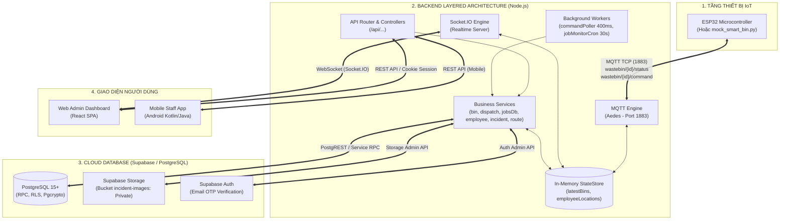
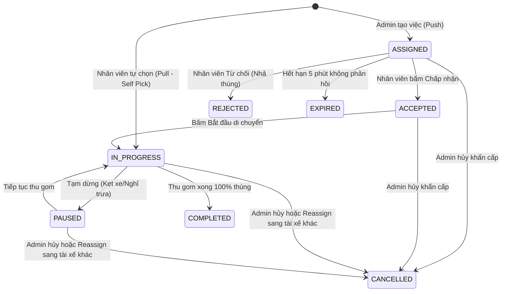

# 📚 TÀI LIỆU TOÀN DIỆN MÁY CHỦ BACKEND (SMARTWASTE BACKEND SERVER)

Hệ thống Máy chủ Điều phối Thu gom & Giám sát Thùng rác Thông minh — Kiến trúc **Đa tầng Chuẩn Doanh nghiệp (Enterprise Layered Architecture)** trên nền tảng **Node.js, Express, Aedes MQTT Broker, Socket.IO WebSockets và Supabase PostgreSQL**.

---

## 📑 MỤC LỤC

1. [TỔNG QUAN HỆ THỐNG & KIẾN TRÚC ĐA TẦNG](#1-tổng-quan-hệ-thống--kiến-trúc-đa-tầng)
2. [CẤU TRÚC THƯ MỤC & PHÂN TÁCH MODULE](#2-cấu-trúc-thư-mục--phân-tách-module)
3. [ĐẶC TẢ CHI TIẾT DANH MỤC RESTful APIs](#3-đặc-tả-chi-tiết-danh-mục-restful-apis)
   - 3.1. [Xác thực & Phiên người dùng (`/api/auth`)](#31-xác-thực--phiên-người-dùng-apiauth)
   - 3.2. [Quản lý Thùng rác & Điều khiển Phần cứng (`/api/bins`)](#32-quản-lý-thùng-rác--điều-khiển-phần-cứng-apibins)
   - 3.3. [Quản lý Nhân viên & Vị trí GPS (`/api/employees`, `/api/location`)](#33-quản-lý-nhân-viên--vị-trí-gps-apiemployees-apilocation)
   - 3.4. [Điều phối Nhiệm vụ Thu gom (`/api/dispatch`)](#34-điều-phối-nhiệm-vụ-thu-gom-apidispatch)
   - 3.5. [Ứng dụng Di động Nhân viên Thực địa (`/api/mobile/jobs`)](#35-ứng-dụng-di-động-nhân-viên-thực-địa-apimobilejobs)
   - 3.6. [Bản đồ & Tối ưu Tuyến đường (`/api/map`)](#36-bản-đồ--tối-ưu-tuyến-đường-apimap)
   - 3.7. [Báo cáo Sự cố & Ảnh Minh chứng (`/api/incidents`)](#37-báo-cáo-sự-cố--ảnh-minh-chứng-apiincidents)
   - 3.8. [Thống kê & Giám sát Hệ thống (`/api/dashboard`, `/api/health`)](#38-thống-kê--giám-sát-hệ-thống-apidashboard-apihealth)
4. [ĐẶC TẢ GIAO THỨC MQTT (IoT HARDWARE)](#4-đặc-tả-giao-thức-mqtt-iot-hardware)
5. [ĐẶC TẢ GIAO THỨC REALTIME WEBSOCKET (SOCKET.IO)](#5-đặc-tả-giao-thức-realtime-websocket-socketio)
6. [QUY TRÌNH NGHIỆP VỤ & MÔ HÌNH STATE MACHINE](#6-quy-trình-nghiệp-vụ--mô-hình-state-machine)
7. [BẢO MẬT & QUẢN LÝ PHIÊN (AUTHENTICATION & SECURITY)](#7-bảo-mật--quản-lý-phiên-authentication--security)
8. [HƯỚNG DẪN CẤU HÌNH, KHỞI CHẠY & BẢO TRÌ](#8-hướng-dẫn-cấu-hình-khởi-chạy--bảo-trì)

---

## 1. TỔNG QUAN HỆ THỐNG & KIẾN TRÚC ĐA TẦNG

Máy chủ Backend hoạt động theo mô hình **Hybrid Server đa giao thức**, kết hợp 3 tầng truyền thông:
- **HTTP REST Engine (Express 5)**: Xử lý các yêu cầu quản trị, đăng nhập, phân quyền, điều phối tuyến và thống kê.
- **Embedded MQTT Broker (Aedes - Port 1883)**: Giao tiếp trực tiếp với vi điều khiển ESP32 / thiết bị giả lập IoT qua TCP với độ trễ siêu thấp.
- **WebSocket Engine (Socket.IO)**: Đẩy luồng dữ liệu thời gian thực (telemetry, vị trí GPS tài xế, cảnh báo đầy rác) lên Web Admin Dashboard.
- **Database Engine (PostgreSQL / Supabase)**: Quản lý toàn vẹn dữ liệu qua Stored Procedures (RPC), Row Level Security (RLS) và pgcrypto.



---

## 2. CẤU TRÚC THƯ MỤC & PHÂN TÁCH MODULE

Mã nguồn được phân tách rõ ràng theo chuẩn **Separation of Concerns (SoC)**:

```
server/backend/
├── src/
│   ├── config/
│   │   ├── env.js                  # Quản lý nạp .env, URL Supabase, Keys, Port
│   │   └── constants.js            # Ngưỡng cảnh báo rác, timeout ca làm, mã trạng thái
│   ├── core/
│   │   ├── logger.js               # Structured logger kèm định dạng giờ Việt Nam [UTC+7]
│   │   ├── supabase.js             # Client HTTP fetch tới Supabase (REST, RPC, Storage, Auth Admin)
│   │   └── stateStore.js           # Quản lý bộ nhớ đệm In-Memory và Event Emitter trung tâm
│   ├── middleware/
│   │   ├── auth.js                 # Middleware requireAuth, requireAdmin, phân tích Cookie
│   │   ├── security.js             # Thiết lập Permissions-Policy và chống Cache trình duyệt
│   │   └── errorHandler.js         # Global error handler & async handler wrapper
│   ├── services/
│   │   ├── binService.js           # Nghiệp vụ thùng rác, lưu telemetry, gửi lệnh nắp
│   │   ├── dispatchService.js      # Nghiệp vụ điều phối (Assign, Reassign, Cancel, Self-Pick, Collect)
│   │   ├── jobsDb.js               # Thao tác CSDL collection_jobs, tính tiến độ hoàn thành
│   │   ├── employeeService.js      # Quản lý tài khoản nhân viên, vị trí GPS thực địa
│   │   ├── incidentService.js      # Báo cáo sự cố, tạo Signed URL bảo mật ảnh
│   │   ├── routingService.js       # Tính toán lộ trình OSRM & thuật toán Fallback Haversine
│   │   └── statsService.js         # Tổng hợp chỉ số thống kê Dashboard
│   ├── routes/
│   │   ├── index.js                # Router tổng gom nhóm toàn bộ API
│   │   ├── authRoutes.js           # Endpoints: /api/auth/login, /api/auth/me, /api/auth/logout
│   │   ├── binRoutes.js            # Endpoints: /api/bins, /api/bins/:id, /api/events
│   │   ├── employeeRoutes.js       # Endpoints: /api/employees, /api/location
│   │   ├── incidentRoutes.js       # Endpoints: /api/incidents
│   │   ├── mapRoutes.js            # Endpoints: /api/map/locations, /api/map/route, /api/map/config
│   │   ├── dispatchRoutes.js       # Endpoints: /api/dispatch/active-jobs, /api/dispatch/assign, ...
│   │   ├── mobileRoutes.js         # Endpoints: /api/mobile/jobs/...
│   │   └── dashboardRoutes.js      # Endpoints: /api/dashboard/stats, /api/health
│   ├── websocket/
│   │   └── socketServer.js         # Quản lý kết nối Socket.IO, phòng ban admin, lệnh nắp 2 chiều
│   ├── mqtt/
│   │   └── mqttBroker.js           # Quản lý Broker Aedes, nhận telemetry, cảnh báo xe gần nhất
│   └── jobs/
│       ├── commandPoller.js        # Worker quét lệnh nắp pending từ DB mỗi 400ms
│       └── jobMonitorCron.js       # Cron kiểm tra hết hạn nhận việc & cảnh báo dừng xe (30s)
├── jobsDb.js                       # Bridge re-export đảm bảo tương thích ngược
├── seed_vietnam_data.js            # Script nạp 10 thùng rác trọng điểm tại TP.HCM
├── supabase_schema.sql             # Toàn bộ Schema CSDL, Function RPC & RLS
└── server.js                       # File khởi động chính (~80 dòng), hỗ trợ Graceful Shutdown
```

---

## 3. ĐẶC TẢ CHI TIẾT DANH MỤC RESTful APIs

Tất cả các endpoint (ngoại trừ `/api/auth/login` và `/api/health`) đều yêu cầu Cookie phiên `smartwaste_session`.

---

### 3.1. Xác thực & Phiên người dùng (`/api/auth`)

#### `POST /api/auth/login`
- **Mô tả**: Đăng nhập hệ thống (Admin Dashboard hoặc Mobile App).
- **Quyền hạn**: Public.
- **Request Body**:
  ```json
  {
    "username": "admin",
    "password": "admin123"
  }
  ```
- **Response `200 OK`**:
  ```json
  {
    "user": {
      "id": "a1b2c3d4-e5f6-7890-abcd-ef1234567890",
      "username": "admin",
      "full_name": "Quản trị viên",
      "role": "admin"
    }
  }
  ```
  *(Kèm theo Header `Set-Cookie: smartwaste_session=...; HttpOnly; SameSite=Strict; Path=/; Max-Age=28800`)*.
- **Response `401 Unauthorized`**: Sai tên đăng nhập hoặc mật khẩu.

#### `GET /api/auth/me`
- **Mô tả**: Lấy thông tin tài khoản của phiên đăng nhập hiện tại.
- **Quyền hạn**: Đã đăng nhập.
- **Response `200 OK`**:
  ```json
  {
    "user": {
      "id": "a1b2c3d4-e5f6-7890-abcd-ef1234567890",
      "username": "admin",
      "full_name": "Quản trị viên",
      "role": "admin"
    }
  }
  ```

#### `POST /api/auth/logout`
- **Mô tả**: Đăng xuất khỏi hệ thống và hủy token phiên trong CSDL.
- **Quyền hạn**: Đã đăng nhập.
- **Response `200 OK`**: `{"ok": true}` *(Cookie bị xóa)*.

---

### 3.2. Quản lý Thùng rác & Điều khiển Phần cứng (`/api/bins`)

#### `GET /api/bins`
- **Mô tả**: Lấy danh sách toàn bộ thùng rác kèm trạng thái mới nhất.
- **Quyền hạn**: Đã đăng nhập.
- **Response `200 OK`**:
  ```json
  [
    {
      "device_id": "BIN_HCM_01",
      "name": "Thùng rác Chợ Bến Thành",
      "location": "Cửa Nam Chợ Bến Thành, Quận 1",
      "latitude": 10.7725,
      "longitude": 106.6980,
      "state": "CLOSED",
      "control_mode": "AUTO",
      "servo_angle": 0,
      "dist_user": 45.2,
      "dist_level": 12.5,
      "level_percent": 78,
      "is_online": true,
      "collection_status": "IDLE",
      "collection_employee_name": null,
      "last_seen": "2026-08-16T18:00:00.000Z"
    }
  ]
  ```

#### `PATCH /api/bins/:id`
- **Mô tả**: Cập nhật thông tin tên, vị trí mô tả hoặc tọa độ thùng rác.
- **Quyền hạn**: Admin.
- **Request Body**:
  ```json
  {
    "name": "Thùng rác Cửa Đông Bến Thành",
    "location": "Đường Phan Chu Trinh, Quận 1",
    "latitude": 10.7726,
    "longitude": 106.6985
  }
  ```
- **Response `200 OK`**: `{"ok": true, "bin": { ... }}`

#### `PATCH /api/bins/:id/coordinates`
- **Mô tả**: Cập nhật nhanh tọa độ GPS khi kéo thả marker trên bản đồ.
- **Quyền hạn**: Admin.
- **Request Body**: `{"latitude": 10.7726, "longitude": 106.6985}`
- **Response `200 OK`**: `{"ok": true}`

#### `POST /api/bins/:id/command`
- **Mô tả**: Gửi lệnh điều khiển phần cứng 2 chiều tới ESP32 (Chờ ACK từ thiết bị).
- **Quyền hạn**: Đã đăng nhập.
- **Request Body**:
  ```json
  {
    "action": "OPEN" // "OPEN" | "CLOSE" | "AUTO" | "MANUAL" | "PAUSE" | "RESUME"
  }
  ```
- **Response `200 OK`** *(Nhận ACK thành công trong vòng 4.5s)*:
  ```json
  {
    "ok": true,
    "bin": { "device_id": "BIN_HCM_01", "state": "OPEN", "servo_angle": 90 },
    "message": "Thiết bị #BIN_HCM_01 đã thực thi thành công."
  }
  ```
- **Response `504 Gateway Timeout`**: Thiết bị ngoại tuyến hoặc không phản hồi.

#### `GET /api/events`
- **Mô tả**: Lịch sử nhật ký hoạt động (`telemetry`, `command`, `alert`).
- **Query Params**: `?deviceId=BIN_HCM_01&limit=50`
- **Response `200 OK`**: Danh sách bản ghi nhật ký.

---

### 3.3. Quản lý Nhân viên & Vị trí GPS (`/api/employees`, `/api/location`)

#### `GET /api/employees`
- **Mô tả**: Danh sách toàn bộ nhân viên trong hệ thống.
- **Quyền hạn**: Admin.
- **Response `200 OK`**:
  ```json
  [
    {
      "id": "uuid...",
      "username": "driver_tin",
      "full_name": "Ngô Nhật Tín",
      "role": "staff",
      "is_active": true,
      "last_login": "2026-08-16T17:30:00.000Z",
      "created_at": "2026-08-01T08:00:00.000Z"
    }
  ]
  ```

#### `POST /api/employees`
- **Mô tả**: Tạo nhân viên mới (Đồng thời tạo Auth User cho Email OTP và Account).
- **Quyền hạn**: Admin.
- **Request Body**:
  ```json
  {
    "fullName": "Trần Văn An",
    "username": "driver_an",
    "email": "driver.an@smartwaste.vn",
    "password": "Password123@",
    "role": "staff"
  }
  ```
- **Response `201 Created`**: Thông tin nhân viên vừa tạo.

#### `PATCH /api/employees/:id/active`
- **Mô tả**: Khóa hoặc mở khóa tài khoản nhân viên.
- **Quyền hạn**: Admin.
- **Request Body**: `{"isActive": false}`
- **Response `200 OK`**: `{"ok": true}`

#### `DELETE /api/employees/:id`
- **Mô tả**: Xóa mềm tài khoản nhân viên (ẩn khỏi danh sách và xóa Auth User).
- **Quyền hạn**: Admin.
- **Response `200 OK`**: `{"ok": true, "authUserDeleted": true}`

#### `POST /api/location`
- **Mô tả**: Cập nhật tọa độ GPS thời gian thực từ Mobile App của nhân viên.
- **Quyền hạn**: Đã đăng nhập.
- **Request Body**:
  ```json
  {
    "latitude": 10.7769,
    "longitude": 106.7009,
    "accuracy": 5.2,
    "heading": 180.0,
    "speed": 25.5
  }
  ```
- **Response `200 OK`**: `{"ok": true}` *(Tự động broadcast `employeeLocation` qua Socket.IO)*.

#### `GET /api/map/locations`
- **Mô tả**: Lấy danh sách tọa độ GPS mới nhất của tất cả nhân viên.
- **Quyền hạn**: Admin.
- **Response `200 OK`**: Danh sách vị trí nhân viên.

---

### 3.4. Điều phối Nhiệm vụ Thu gom (`/api/dispatch`)

#### `GET /api/dispatch/active-jobs`
- **Mô tả**: Lấy tất cả nhiệm vụ đang hoạt động (`ASSIGNED`, `ACCEPTED`, `IN_PROGRESS`, `PAUSED`) kèm tiến độ %.
- **Quyền hạn**: Đã đăng nhập.
- **Response `200 OK`**:
  ```json
  [
    {
      "id": "JOB_1723800000000",
      "employee_id": "uuid...",
      "employee_name": "Ngô Nhật Tín",
      "source": "ADMIN_ASSIGNED",
      "status": "IN_PROGRESS",
      "target_bin_ids": ["BIN_HCM_01", "BIN_HCM_02"],
      "completed_bin_ids": ["BIN_HCM_01"],
      "progress": { "total": 2, "collected": 1, "percent": 50 },
      "route_data": { "distanceMeters": 4200, "durationSeconds": 650 },
      "started_at": "2026-08-16T18:05:00.000Z"
    }
  ]
  ```

#### `GET /api/dispatch/history`
- **Mô tả**: Lịch sử các ca thu gom đã hoàn thành hoặc đã hủy.
- **Query Params**: `?limit=100`
- **Response `200 OK`**: Danh sách lịch sử jobs.

#### `POST /api/dispatch/assign`
- **Mô tả**: Admin gán tuyến thu gom cho nhân viên (Push model). Tự động khóa thùng rác và tính toán lộ trình tối ưu OSRM.
- **Quyền hạn**: Admin.
- **Request Body**:
  ```json
  {
    "employeeId": "uuid...",
    "employeeName": "Ngô Nhật Tín",
    "binIds": ["BIN_HCM_01", "BIN_HCM_04"]
  }
  ```
- **Response `201 Created`**: Thông tin Job đã tạo kèm tiến độ ban đầu.
- **Response `409 Conflict`**: Thùng rác đã bị nhận bởi tài xế khác hoặc tài xế đang bận job chưa xong.

#### `POST /api/dispatch/jobs/:id/reassign`
- **Mô tả**: Admin chuyển giao các thùng rác còn lại trong Job cho tài xế khác (khi xe bị hư hoặc tài xế gặp sự cố).
- **Quyền hạn**: Admin.
- **Request Body**:
  ```json
  {
    "employeeId": "uuid_new_driver",
    "employeeName": "Trần Văn An"
  }
  ```
- **Response `200 OK`**: `{"ok": true, "old_job": { ... }, "new_job": { ... }}`

#### `POST /api/dispatch/jobs/:id/cancel`
- **Mô tả**: Admin hủy khẩn cấp nhiệm vụ (Tự động giải phóng các thùng rác về trạng thái `IDLE`).
- **Quyền hạn**: Admin.
- **Response `200 OK`**: `{"ok": true, "job": { ... }}`

---

### 3.5. Ứng dụng Di động Nhân viên Thực địa (`/api/mobile/jobs`)

#### `GET /api/mobile/jobs/active`
- **Mô tả**: Lấy thông tin nhiệm vụ hiện tại của nhân viên đang đăng nhập.
- **Quyền hạn**: Đã đăng nhập.
- **Response `200 OK`**: `{"job": { ... }}` hoặc `{"job": null}`.

#### `POST /api/mobile/jobs/self-pick`
- **Mô tả**: Nhân viên tự chọn thùng rác đầy gần mình để thu gom (Pull model).
- **Quyền hạn**: Đã đăng nhập.
- **Request Body**: `{"binIds": ["BIN_HCM_02", "BIN_HCM_07"]}`
- **Response `201 Created`**: Thông tin Job vừa tạo ở trạng thái `IN_PROGRESS`.

#### `POST /api/mobile/jobs/:id/accept`
- **Mô tả**: Nhân viên chấp nhận nhiệm vụ được gán (`ASSIGNED` -> `ACCEPTED`).
- **Response `200 OK`**: `{"ok": true, "job": { ... }}`

#### `POST /api/mobile/jobs/:id/reject`
- **Mô tả**: Nhân viên từ chối nhiệm vụ (`ASSIGNED` -> `REJECTED`, giải phóng thùng rác).
- **Response `200 OK`**: `{"ok": true, "job": { ... }}`

#### `POST /api/mobile/jobs/:id/start`
- **Mô tả**: Nhân viên bắt đầu di chuyển thu gom (`ACCEPTED` -> `IN_PROGRESS`).
- **Response `200 OK`**: `{"ok": true, "job": { ... }}`

#### `POST /api/mobile/jobs/:id/pause`
- **Mô tả**: Tạm dừng ca thu gom (nghỉ trưa / kẹt xe / xe hỏng).
- **Request Body**: `{"reason": "Kẹt xe đường Nam Kỳ Khởi Nghĩa"}`
- **Response `200 OK`**: `{"ok": true, "job": { ... }}`

#### `POST /api/mobile/jobs/:id/resume`
- **Mô tả**: Tiếp tục ca thu gom sau khi tạm dừng (`PAUSED` -> `IN_PROGRESS`).
- **Response `200 OK`**: `{"ok": true, "job": { ... }}`

#### `POST /api/mobile/jobs/:id/collect-bin`
- **Mô tả**: Xác nhận đã thu gom 1 thùng rác (Cập nhật mức rác về 0%, giải phóng thùng, tự động hoàn thành Job nếu gom hết thùng).
- **Request Body**:
  ```json
  {
    "binId": "BIN_HCM_01",
    "status": "COLLECTED",
    "note": "Rác đầy tràn miệng thùng, đã dọn sạch xung quanh",
    "photoUrl": "https://..."
  }
  ```
- **Response `200 OK`**:
  ```json
  {
    "ok": true,
    "allDone": false,
    "idempotent": false,
    "job": { ... }
  }
  ```

---

### 3.6. Bản đồ & Tối ưu Tuyến đường (`/api/map`)

#### `GET /api/map/config`
- **Mô tả**: Cấu hình bản đồ (Google Maps API Key, Map ID hoặc Leaflet OpenStreetMap).
- **Response `200 OK`**:
  ```json
  {
    "provider": "google",
    "googleMapsBrowserKey": "AIza...",
    "googleMapId": null,
    "routesProvider": "osrm"
  }
  ```

#### `POST /api/map/route`
- **Mô tả**: Tính toán khoảng cách, thời gian và thứ tự điểm dừng tối ưu (OSRM Driving Engine + Haversine Fallback).
- **Request Body**:
  ```json
  {
    "coordinates": [
      [106.7009, 10.7769],
      [106.6980, 10.7725],
      [106.7219, 10.7950]
    ]
  }
  ```
- **Response `200 OK`**:
  ```json
  {
    "provider": "osrm",
    "distanceMeters": 5820,
    "durationSeconds": 920,
    "coordinates": [[106.7009, 10.7769], ...],
    "optimizedOrder": [0, 1, 2]
  }
  ```

---

### 3.7. Báo cáo Sự cố & Ảnh Minh chứng (`/api/incidents`)

#### `GET /api/incidents`
- **Mô tả**: Lấy danh sách tất cả báo cáo sự cố hư hỏng nắp, cảm biến, quá tải thùng rác.
- **Quyền hạn**: Admin.
- **Response `200 OK`**: Danh sách sự cố kèm link xem ảnh.

#### `PATCH /api/incidents/:id/status`
- **Mô tả**: Cập nhật trạng thái xử lý sự cố (`NEW` -> `IN_REVIEW` -> `RESOLVED`).
- **Quyền hạn**: Admin.
- **Request Body**: `{"status": "RESOLVED"}`
- **Response `200 OK`**: Thông tin sự cố đã cập nhật.

#### `GET /api/employees/:id/incidents/:reportId/image`
- **Mô tả**: Chuyển hướng (302 Redirect) tới **Signed URL bảo mật** thời hạn 1 giờ từ Supabase Storage Bucket riêng tư (`incident-images`).

---

### 3.8. Thống kê & Giám sát Hệ thống (`/api/dashboard`, `/api/health`)

#### `GET /api/health`
- **Mô tả**: Kiểm tra trạng thái máy chủ, cổng MQTT và kết nối CSDL Supabase.
- **Quyền hạn**: Public.
- **Response `200 OK`**:
  ```json
  {
    "ok": true,
    "mqttPort": 1883,
    "devices": 10,
    "supabase": "connected"
  }
  ```

#### `GET /api/dashboard/stats`
- **Mô tả**: Tổng hợp các số liệu KPI theo thời gian thực cho Admin Dashboard.
- **Quyền hạn**: Đã đăng nhập.
- **Response `200 OK`**:
  ```json
  {
    "ok": true,
    "totalBins": 10,
    "onlineBins": 10,
    "offlineBins": 0,
    "overfullBins": 3,
    "nearFullBins": 2,
    "normalBins": 5,
    "activeTrucks": 2,
    "activeJobsCount": 1,
    "completedJobsCount": 14,
    "totalTons": 18.7,
    "updatedAt": "2026-08-16T18:15:00.000Z"
  }
  ```

---

## 4. ĐẶC TẢ GIAO THỨC MQTT (IoT HARDWARE)

Máy chủ tích hợp sẵn **Aedes MQTT Broker** tại cổng TCP `1883`.

### 4.1. Telemetry Ingestion (ESP32 -> Server)
- **Topic**: `wastebin/{device_id}/status`
- **QoS**: `1`
- **Payload Schema (JSON)**:
  ```json
  {
    "state": "CLOSED",
    "controlMode": "AUTO",
    "servoAngle": 0,
    "distUser": 35.4,
    "distLevel": 10.2,
    "levelPercent": 88,
    "collectionPaused": false,
    "ipAddress": "192.168.1.105",
    "commandAckId": "2026-08-16T18:00:00.000Z",
    "commandAckAction": "OPEN"
  }
  ```
- **Xử lý tại Backend**:
  1. Cập nhật trạng thái tức thì vào `stateStore.latestBins`.
  2. Nếu có `commandAckId`, đánh dấu hoàn thành lệnh (`command_status: 'done'`) và giải phóng retain message.
  3. Nếu `levelPercent >= 85%`: Tính toán xe thu gom gần nhất đang rảnh và gửi cảnh báo `binOverfullAlert` tới phòng `admins` trên WebSockets.
  4. Lấy mẫu ghi CSDL `bin_events` mỗi 30 giây/thùng (chống tràn băng thông và quá tải CSDL).

### 4.2. Command Publishing (Server -> ESP32)
- **Topic**: `wastebin/{device_id}/command`
- **QoS**: `1`
- **Retain**: `true` *(Đảm bảo vi điều khiển nhận được lệnh ngay khi vừa kết nối lại Wi-Fi)*.
- **Payload Schema (JSON)**:
  ```json
  {
    "action": "OPEN",
    "commandId": "2026-08-16T18:05:00.000Z"
  }
  ```

---

## 5. ĐẶC TẢ GIAO THỨC REALTIME WEBSOCKET (SOCKET.IO)

### 5.1. Phòng & Định danh (Rooms)
- `admins`: Dành riêng cho tài khoản có `role = 'admin'`.
- `employee_{id}`: Phòng riêng của từng nhân viên để nhận thông báo gán nhiệm vụ (`jobAssigned`).

### 5.2. Các sự kiện phát từ Server (Server -> Client)

| Tên sự kiện | Room | Dữ liệu kèm theo | Mục đích |
| :--- | :--- | :--- | :--- |
| `initialBins` | Client | Danh sách toàn bộ thùng rác trong cache | Khởi tạo giao diện ngay khi vừa kết nối |
| `binData` | Toàn bộ | `{ binId, data }` | Cập nhật mức rác, nắp mở/đóng theo thời gian thực |
| `employeeLocation` | `admins` | `{ employee_id, latitude, longitude, ... }` | Marker di chuyển xe rác trên bản đồ trực tiếp |
| `binOverfullAlert` | `admins` | `{ binId, name, levelPercent, suggestedNearestTruck }` | Popup cảnh báo thùng rác quá tải & gợi ý tài xế gần nhất |
| `jobAssigned` | `employee_{id}` | `{ ...job }` | Thông báo rung chuông nhận nhiệm vụ cho tài xế |
| `jobUpdated` | Toàn bộ | `{ ...job }` | Đồng bộ tiến độ % thu gom giữa Web và App |
| `jobCompleted` | Toàn bộ | `{ jobId, employeeId }` | Thông báo hoàn tất toàn bộ lộ trình |
| `jobPausedTooLong` | `admins` | `{ jobId, employeeName, pausedMinutes }` | Cảnh báo tài xế dừng xe quá 30 phút |

### 5.3. Các sự kiện nhận từ Client (Client -> Server)

- **`lidCommand`**: Điều khiển nắp thùng rác từ Dashboard.
  - **Payload**: `{"binId": "BIN_HCM_01", "action": "OPEN"}`
  - **Acknowledge Callback**:
    ```json
    {
      "ok": true,
      "message": "Thiết bị #BIN_HCM_01 đã thực thi \"Mở nắp\" thành công!",
      "bin": { "device_id": "BIN_HCM_01", "state": "OPEN" }
    }
    ```

---

## 6. QUY TRÌNH NGHIỆP VỤ & MÔ HÌNH STATE MACHINE

### 6.1. Vòng đời Trạng thái Nhiệm vụ Thu gom (Job State Machine)



### 6.2. Tính năng Phòng chống Xung đột (Concurrency Control)
- Tất cả các thao tác nhận việc, chuyển giao xe, đổi trạng thái đều được bọc trong **1 Transaction Stored Procedure duy nhất** với khóa dòng `FOR UPDATE` và kiểm tra `version = version + 1` (Optimistic Concurrency Control).
- Ngăn chặn triệt để tình trạng 2 tài xế cùng tranh chấp 1 thùng rác trên bản đồ.

---

## 7. BẢO MẬT & QUẢN LÝ PHIÊN (AUTHENTICATION & SECURITY)

1. **Phiên trượt an toàn (Sliding Session Cookie)**:
   - Sử dụng Cookie `smartwaste_session` với cờ `HttpOnly; SameSite=Strict`.
   - Token ngẫu nhiên 32-byte (256-bit entropy) được băm một chiều `SHA-256` trước khi lưu vào bảng `employee_sessions`.
2. **Mã hóa mật khẩu chuẩn Bcrypt**:
   - Sử dụng extension `pgcrypto` (`extensions.crypt(password, extensions.gen_salt('bf', 10))`).
3. **Bảo mật ảnh sự cố riêng tư (Capability Signed URLs)**:
   - Bucket `incident-images` được thiết lập `public = false`.
   - Chỉ người dùng có token hợp lệ mới được cấp Signed URL xem ảnh trong thời hạn 3600 giây.

---

## 8. HƯỚNG DẪN CẤU HÌNH, KHỞI CHẠY & BẢO TRÌ

### 8.1. Cấu hình biến môi trường (`.env`)

Tạo file `.env` tại thư mục `server/backend/.env`:

```ini
# Cổng dịch vụ
HTTP_PORT=3000
MQTT_PORT=1883

# Supabase Credentials
SUPABASE_URL=https://zwrapaqlozdkbkblohcq.supabase.co
SUPABASE_ANON_KEY=eyJhbGciOiJIUzI1NiIsInR5cCI6IkpXVCJ9...
SUPABASE_SERVICE_ROLE_KEY=eyJhbGciOiJIUzI1NiIsInR5cCI6IkpXVCJ9...

# Bản đồ & Định tuyến GIS Miễn phí 100% (OpenStreetMap + Leaflet + OSRM)
MAP_PROVIDER=leaflet
ROUTES_PROVIDER=osrm

# Ngưỡng điều phối & Cảnh báo
FILL_THRESHOLD_WARNING=70
FILL_THRESHOLD_CRITICAL=85
ASSIGN_TIMEOUT_MINUTES=5
PAUSED_TIMEOUT_MINUTES=30
```

### 8.2. Khởi tạo Cơ sở dữ liệu Supabase

1. Mở **Supabase Dashboard → SQL Editor**.
2. Chạy toàn bộ mã nguồn trong file [supabase_schema.sql](file:///c:/Users/Phucx/Downloads/waste/server/backend/supabase_schema.sql).
3. Tài khoản quản trị mặc định:
   - **Tên đăng nhập**: `admin`
   - **Mật khẩu**: `admin123`

### 8.3. Nạp Dữ liệu Mẫu 10 Thùng rác TP.HCM

```powershell
npm run seed
```

### 8.4. Lệnh Khởi động Máy chủ

- **Chạy trực tiếp Backend**:
  ```powershell
  npm start
  ```
- **Chạy từ thư mục gốc dự án**:
  ```powershell
  npm run server
  ```
- **Kiểm tra cú pháp toàn bộ module**:
  ```powershell
  npm run check
  ```
