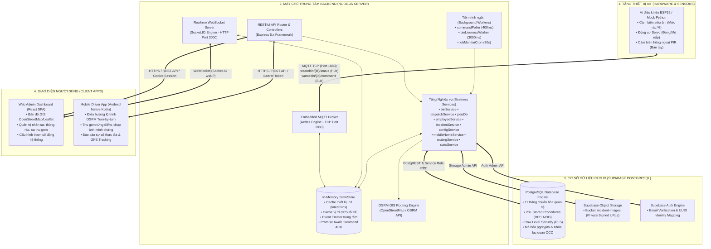
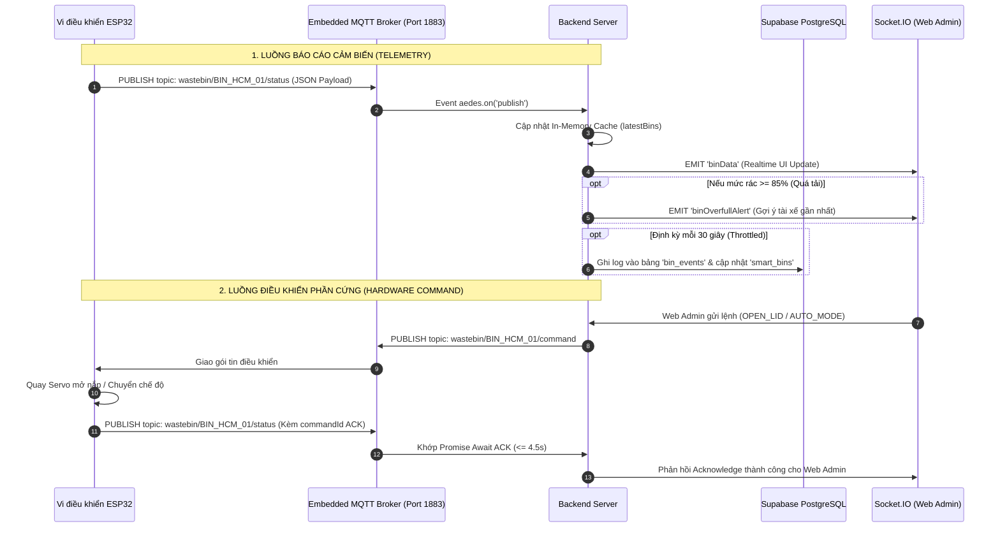
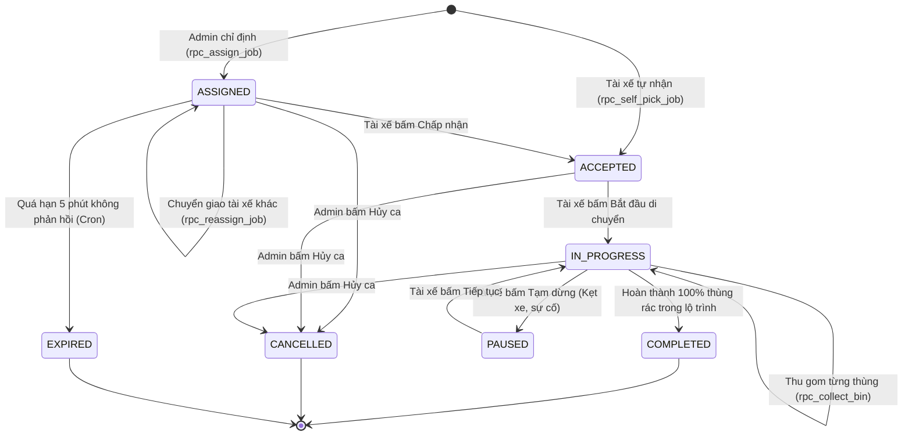

# 📚 TÀI LIỆU KỸ THUẬT TOÀN DIỆN MÁY CHỦ BACKEND (SMARTWASTE BACKEND SERVER)

> **Hệ thống Máy chủ Điều phối Thu gom & Giám sát Thùng rác Thông minh — SmartWaste IoT Platform**  
> **Kiến trúc:** Đa tầng Chuẩn Doanh nghiệp (Enterprise Layered Architecture) kết hợp Đa giao thức (RESTful HTTP, MQTT Broker, Socket.IO WebSockets & Cloud PostgreSQL).  
> **Phiên bản:** 1.0.0 • **Môi trường:** Node.js 18+ (ESM & CommonJS Hybrid) • **Database:** Supabase PostgreSQL 15+

---

## 📑 MỤC LỤC

1. [TỔNG QUAN HỆ THỐNG & KIẾN TRÚC ĐA TẦNG](#1-tổng-quan-hệ-thống--kiến-trúc-đa-tầng)
2. [CẤU TRÚC THƯ MỤC & PHÂN TÁCH TRÁCH NHIỆM MODULE](#2-cấu-trúc-thư-mục--phân-tách-trách-nhiệm-module)
3. [MÔ HÌNH DỮ LIỆU & QUẢN TRỊ CSDL SUPABASE (DATABASE & ERD)](#3-mô-hình-dữ-liệu--quản-trị-csdl-supabase-database--erd)
4. [ĐẶC TẢ CHI TIẾT TOÀN BỘ DANH MỤC RESTful APIs](#4-đặc-tả-chi-tiết-toàn-bộ-danh-mục-restful-apis)
   - 4.1. [Xác thực & Phiên làm việc (`/api/auth`)](#41-xác-thực--phiên-làm-việc-apiauth)
   - 4.2. [Quản lý Thùng rác & Điều khiển Phần cứng (`/api/bins`)](#42-quản-lý-thùng-rác--điều-khiển-phần-cứng-apibins)
   - 4.3. [Điều phối Tuyến & Ca làm việc (`/api/dispatch`)](#43-điều-phối-tuyến--ca-làm-việc-apidispatch)
   - 4.4. [Ứng dụng Di động Nhân viên Thực địa (`/api/mobile`)](#44-ứng-dụng-di-động-nhân-viên-thực-địa-apimobile)
   - 4.5. [Quản lý Nhân sự & Vị trí GPS (`/api/employees`, `/api/location`)](#45-quản-lý-nhân-sự--vị-trí-gps-apiemployees-apilocation)
   - 4.6. [Báo cáo Sự cố & Minh chứng Ảnh (`/api/incidents`)](#46-báo-cáo-sự-cố--minh-chứng-ảnh-apiincidents)
   - 4.7. [Bản đồ & Tối ưu Tuyến đường GIS (`/api/map`)](#47-bản-đồ--tối-ưu-tuyến-đường-gis-apimap)
   - 4.8. [Cài đặt & Cấu hình Tham số Động (`/api/settings`)](#48-cài-đặt--cấu-hình-tham-số-động-apisettings)
   - 4.9. [Giám sát & Thống kê Thời gian thực (`/api/health`, `/api/dashboard`)](#49-giám-sát--thống-kê-thời-gian-thực-apihealth-apidashboard)
5. [ĐẶC TẢ GIAO THỨC MQTT (ESP32 HARDWARE & EMULATOR)](#5-đặc-tả-giao-thức-mqtt-esp32-hardware--emulator)
6. [ĐẶC TẢ GIAO THỨC REALTIME WEBSOCKET (SOCKET.IO)](#6-đặc-tả-giao-thức-realtime-websocket-socketio)
7. [QUY TRÌNH NGHIỆP VỤ & MÔ HÌNH STATE MACHINE](#7-quy-trình-nghiệp-vụ--mô-hình-state-machine)
8. [CÁC TIẾN TRÌNH CHẠY NGẦM (BACKGROUND WORKERS & CRON)](#8-các-tiến-trình-chạy-ngầm-background-workers--cron)
9. [BẢO MẬT, KIỂM SOÁT PHIÊN & AN TOÀN DỮ LIỆU](#9-bảo-mật-kiểm-soát-phiên--an-toàn-dữ-liệu)
10. [HƯỚNG DẪN CÀI ĐẶT, KHỞI CHẠY, SEEDING & KIỂM THỬ](#10-hướng-dẫn-cài-đặt-khởi-chạy-seeding--kiểm-thử)

---

## 1. TỔNG QUAN HỆ THỐNG & KIẾN TRÚC ĐA TẦNG

Máy chủ Backend hoạt động theo mô hình **Hybrid Server đa giao thức**, chịu trách nhiệm điều phối toàn diện hệ thống quản lý chất thải thông minh với 4 trụ cột truyền thông:



---

## 2. CẤU TRÚC THƯ MỤC & PHÂN TÁCH TRÁCH NHIỆM MODULE

```
server/backend/
├── .env                            # Tệp biến môi trường bí mật (Supabase Keys, Ports, Timeouts)
├── .env.example                    # Tệp mẫu cấu hình môi trường chuẩn
├── server.js                       # Entry point khởi tạo HTTP, MQTT, Socket.IO, Workers và Graceful Shutdown
├── package.json                    # Khai báo dependencies, scripts khởi động và kiểm tra
├── seed_vietnam_data.js            # Script nạp 10 thùng rác mẫu TP.HCM, tài khoản nhân viên & ca gom mẫu
├── test_all_apis.js                # Bộ kiểm thử tự động toàn diện REST APIs
├── test_live_apis.js               # Bộ kiểm thử End-to-End với máy chủ đang hoạt động
├── supabase_schema.sql             # Toàn bộ mã nguồn DDL Tables, Indices, Triggers & Stored Procedures (RPC)
├── data/
│   └── system_settings.json        # File cache lưu trữ tham số động cục bộ của hệ thống
└── src/
    ├── config/
    │   ├── env.js                  # Module nạp, xác thực và chuẩn hóa biến môi trường
    │   └── constants.js            # Định nghĩa hằng số: vai trò, hành động nắp thùng, tên cookie, timeout
    ├── core/
    │   ├── logger.js               # Structured Logger chuẩn hóa nhãn thời gian Việt Nam [Asia/Ho_Chi_Minh]
    │   ├── supabase.js             # HTTP Client giao tiếp Supabase (REST, RPC, Storage, Auth Admin)
    │   └── stateStore.js           # Bộ nhớ đệm In-Memory trung tâm và Event Emitter liên module
    ├── middleware/
    │   ├── auth.js                 # Middleware xác thực requireAuth, phân quyền requireAdmin, xử lý Cookie/Token
    │   ├── security.js             # Thiết lập HTTP Security Headers, Content-Security-Policy & No-Cache
    │   └── errorHandler.js         # Xử lý lỗi toàn cục và wrapper asyncHandler cho async route handlers
    ├── services/
    │   ├── binService.js           # Nghiệp vụ quản lý thùng rác, lưu telemetry, gửi lệnh phần cứng & sự kiện
    │   ├── configService.js        # Quản lý cấu hình tham số động hệ thống (Supabase + File JSON + .env)
    │   ├── dispatchService.js      # Nghiệp vụ điều phối: Gán ca, tự nhận ca, chuyển giao, hủy, thu gom từng điểm
    │   ├── employeeService.js      # Nghiệp vụ nhân sự: Đăng nhập, đăng xuất, CRUD nhân viên, GPS tracking
    │   ├── incidentService.js      # Báo cáo sự cố thực địa, ký Signed URLs ảnh minh chứng (Supabase Storage)
    │   ├── jobsDb.js               # Thao tác CSDL bảng ca làm việc `collection_jobs` & `job_bin_items`
    │   ├── mobileHomeService.js    # Tổng hợp chỉ số Dashboard màn hình chính cho ứng dụng Mobile Driver
    │   ├── routingService.js       # Tính toán lộ trình OSRM (Quãng đường mét, Thời gian giây, Tọa độ Polyline)
    │   └── statsService.js         # Tổng hợp chỉ số KPI thống kê thời gian thực cho Web Dashboard
    ├── routes/
    │   ├── index.js                # Tổng hợp Router trung tâm gắn tiền tố `/api`
    │   ├── authRoutes.js           # `/api/auth` (login, me, change-password, logout)
    │   ├── binRoutes.js            # `/api/bins` (list, update, coordinates, command, events)
    │   ├── dashboardRoutes.js      # `/api/health`, `/api/dashboard/stats`
    │   ├── dispatchRoutes.js       # `/api/dispatch` (active-jobs, history, assign, reassign, cancel)
    │   ├── employeeRoutes.js       # `/api/employees`, `/api/location`
    │   ├── incidentRoutes.js       # `/api/incidents` (uploads, complete, my, image, create, list, status)
    │   ├── mapRoutes.js            # `/api/map` (locations, config, route)
    │   ├── mobileRoutes.js         # `/api/mobile` (home, jobs/active, self-pick, accept, reject, start, pause, resume, collect-bin)
    │   └── settingsRoutes.js       # `/api/settings` (get, update, reset)
    ├── mqtt/
    │   └── mqttBroker.js           # Embedded Aedes MQTT Broker xử lý gói tin vi điều khiển ESP32 (Port 1883)
    ├── websocket/
    │   └── socketServer.js         # Khởi tạo Socket.IO Server, xác thực phòng `admins` & `employee_{id}`
    └── jobs/
        ├── binLivenessWorker.js    # Quét định kỳ kiểm tra trạng thái Online/Offline của Thùng rác & Tài xế
        ├── commandPoller.js        # Quét CSDL phát hiện lệnh điều khiển nắp đang chờ và đẩy sang MQTT
        └── jobMonitorCron.js       # Quét phát hiện ca làm việc quá hạn tiếp nhận hoặc tạm dừng quá lâu
```

---

## 3. MÔ HÌNH DỮ LIỆU & QUẢN TRỊ CSDL SUPABASE (DATABASE & ERD)

Toàn bộ CSDL được xây dựng trên nền tảng **PostgreSQL 15+** qua Supabase với 11 bảng thực thể chuẩn hóa quan hệ và 20 Stored Procedures bảo đảm tính toàn vẹn ACID:

### 3.1. Sơ đồ Quan hệ Thực thể (Entity Relationship Diagram - ERD)

```mermaid
erDiagram
    employee_accounts ||--o{ employee_sessions : "has sessions"
    employee_accounts ||--o{ employee_locations : "reports GPS"
    employee_accounts ||--o{ collection_jobs : "assigned driver"
    employee_accounts ||--o{ incident_reports : "reports incident"
    employee_accounts ||--o{ incident_image_uploads : "uploads photos"
    employee_accounts ||--o{ bin_collections : "driver collects"

    smart_bins ||--o{ bin_events : "generates telemetry"
    smart_bins ||--o{ job_bin_items : "included in route"
    smart_bins ||--o{ bin_collections : "recorded history"
    smart_bins ||--o{ incident_reports : "subject of incident"
    smart_bins ||--o{ incident_image_uploads : "photo target"

    collection_jobs ||--|{ job_bin_items : "contains stop items"
    incident_reports ||--o| incident_image_uploads : "linked proof image"

    employee_accounts {
        uuid id PK
        text full_name "Họ và tên nhân viên"
        text username UK "Tên đăng nhập (3-32 ký tự)"
        text email UK "Địa chỉ email"
        uuid auth_user_id "Khóa ngoại Supabase Auth"
        text password_hash "Mật khẩu mã hóa bcrypt"
        text role "admin | staff"
        boolean is_active "Trạng thái kích hoạt"
        timestamptz last_login "Lần đăng nhập cuối"
        timestamptz deleted_at "Xóa mềm (Soft delete)"
    }

    employee_sessions {
        text token_hash PK "SHA-256 Hash của token"
        uuid employee_id FK "Liên kết employee_accounts"
        timestamptz expires_at "Thời hạn phiên (Trượt 8 giờ)"
    }

    employee_locations {
        uuid employee_id PK,FK "Mã nhân viên"
        double_precision latitude "Vĩ độ GPS (-90 đến 90)"
        double_precision longitude "Kinh độ GPS (-180 đến 180)"
        double_precision accuracy "Độ chính xác GPS (mét)"
        double_precision heading "Góc hướng di chuyển"
        double_precision speed "Vận tốc di chuyển (m/s)"
        timestamptz recorded_at "Thời điểm cập nhật"
    }

    smart_bins {
        text device_id PK "Mã thiết bị phần cứng (BIN_HCM_xx)"
        text name "Tên vị trí thùng rác"
        text location "Địa chỉ chi tiết"
        double_precision latitude "Tọa độ GPS Lat"
        double_precision longitude "Tọa độ GPS Lng"
        int level_percent "Mức rác hiện tại (0-100%)"
        text lid_status "OPEN | CLOSED"
        text mode "AUTO | MANUAL"
        boolean is_online "Trạng thái kết nối"
        timestamptz last_seen "Lần giao tiếp cuối"
        text collection_status "IDLE | ASSIGNED | COLLECTED"
        uuid collection_employee_id FK
        text collection_employee_name
        text last_command "OPEN_LID | CLOSE_LID | ..."
        text command_status "pending | sent | executed | failed"
    }

    bin_events {
        bigint id PK "Tự tăng (Identity)"
        text device_id FK "Mã thùng rác"
        text event_type "telemetry | lid_open | lid_close | alert | command"
        int level_percent "Mức rác tại thời điểm log"
        text lid_status "Trạng thái nắp"
        text mode "Chế độ hoạt động"
        jsonb payload "Dữ liệu mở rộng"
        timestamptz created_at "Thời điểm ghi nhận"
    }

    collection_jobs {
        text id PK "Mã ca thu gom (JOB_xxx)"
        uuid employee_id FK "Tài xế phụ trách"
        text employee_name "Tên tài xế hiển thị"
        text source "ADMIN_ASSIGNED | STAFF_SELF_PICK | AUTO_SYSTEM"
        text status "ASSIGNED | ACCEPTED | IN_PROGRESS | PAUSED | COMPLETED | CANCELLED | EXPIRED"
        int version "Khóa phiên bản lạc quan (OCC)"
        text_array target_bin_ids "Danh sách mã thùng theo lộ trình"
        text_array completed_bin_ids "Danh sách mã thùng đã hoàn thành"
        jsonb route_data "Dữ liệu OSRM (Khoảng cách, thời gian, polyline)"
        text pause_reason "Lý do tạm dừng của tài xế"
        timestamptz assigned_at "Thời điểm gán ca"
        timestamptz accepted_at "Thời điểm tài xế nhận"
        timestamptz started_at "Thời điểm xuất phát"
        timestamptz paused_at "Thời điểm tạm dừng"
        timestamptz completed_at "Thời điểm hoàn thành toàn ca"
        timestamptz cancelled_at "Thời điểm hủy ca"
    }

    job_bin_items {
        text job_id PK,FK "Khóa ngoại collection_jobs"
        text bin_id PK,FK "Khóa ngoại smart_bins"
        int sort_order "Thứ tự điểm dừng (1, 2, 3...)"
        text status "PENDING | COLLECTED | SKIPPED | INCIDENT"
        timestamptz collected_at "Thời điểm hoàn tất thu gom"
        text note "Ghi chú hiện trường của tài xế"
        text photo_url "URL ảnh minh chứng thu gom"
    }

    bin_collections {
        bigint id PK "Tự tăng"
        text device_id FK "Mã thùng rác"
        uuid employee_id FK "Tài xế thu gom"
        text employee_name "Tên tài xế"
        text job_id FK "Mã ca làm việc liên quan"
        int level_before "Mức rác trước khi gom"
        timestamptz collected_at "Thời điểm gom"
    }

    incident_reports {
        bigint id PK "Tự tăng"
        text device_id FK "Mã thùng rác gặp sự cố"
        uuid employee_id FK "Nhân viên báo cáo"
        text employee_name "Tên người báo cáo"
        text reason "Loại sự cố (Hỏng cảm biến, nắp kẹt, quá tải...)"
        text description "Mô tả chi tiết"
        boolean has_photo "Có đính kèm ảnh chụp"
        text proof_image_url "Đường dẫn Storage hoặc Base64/URL"
        text status "NEW | IN_REVIEW | RESOLVED"
        timestamptz created_at "Thời điểm tạo báo cáo"
        timestamptz resolved_at "Thời điểm xử lý xong"
    }

    incident_image_uploads {
        uuid id PK "Mã phiên upload"
        uuid employee_id FK
        text device_id FK
        text reason
        text object_path UK "Đường dẫn đối tượng trong Bucket Storage"
        timestamptz expires_at "Thời hạn URL tải ảnh"
        bigint report_id FK "Báo cáo sự cố liên kết"
        timestamptz completed_at "Thời điểm upload hoàn tất"
    }

    system_settings {
        text id PK "default"
        int fill_threshold_warning "Ngưỡng cảnh báo đầy (70%)"
        int fill_threshold_critical "Ngưỡng quá tải khẩn cấp (85%)"
        int bin_offline_timeout_seconds "Timeout ngoại tuyến thùng rác (15s)"
        int employee_offline_timeout_seconds "Timeout ngoại tuyến tài xế (120s)"
        int assign_timeout_minutes "Timeout chờ nhận ca (5 phút)"
        int paused_timeout_minutes "Timeout cảnh báo tạm dừng quá lâu (30 phút)"
        int offline_timeout_seconds "Timeout ngắt kết nối chung (300s)"
        int gps_throttle_min_distance "Khoảng cách lọc GPS tối thiểu (10m)"
        boolean auto_assign "Tự động kích hoạt điều phối AI"
        text map_provider "leaflet"
        text routes_provider "osrm"
    }
```



### 3.2. Danh mục Stored Procedures (PostgreSQL RPC Functions)

| Tên Stored Procedure | Quyền Hạn | Mô Tả Nghiệp Vụ & Cơ Chế Xử Lý |
| :--- | :--- | :--- |
| `employee_login(username, password, token_hash)` | Public | Xác thực đăng nhập qua `crypt()`, dọn dẹp session hết hạn, tạo session mới thời hạn 8 giờ. |
| `employee_current(token_hash)` | Authenticated | Truy xuất thông tin người dùng hiện tại từ token hash với điều kiện session còn hiệu lực. |
| `employee_logout(token_hash)` | Authenticated | Xóa session tương ứng khỏi bảng `employee_sessions`. |
| `employee_list(token_hash)` | Admin | Lấy danh sách toàn bộ nhân sự (yêu cầu người gọi có vai trò `admin`). |
| `employee_create(token_hash, ...)` | Admin | Tạo mới nhân viên, liên kết tài khoản Supabase Auth, mã hóa mật khẩu bcrypt. |
| `employee_update(token_hash, id, name, pass, role)` | Admin | Cập nhật họ tên, mật khẩu hoặc vai trò của nhân viên/quản trị viên. |
| `employee_set_active(token_hash, id, is_active)` | Admin | Kích hoạt hoặc khóa tài khoản (nếu khóa, xóa toàn bộ session đang mở). |
| `employee_delete(token_hash, id)` | Admin | Xóa mềm tài khoản, xóa phiên làm việc và tọa độ GPS, trả về `auth_user_id` để dọn dẹp Auth. |
| `employee_location_update(...)` | Authenticated | Cập nhật tọa độ GPS, độ chính xác, góc hướng và vận tốc của nhân viên. |
| `employee_location_list(token_hash)` | Admin | Lấy danh sách vị trí GPS mới nhất của tất cả nhân viên. |
| `rpc_assign_job(...)` | Admin / Service | Gán ca thu gom cho tài xế, khởi tạo các điểm dừng trong `job_bin_items`, chuyển trạng thái thùng sang `ASSIGNED`. |
| `rpc_self_pick_job(...)` | Staff / Service | Tài xế tự chọn thùng rác khẩn cấp để tạo ca gom tự phát (`STAFF_SELF_PICK`). |
| `rpc_reassign_job(...)` | Admin / Service | Chuyển giao các thùng rác chưa hoàn thành từ ca cũ sang ca mới cho tài xế khác với khóa OCC. |
| `rpc_cancel_job(...)` | Admin / Service | Hủy bỏ ca làm việc, giải phóng toàn bộ thùng rác chưa gom về trạng thái `IDLE`. |
| `rpc_reject_job(...)` | Staff / Service | Tài xế từ chối ca được gán, hệ thống thu hồi ca và giải phóng thùng rác. |
| `rpc_expire_job(...)` | System Cron | Hệ thống tự động thu hồi ca sau 5 phút nếu tài xế không phản hồi xác nhận. |
| `rpc_collect_bin(...)` | Staff / Service | Ghi nhận hoàn thành thu gom tại một thùng rác: reset mức rác về 0%, lưu lịch sử `bin_collections`, kiểm tra hoàn thành toàn bộ ca. |
| `employee_incident_upload_prepare(...)` | Staff / Admin | Chuẩn bị phiên upload ảnh sự cố, tạo bản ghi giữ chỗ trong `incident_image_uploads`. |
| `employee_incident_upload_finalize(...)` | Staff / Admin | Xác thực hoàn tất tải ảnh lên Storage và tự động tạo bản ghi `incident_reports`. |

---

## 4. ĐẶC TẢ CHI TIẾT TOÀN BỘ DANH MỤC RESTful APIs

Tất cả các API đều có tiền tố chuẩn: `http://<host>:3000/api`.  
Hệ thống chấp nhận xác thực qua **Cookie Session** (`smartwaste_session`) hoặc Header **Authorization Bearer Token** (`Authorization: Bearer <raw_token>`).

---

### 4.1. Xác thực & Phiên làm việc (`/api/auth`)

#### `POST /api/auth/login`
- **Mô tả:** Đăng nhập hệ thống (dành cho Web Admin và Mobile Staff App).
- **Yêu cầu quyền:** Public.
- **Request Body:**
  ```json
  {
    "username": "admin",
    "password": "admin123"
  }
  ```
- **Response `200 OK`:**
  ```json
  {
    "token": "a1b2c3d4e5f6...",
    "user": {
      "id": "7b7a602c-4731-419b-b9f4-0b1a03f4dc94",
      "username": "admin",
      "full_name": "Quản trị viên",
      "role": "admin"
    }
  }
  ```
  *Kèm Header: `Set-Cookie: smartwaste_session=...; Path=/; HttpOnly; SameSite=Lax; Max-Age=28800`*
- **Lỗi:** `400 Bad Request` (Dữ liệu không hợp lệ), `401 Unauthorized` (Sai tài khoản hoặc mật khẩu).

#### `GET /api/auth/me`
- **Mô tả:** Lấy thông tin tài khoản đang đăng nhập từ Session Cookie hoặc Token.
- **Yêu cầu quyền:** Đã đăng nhập (`requireAuth`).
- **Response `200 OK`:**
  ```json
  {
    "user": {
      "id": "7b7a602c-4731-419b-b9f4-0b1a03f4dc94",
      "username": "admin",
      "full_name": "Quản trị viên",
      "role": "admin"
    }
  }
  ```

#### `POST /api/auth/change-password`
- **Mô tả:** Đổi mật khẩu tài khoản hiện tại.
- **Yêu cầu quyền:** Đã đăng nhập (`requireAuth`).
- **Request Body:**
  ```json
  {
    "oldPassword": "admin123",
    "newPassword": "newpassword123"
  }
  ```
- **Response `200 OK`:**
  ```json
  {
    "ok": true,
    "message": "Đổi mật khẩu thành công!"
  }
  ```

#### `POST /api/auth/logout`
- **Mô tả:** Đăng xuất khỏi hệ thống và hủy Cookie/Session trên máy chủ.
- **Yêu cầu quyền:** Đã đăng nhập (`requireAuth`).
- **Response `200 OK`:** `{"ok": true}`

---

### 4.2. Quản lý Thùng rác & Điều khiển Phần cứng (`/api/bins`)

#### `GET /api/bins`
- **Mô tả:** Lấy danh sách toàn bộ thùng rác thông minh kèm thông số cảm biến mới nhất từ In-Memory Cache & Supabase.
- **Yêu cầu quyền:** Đã đăng nhập (`requireAuth`).
- **Response `200 OK`:**
  ```json
  [
    {
      "device_id": "BIN_HCM_01",
      "name": "Thùng rác Chợ Bến Thành",
      "location": "Cửa Nam Chợ Bến Thành, Đường Lê Thánh Tôn, Phường Bến Thành, Quận 1",
      "latitude": 10.7725,
      "longitude": 106.698,
      "level_percent": 88,
      "lid_status": "CLOSED",
      "mode": "AUTO",
      "is_online": true,
      "last_seen": "2026-08-17T20:55:00.000Z",
      "collection_status": "IDLE"
    }
  ]
  ```

#### `PATCH /api/bins/:id`
- **Mô tả:** Cập nhật tên, địa chỉ hoặc cấu hình thùng rác.
- **Yêu cầu quyền:** Quản trị viên (`requireAdmin`).
- **Request Body:** `{"name": "Tên mới", "location": "Địa chỉ mới"}`
- **Response `200 OK`:** `{"ok": true, "bin": { ... }}`

#### `PATCH /api/bins/:id/coordinates`
- **Mô tả:** Chỉnh sửa tọa độ GPS chính xác của thùng rác trên bản đồ GIS.
- **Yêu cầu quyền:** Quản trị viên (`requireAdmin`).
- **Request Body:**
  ```json
  {
    "latitude": 10.772545,
    "longitude": 106.698012
  }
  ```
- **Response `200 OK`:** `{"ok": true}`

#### `POST /api/bins/:id/command`
- **Mô tả:** Gửi lệnh điều khiển phần cứng tới vi điều khiển ESP32 qua MQTT và chờ phản hồi thực thi (ACK) trong tối đa 4.5 giây.
- **Yêu cầu quyền:** Đã đăng nhập (`requireAuth`).
- **Danh sách lệnh hỗ trợ (`action`):**
  - `OPEN_LID`: Mở nắp thùng rác từ xa.
  - `CLOSE_LID`: Đóng nắp thùng rác từ xa.
  - `AUTO_MODE`: Bật chế độ tự động cảm biến khoảng cách.
  - `MANUAL_MODE`: Khóa nắp ở chế độ điều khiển thủ công.
- **Request Body:** `{"action": "OPEN_LID"}`
- **Response `200 OK` (Thiết bị phản hồi thành công):**
  ```json
  {
    "ok": true,
    "message": "Thiết bị #BIN_HCM_01 đã thực thi thành công.",
    "bin": {
      "device_id": "BIN_HCM_01",
      "lid_status": "OPEN",
      "mode": "AUTO",
      "level_percent": 88
    }
  }
  ```
- **Lỗi `504 Gateway Timeout`:** Thiết bị ngoại tuyến hoặc không gửi phản hồi qua MQTT trong 4.5s.

#### `GET /api/events`
- **Mô tả:** Truy xuất nhật ký dữ liệu đo đạc (Telemetry) và sự kiện phần cứng.
- **Query Params:** `limit=100` (1-200), `deviceId=BIN_HCM_01` (tùy chọn).
- **Response `200 OK`:** Danh sách bản ghi `bin_events`.

---

### 4.3. Điều phối Tuyến & Ca làm việc (`/api/dispatch`)

#### `GET /api/dispatch/active-jobs`
- **Mô tả:** Lấy danh sách toàn bộ các ca làm việc đang hoạt động (`ASSIGNED`, `ACCEPTED`, `IN_PROGRESS`, `PAUSED`) kèm tiến độ từng điểm dừng.
- **Yêu cầu quyền:** Đã đăng nhập (`requireAuth`).
- **Response `200 OK`:**
  ```json
  [
    {
      "id": "JOB_1723798000000",
      "employee_id": "8a32a10b-8d19-4876-b9b5-c0529d8916b8",
      "employee_name": "NGÔ NHẬT TÍN",
      "source": "ADMIN_ASSIGNED",
      "status": "IN_PROGRESS",
      "version": 3,
      "target_bin_ids": ["BIN_HCM_01", "BIN_HCM_04"],
      "completed_bin_ids": ["BIN_HCM_01"],
      "items": [
        {
          "bin_id": "BIN_HCM_01",
          "sort_order": 1,
          "status": "COLLECTED",
          "collected_at": "2026-08-17T20:30:00.000Z",
          "note": "Đã thu gom sạch sẽ",
          "photo_url": "https://..."
        },
        {
          "bin_id": "BIN_HCM_04",
          "sort_order": 2,
          "status": "PENDING",
          "collected_at": null,
          "note": null,
          "photo_url": null
        }
      ],
      "route_data": {
        "distanceMeters": 4250,
        "durationSeconds": 680,
        "coordinates": [[106.698, 10.7725], [106.7219, 10.795]]
      },
      "created_at": "2026-08-17T20:15:00.000Z",
      "started_at": "2026-08-17T20:20:00.000Z"
    }
  ]
  ```

#### `GET /api/dispatch/history`
- **Mô tả:** Lấy lịch sử toàn bộ các ca thu gom đã kết thúc (`COMPLETED`, `CANCELLED`, `EXPIRED`) kèm chi tiết từng điểm dừng để đối soát.
- **Query Params:** `limit=100` (mặc định 100, tối đa 200).
- **Yêu cầu quyền:** Đã đăng nhập (`requireAuth`).

#### `POST /api/dispatch/assign`
- **Mô tả:** Quản trị viên chỉ định tuyến gom cho tài xế kèm tính toán tự động lộ trình OSRM.
- **Yêu cầu quyền:** Quản trị viên (`requireAdmin`).
- **Request Body:**
  ```json
  {
    "employeeId": "8a32a10b-8d19-4876-b9b5-c0529d8916b8",
    "employeeName": "NGÔ NHẬT TÍN",
    "binIds": ["BIN_HCM_01", "BIN_HCM_04"]
  }
  ```
- **Response `201 Created`:** Ca làm việc mới được tạo kèm dữ liệu lộ trình.

#### `POST /api/dispatch/jobs/:id/reassign`
- **Mô tả:** Chuyển giao các thùng rác còn lại trong ca cho tài xế khác (nếu tài xế hiện tại gặp sự cố hoặc kẹt xe).
- **Yêu cầu quyền:** Quản trị viên (`requireAdmin`).
- **Request Body:** `{"employeeId": "new_uuid", "employeeName": "Tài xế mới"}`
- **Response `200 OK`:** `{"ok": true, "old_job": { ... }, "new_job": { ... }}`

#### `POST /api/dispatch/jobs/:id/cancel`
- **Mô tả:** Hủy ca làm việc và tự động giải phóng các thùng rác về trạng thái sẵn sàng (`IDLE`).
- **Yêu cầu quyền:** Quản trị viên (`requireAdmin`).
- **Response `200 OK`:** `{"ok": true, "job": { ... }}`

---

### 4.4. Ứng dụng Di động Nhân viên Thực địa (`/api/mobile`)

#### `GET /api/mobile/home`
- **Mô tả:** Cung cấp toàn bộ dữ liệu tổng hợp cho Màn hình chính của App Mobile Driver (ca làm việc hiện tại, tổng số thùng đã gom, tổng km di chuyển, ước tính kg rác).
- **Yêu cầu quyền:** Nhân viên thực địa (`requireAuth`).
- **Response `200 OK`:**
  ```json
  {
    "job": { ... },
    "stats": {
      "collectionCount": 12,
      "distanceMeters": 18450,
      "estimatedWeightKg": 480,
      "estimateKgPerCollection": 40.0,
      "day": "2026-08-17",
      "timezone": "Asia/Ho_Chi_Minh"
    }
  }
  ```

#### `GET /api/mobile/jobs/active`
- **Mô tả:** Lấy ca làm việc đang hoạt động của chính nhân viên đang đăng nhập.
- **Yêu cầu quyền:** Đã đăng nhập (`requireAuth`).
- **Response `200 OK`:** `{"job": { ... }}` hoặc `{"job": null}`

#### `POST /api/mobile/jobs/self-pick`
- **Mô tả:** Tài xế tự nhận danh sách thùng rác cần gom khi không có ca chỉ định (`STAFF_SELF_PICK`).
- **Request Body:** `{"binIds": ["BIN_HCM_02", "BIN_HCM_03"]}`
- **Response `201 Created`:** Ca làm việc mới được tạo.

#### `POST /api/mobile/jobs/:id/accept`
- **Mô tả:** Tài xế xác nhận nhận nhiệm vụ (`ASSIGNED` ➔ `ACCEPTED`).
- **Response `200 OK`:** `{"ok": true, "job": { ... }}`

#### `POST /api/mobile/jobs/:id/reject`
- **Mô tả:** Tài xế từ chối nhiệm vụ được gán.
- **Response `200 OK`:** `{"ok": true, "job": { ... }}`

#### `POST /api/mobile/jobs/:id/start`
- **Mô tả:** Tài xế bắt đầu di chuyển thực hiện tuyến gom (`ACCEPTED` ➔ `IN_PROGRESS`).
- **Response `200 OK`:** `{"ok": true, "job": { ... }}`

#### `POST /api/mobile/jobs/:id/pause`
- **Mô tả:** Tài xế tạm dừng ca làm việc (kẹt xe, nghỉ ăn trưa, sự cố xe).
- **Request Body:** `{"reason": "Bảo dưỡng lốp xe tại hiện trường"}`
- **Response `200 OK`:** `{"ok": true, "job": { ... }}`

#### `POST /api/mobile/jobs/:id/resume`
- **Mô tả:** Tài xế tiếp tục hành trình sau khi tạm dừng (`PAUSED` ➔ `IN_PROGRESS`).
- **Response `200 OK`:** `{"ok": true, "job": { ... }}`

#### `POST /api/mobile/jobs/:id/collect-bin`
- **Mô tả:** Ghi nhận đã thu gom xong một thùng rác trong ca làm việc, kèm ghi chú và ảnh minh chứng.
- **Request Body:**
  ```json
  {
    "binId": "BIN_HCM_01",
    "status": "COLLECTED",
    "note": "Rác đã được nén đầy thùng và dọn sạch xung quanh",
    "photoUrl": "https://..."
  }
  ```
- **Response `200 OK`:**
  ```json
  {
    "ok": true,
    "allDone": false,
    "idempotent": false,
    "job": { ... }
  }
  ```

---

### 4.5. Quản lý Nhân sự & Vị trí GPS (`/api/employees`, `/api/location`)

#### `GET /api/employees`
- **Mô tả:** Lấy danh sách toàn bộ tài khoản nhân sự và quản trị viên kèm trạng thái Online App thực tế.
- **Yêu cầu quyền:** Quản trị viên (`requireAdmin`).
- **Response `200 OK`:** Danh sách nhân viên kèm trường `is_online` và `location`.

#### `POST /api/employees`
- **Mô tả:** Tạo mới tài khoản nhân sự (tự động tạo tài khoản Supabase Auth).
- **Yêu cầu quyền:** Quản trị viên (`requireAdmin`).
- **Request Body:**
  ```json
  {
    "fullName": "Nguyễn Văn An",
    "username": "nguyenvanan",
    "email": "nguyenvanan@smartwaste.vn",
    "password": "password123",
    "role": "staff"
  }
  ```
- **Response `201 Created`:** `{"employee": { ... }}`

#### `PUT /api/employees/:id`
- **Mô tả:** Chỉnh sửa thông tin nhân viên hoặc tài khoản quản trị viên (Họ tên, Mật khẩu mới, Vai trò).
- **Yêu cầu quyền:** Quản trị viên (`requireAdmin`).
- **Request Body:**
  ```json
  {
    "fullName": "Nguyễn Văn Phúc (Admin)",
    "password": "newpassword123",
    "role": "admin"
  }
  ```
- **Response `200 OK`:** `{"ok": true, "employee": { ... }}`

#### `PATCH /api/employees/:id/active`
- **Mô tả:** Khóa hoặc Kích hoạt tài khoản nhân viên.
- **Yêu cầu quyền:** Quản trị viên (`requireAdmin`).
- **Request Body:** `{"isActive": false}`
- **Response `200 OK`:** `{"ok": true}`

#### `DELETE /api/employees/:id`
- **Mô tả:** Xóa mềm tài khoản nhân viên và dọn dẹp Supabase Auth.
- **Yêu cầu quyền:** Quản trị viên (`requireAdmin`).
- **Response `200 OK`:** `{"ok": true, "authUserDeleted": true}`

#### `POST /api/location`
- **Mô tả:** Ứng dụng Mobile cập nhật tọa độ GPS định kỳ lên máy chủ (được đẩy ngay lập tức lên Web Admin qua WebSocket).
- **Yêu cầu quyền:** Đã đăng nhập (`requireAuth`).
- **Request Body:**
  ```json
  {
    "latitude": 10.776889,
    "longitude": 106.700806,
    "accuracy": 5.2,
    "heading": 180.0,
    "speed": 4.5
  }
  ```
- **Response `200 OK`:** `{"ok": true}`

---

### 4.6. Báo cáo Sự cố & Minh chứng Ảnh (`/api/incidents`)

#### `POST /api/incidents`
- **Mô tả:** Gửi báo cáo sự cố thực địa trực tiếp (hỏng hóc, nắp kẹt, rác tràn xung quanh).
- **Request Body:**
  ```json
  {
    "deviceId": "BIN_HCM_04",
    "reason": "Hỏng cảm biến siêu âm",
    "description": "Cảm biến báo 100% liên tục mặc dù thùng rỗng",
    "photoUrl": "https://..."
  }
  ```
- **Response `201 Created`:** `{"ok": true, "report": { ... }}`

#### `GET /api/incidents`
- **Mô tả:** Lấy danh sách toàn bộ báo cáo sự cố trên toàn hệ thống (dành cho Web Admin).
- **Yêu cầu quyền:** Quản trị viên (`requireAdmin`).

#### `PATCH /api/incidents/:id/status`
- **Mô tả:** Cập nhật trạng thái xử lý sự cố (`NEW` ➔ `IN_REVIEW` ➔ `RESOLVED`).
- **Yêu cầu quyền:** Quản trị viên (`requireAdmin`).
- **Request Body:** `{"status": "RESOLVED"}`
- **Response `200 OK`:** `{"ok": true, "report": { ... }}`

#### Quy trình Tải Ảnh Bảo mật 2 bước (2-Step Signed Upload):
1. **Bước 1:** `POST /api/incidents/uploads`  
   - Gửi `deviceId`, `reason`, `description`. Máy chủ sinh Signed Upload URL có thời hạn của Supabase Storage.
2. **Bước 2:** Mobile đẩy trực tiếp binary ảnh JPEG lên Storage qua URL vừa nhận.
3. **Bước 3:** `POST /api/incidents/uploads/:uploadId/complete`  
   - Máy chủ xác thực file đã tồn tại và tạo bản ghi sự cố chính thức.

---

### 4.7. Bản đồ & Tối ưu Tuyến đường GIS (`/api/map`)

#### `GET /api/map/locations`
- **Mô tả:** Lấy danh sách vị trí GPS thời gian thực của tất cả nhân viên.
- **Yêu cầu quyền:** Quản trị viên (`requireAdmin`).

#### `GET /api/map/config`
- **Mô tả:** Cung cấp thông số cấu hình bản đồ OpenStreetMap & Leaflet (100% Miễn phí, không phụ thuộc API Key trả phí).
- **Response `200 OK`:**
  ```json
  {
    "provider": "leaflet",
    "routesProvider": "osrm",
    "tileLayer": "https://{s}.tile.openstreetmap.org/{z}/{x}/{y}.png",
    "attribution": "&copy; OpenStreetMap contributors"
  }
  ```

#### `POST /api/map/route`
- **Mô tả:** Tính toán khoảng cách di chuyển thực tế theo mạng lưới đường bộ OSRM (độ trễ ~50ms).
- **Request Body:**
  ```json
  {
    "coordinates": [
      [106.6980, 10.7725],
      [106.7009, 10.7769],
      [106.7219, 10.7950]
    ]
  }
  ```
- **Response `200 OK`:**
  ```json
  {
    "distanceMeters": 5840,
    "durationSeconds": 850,
    "coordinates": [[106.6980, 10.7725], ...],
    "waypoints": [ ... ]
  }
  ```

---

### 4.8. Cài đặt & Cấu hình Tham số Động (`/api/settings`)

#### `GET /api/settings`
- **Mô tả:** Lấy toàn bộ tham số vận hành hiện tại của hệ thống.
- **Response `200 OK`:**
  ```json
  {
    "ok": true,
    "settings": {
      "fill_threshold_warning": 70,
      "fill_threshold_critical": 85,
      "bin_offline_timeout_seconds": 15,
      "employee_offline_timeout_seconds": 120,
      "assign_timeout_minutes": 5,
      "paused_timeout_minutes": 30,
      "offline_timeout_seconds": 300,
      "gps_throttle_min_distance": 10,
      "auto_assign": false,
      "map_provider": "leaflet",
      "routes_provider": "osrm"
    }
  }
  ```

#### `PATCH /api/settings`
- **Mô tả:** Thay đổi tham số vận hành. Lưu đồng thời vào CSDL Supabase, File JSON cục bộ và phát sự kiện `systemSettingsUpdated` tới toàn bộ Client qua WebSocket.
- **Yêu cầu quyền:** Quản trị viên (`requireAdmin`).

#### `POST /api/settings/reset`
- **Mô tả:** Khôi phục toàn bộ cài đặt về giá trị mặc định ban đầu từ `.env`.
- **Yêu cầu quyền:** Quản trị viên (`requireAdmin`).

---

### 4.9. Giám sát & Thống kê Thời gian thực (`/api/health`, `/api/dashboard`)

#### `GET /api/health`
- **Mô tả:** Kiểm tra tình trạng sống (Liveness Probe) của máy chủ, cổng MQTT và kết nối Supabase.
- **Response `200 OK`:**
  ```json
  {
    "ok": true,
    "mqttPort": 1883,
    "devices": 10,
    "supabase": "connected"
  }
  ```

#### `GET /api/dashboard/stats`
- **Mô tả:** Tổng hợp toàn bộ số liệu thống kê thời gian thực phục vụ Dashboard quản trị:
  - Tổng số thùng, số thùng online, số thùng quá tải (>85%), đầy (70-85%).
  - Tổng số nhân viên, số tài xế đang online.
  - Tổng số ca làm việc đang chạy, số ca hoàn thành trong ngày.
  - Biểu đồ phân bổ mức rác và lịch sử sự kiện gần nhất.
- **Yêu cầu quyền:** Đã đăng nhập (`requireAuth`).

---

## 5. ĐẶC TẢ GIAO THỨC MQTT (ESP32 HARDWARE & EMULATOR)

Máy chủ tích hợp sẵn **Aedes MQTT Broker** lắng nghe trực tiếp trên cổng TCP **1883** (`0.0.0.0:1883`).



### 5.1. Định dạng Gói tin Telemetry (ESP32 ➔ Broker)
- **Topic:** `wastebin/{device_id}/status` (Ví dụ: `wastebin/BIN_HCM_01/status`)
- **Payload Schema:**
  ```json
  {
    "deviceId": "BIN_HCM_01",
    "distance": 8.5,
    "levelPercent": 88,
    "lidStatus": "CLOSED",
    "mode": "AUTO",
    "manualOverride": false,
    "handDetected": false,
    "commandId": "2026-08-17T20:55:00.000Z"
  }
  ```

### 5.2. Định dạng Gói tin Điều khiển (Broker ➔ ESP32)
- **Topic:** `wastebin/{device_id}/command` (Ví dụ: `wastebin/BIN_HCM_01/command`)
- **Payload Schema:**
  ```json
  {
    "action": "OPEN_LID",
    "commandId": "2026-08-17T20:55:00.000Z"
  }
  ```

---

## 6. ĐẶC TẢ GIAO THỨC REALTIME WEBSOCKET (SOCKET.IO)

Hệ thống WebSocket sử dụng thư viện **Socket.IO 4.x** tích hợp trực tiếp trên cổng HTTP chính (Port 3000).

### 6.1. Xác thực & Phân chia Phòng (Rooms)
- **Xác thực tự động:** Kiểm tra `smartwaste_session` trong Cookie handshake.
- **Phòng quản trị (`admins`):** Tự động tham gia nếu người dùng có `role: 'admin'`. Nhận toàn bộ cảnh báo quá tải, vị trí GPS toàn đội xe và sự cố mới.
- **Phòng cá nhân (`employee_{id}`):** Nhận thông báo khi được gán nhiệm vụ mới hoặc lệnh riêng.

### 6.2. Danh mục Sự kiện WebSocket

| Tên Sự Kiện | Chiều Giao Tiếp | Mô Tả & Ý Nghĩa Dữ Liệu |
| :--- | :---: | :--- |
| `initialBins` | Server ➔ Client | Gửi danh sách toàn bộ thùng rác ngay khi kết nối thành công. |
| `binData` | Server ➔ Client | Phát dữ liệu cập nhật mức rác, trạng thái nắp khi có thay đổi. |
| `binOverfullAlert` | Server ➔ Client | Cảnh báo khẩn cấp khi có thùng vượt ngưỡng quá tải (>= 85%). |
| `employeeLocation` | Server ➔ Client | Vị trí GPS thời gian thực của nhân viên thực địa trên bản đồ. |
| `jobAssigned` | Server ➔ Client | Thông báo cho tài xế khi có ca thu gom mới được chỉ định. |
| `jobUpdated` | Server ➔ Client | Cập nhật tiến độ ca làm việc (nhận ca, bắt đầu, tạm dừng, gom từng điểm). |
| `jobCompleted` | Server ➔ Client | Thông báo khi ca làm việc đã hoàn thành toàn bộ các điểm dừng. |
| `jobPausedTooLong` | Server ➔ Client | Cảnh báo quản trị viên khi tài xế tạm dừng ca quá 30 phút. |
| `incidentReported` | Server ➔ Client | Báo cáo sự cố mới được gửi từ nhân viên thực địa. |
| `systemSettingsUpdated`| Server ➔ Client | Đồng bộ ngay lập tức các tham số cài đặt hệ thống mới. |
| `lidCommand` | Client ➔ Server | Web Admin gửi lệnh đóng/mở nắp thùng rác trực tiếp kèm ACK callback. |

---

## 7. QUY TRÌNH NGHIỆP VỤ & MÔ HÌNH STATE MACHINE

### 7.1. Vòng đời Ca làm việc (Collection Job State Machine)

Mỗi ca làm việc tuân thủ nghiêm ngặt mô hình chuyển đổi trạng thái một chiều kết hợp **Khóa phiên bản lạc quan (OCC Versioning)** để ngăn chặn Race Condition:



---

## 8. CÁC TIẾN TRÌNH CHẠY NGẦM (BACKGROUND WORKERS & CRON)

Máy chủ vận hành 3 tiến trình ngầm tự động bảo đảm hệ thống vận hành liên tục không gián đoạn:

### 8.1. `binLivenessWorker.js` (Quét mỗi 3 giây)
- Kiểm tra chênh lệch thời gian `last_seen` của từng thùng rác với ngưỡng `bin_offline_timeout_seconds` (mặc định 15s).
- Nếu quá hạn: chuyển trạng thái thùng sang `is_online: false`, phát sự kiện `binData` và cập nhật CSDL.
- Kiểm tra thời gian `recorded_at` của GPS tài xế với ngưỡng `employee_offline_timeout_seconds` (mặc định 120s) để xác định trạng thái Online App.

### 8.2. `commandPoller.js` (Quét mỗi 400ms)
- Quét các lệnh điều khiển nắp thùng có trạng thái `pending` trong bảng `smart_bins` của CSDL Supabase.
- Đẩy ngay lệnh sang hàng đợi MQTT `wastebin/{id}/command` để xử lý các lệnh được kích hoạt từ Supabase Studio hoặc hệ thống bên thứ ba.

### 8.3. `jobMonitorCron.js` (Quét mỗi 30 giây)
- **Tự động thu hồi ca quá hạn (`ASSIGNED`):** Nếu sau `assign_timeout_minutes` (5 phút) tài xế không bấm Chấp nhận, gọi `rpc_expire_job` thu hồi ca và giải phóng thùng rác.
- **Cảnh báo tạm dừng ca quá lâu (`PAUSED`):** Nếu ca bị tạm dừng vượt quá `paused_timeout_minutes` (30 phút), phát cảnh báo `jobPausedTooLong` tới Quản trị viên.

---

## 9. BẢO MẬT, KIỂM SOÁT PHIÊN & AN TOÀN DỮ LIỆU

1. **Quản lý Phiên Trượt 8 giờ (8-Hour Sliding Session):**  
   Mỗi phiên đăng nhập sinh ra một `rawToken` ngẫu nhiên 32 byte. Máy chủ chỉ lưu bản băm **SHA-256 (`token_hash`)** trong CSDL, ngăn ngừa lộ token ngay cả khi CSDL bị trích xuất.
2. **Mã hóa Mật khẩu Chuẩn Doanh nghiệp:**  
   Sử dụng thuật toán `Blowfish (bf)` với độ phức tạp `cost 10` thông qua extension `pgcrypto` (`crypt(password, gen_salt('bf', 10))`).
3. **Bảo vệ Ảnh Báo cáo Sự cố với Private Signed URLs:**  
   Toàn bộ ảnh chụp hiện trường được lưu trữ trong Bucket Supabase Storage ở chế độ **Private**. Máy chủ tạo Signed URLs tạm thời có thời hạn (1 giờ) chỉ cấp phát cho người dùng đã xác thực.
4. **Kiểm soát Truy cập Phân quyền (RBAC):**  
   Phân tách rõ ràng 2 cấp quyền: `admin` (Toàn quyền quản trị, điều phối, xem lịch sử, chỉnh sửa cài đặt) và `staff` (Chỉ thao tác trên ca làm việc và sự cố của chính mình).

---

## 10. HƯỚNG DẪN CÀI ĐẶT, KHỞI CHẠY, SEEDING & KIỂM THỬ

### 10.1. Chuẩn bị File Cấu hình Môi trường (`.env`)

Tạo file `.env` tại thư mục `server/backend/.env` với nội dung mẫu:

```ini
HTTP_PORT=3000
MQTT_PORT=1883

SUPABASE_URL=https://your-project-id.supabase.co
SUPABASE_ANON_KEY=eyJhbGciOi...
SUPABASE_SERVICE_ROLE_KEY=eyJhbGciOi...

FILL_THRESHOLD_WARNING=70
FILL_THRESHOLD_CRITICAL=85
BIN_OFFLINE_TIMEOUT_SECONDS=15
EMPLOYEE_OFFLINE_TIMEOUT_SECONDS=120
ASSIGN_TIMEOUT_MINUTES=5
PAUSED_TIMEOUT_MINUTES=30
OFFLINE_TIMEOUT_SECONDS=300
GPS_THROTTLE_MIN_DISTANCE=10
AUTO_ASSIGN=false
```

### 10.2. Khởi tạo Cơ sở Dữ liệu Supabase

1. Mở **Supabase Dashboard → SQL Editor**.
2. Dán toàn bộ nội dung trong file [supabase_schema.sql](file:///c:/Users/Phucx/Downloads/waste/server/backend/supabase_schema.sql) và nhấn **Run**.
3. Tài khoản Quản trị viên mặc định:
   - **Tên đăng nhập:** `admin`
   - **Mật khẩu:** `admin123`

### 10.3. Nạp Dữ liệu Mẫu (Seeding Vietnam Dataset)

Chạy lệnh sau để nạp 10 thùng rác thực tế tại các địa danh nổi tiếng TP.HCM, danh sách nhân viên và ca làm việc mẫu:

```powershell
npm run seed
```

### 10.4. Lệnh Khởi động & Kiểm tra

```powershell
# Chạy máy chủ Backend
npm start

# Kiểm tra cú pháp toàn bộ module Backend
npm run check

# Chạy bộ kiểm thử tự động toàn diện REST APIs
node test_all_apis.js
```

---

*Tài liệu được cập nhật và chuẩn hóa toàn diện theo kiến trúc mã nguồn thực tế của dự án SmartWaste Management Platform.*
